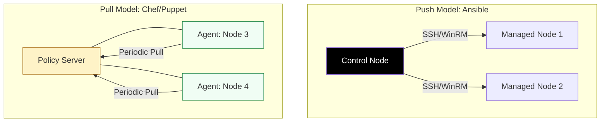

# ⚙️ Server Configuration: Layer 2 Orchestration

> **"If Provisioning builds the house, Configuration moves the furniture in and sets the alarm. A server is just a blank canvas; the configuration is the art of production-ready engineering."**

Welcome to the **Server Configuration** module. This is the "Inside-Out" layer of automation. You will master the tools that manage the operating system, packages, user access, and security policies across vast fleets of servers. We focus on the two dominant architectures: **Agentless (Push)** and **Agent-based (Pull)**, and how to use them to enforce absolute consistency.

---

## 🏗️ Configuration Architectures

Configuration Management (CM) relies on **Continuous State Enforcement**.



---

## 🎭 Real-World DevOps Scenarios

### 🛡️ Scenario: The "CVE-2024" Emergency Patch
**The Incident:** A critical zero-day vulnerability was discovered in `OpenSSL`. The security team required that all 5,000 servers in the company be patched within 4 hours to maintain compliance.
**The Failure:** Manual patching would take days. Even a bash script would struggle with error handling and verifying the results across three different Linux distributions.
**The Fix:** A single **Ansible Playbook** using the `package` module. 
**The Result:** The playbook was executed across the fleet in parallel. In 45 minutes, 4,980 servers were successfully patched. The remaining 20 servers were flagged for manual review due to disk space issues. 100% auditability for the security team.

---

## 💻 DevOps Logic Snippets: "The State Enforcer"

Master the use of roles and dynamic variables to manage complex fleets.

```yaml
# 🚀 Standard: Role-Based Configuration
- name: Harden Web Servers
  hosts: webservers
  roles:
    - { role: common, tags: ['base'] }      # Install SSH keys, NTP, Logging
    - { role: nginx, nginx_port: 80, tags: ['web'] } # Web-specific logic
  
  # 🛡️ Guard Clause: Apply only to specific OS families
  tasks:
    - name: Enable Firewall for RedHat nodes
      firewalld:
        service: http
        permanent: yes
        state: enabled
      when: ansible_os_family == "RedHat"
```

---

## 🎙️ Interview Preparation (Server Configuration)

1.  **"What is the core difference between the 'Push' and 'Pull' configuration models?"**
    *   *Answer:* The **Push model** (Ansible) initiates configuration from a central control node over SSH. The **Pull model** (Chef/Puppet) has an agent installed on every server that periodically "phones home" to a central server to pull the latest policy. Push is better for troubleshooting; Pull is better for continuous drift enforcement.
2.  **"Explain the concept of 'Compliance as Code' in server management."**
    *   *Answer:* It is the practice of defining your security requirements (e.g., "SSH root login must be disabled") inside your configuration playbooks. The tool then automatically audits and enforces these rules on every server run.
3.  **"What is a 'Dynamic Inventory' and why is it essential for cloud environments?"**
    *   *Answer:* In the cloud, servers are constantly being created and destroyed. A dynamic inventory is a script or plugin that queries the Cloud API (like AWS EC2) to get a real-time list of IP addresses, ensuring your automation is never out of date.
4.  **"Why use 'Roles' instead of putting everything into one large playbook?"**
    *   *Answer:* Roles provide **Modularization**. They allow you to reuse common logic (like "Setup Logging") across multiple projects, make code easier to test, and prevent namespace collisions between variables.
5.  **"How do you handle 'Orchestration' (order of operations) between different server groups?"**
    *   *Answer:* Using multi-play playbooks. You can define one "Play" to setup the database servers first, and a second "Play" to setup the web servers only after the database is verified as ready.

---

## 🧠 Knowledge Check

1.  **Which tool is famous for using an 'Agentless' architecture?**
    *   [ ] Chef
    *   [x] Ansible
    *   [ ] Puppet
2.  **What does a 'Handler' do in configuration management?**
    *   [ ] It runs every time the script runs.
    *   [x] It only triggers if another task makes a change (e.g., restarting a service if the config changed).
    *   [ ] It deletes old log files.
3.  **True or False: Chef uses Ruby-based 'Cookbooks' and 'Recipes' for logic.**
    *   [x] True
    *   [ ] False
4.  **Which protocol does Ansible primarily use to communicate with Linux servers?**
    *   [ ] HTTP
    *   [x] SSH
    *   [ ] FTP
5.  **What is the benefit of 'Agent-based' systems for long-term drift prevention?**
    *   [x] The agent continuously pulls and enforces the state without human intervention.
    *   [ ] It makes the server run faster.
    *   [ ] It costs less in cloud fees.

---

[⬅️ Back to Config Management Index](../README.md) | [Next: Immutable Infrastructure](../04-Immutable-Infrastructure/README.md) ➡️
