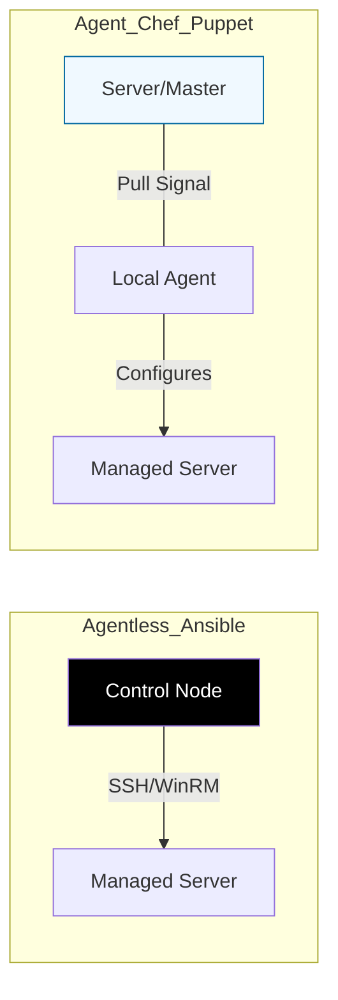

# ⚙️ 03: Server Configuration

> **"Infrastructure Provisioning builds the house. Configuration Management moves the furniture in and sets the alarm."**

---

## 🏛️ Configuration Management Models

Server configuration is "Layer 2". It focuses on the OS settings, packages, users, and security policies inside the virtual machines.

### Agent vs Agentless Architecture

---

## 🌟 Overview

This module covers the "Interior Designers" of the server world. We explore the two primary ways to manage large fleets of Linux and Windows servers: the "Push" model (Agentless) and the "Pull" model (Agent-based).

### Key Tools:
1.  **[Ansible](../../01-Scripting-Automation/05-Ansible/README.md)**: The leader in agentless configuration. Reliable, YAML-based, and perfect for "ad-hoc" tasks.
2.  **[03-Chef](./03-Chef/README.md)**: Ruby-based, policy-driven automation. Best for complex logic in large enterprise environments.
3.  **[07-Puppet](./07-Puppet/README.md)**: Model-driven automation using its own DSL. Excellent for enforcement of security baselines.
4.  **[08-SaltStack](./08-SaltStack/README.md)**: Speed-focused orchestration. Uses a "Minion" architecture for near-instant execution across thousands of nodes.

---

## 🚀 Intermediate Configuration Patterns

1.  **Compliance as Code**: Automatically enforcing that every server has `root` login disabled and the latest security patches.
2.  **Role-Based Management**: Assigning configurations based on tags (e.g., "If tag is 'web', install Nginx; if tag is 'db', install MySQL").
3.  **Dynamic Inventory**: Automatically discovering new servers created by Terraform and configuring them without manual IP entry.

---

## 🏆 Real-World Scenario: The 5,000 Server Patch

**The Challenge**: A critical zero-day vulnerability (like Log4j) is discovered. 5,000 servers across 3 clouds need a specific library updated immediately.
**The Solution**: An **Ansible Playbook** or **Puppet Policy**. 
1.  The security team pushes a code change to the "Base Configuration" repository.
2.  **Chef/Puppet Agents** check in every 30 minutes and apply the fix automatically.
3.  **Ansible** is run in parallel to verify the update on critical nodes.
**Result**: The entire fleet is patched in under 1 hour with a full audit trail.

---

## ❓ Interview Preparation (Configuration)

1.  **Q: What is the main advantage of an Agentless system like Ansible?**
    *A: Low overhead and ease of setup. You don't need to install or maintain software on the target nodes; you only need SSH access and Python. This is ideal for ephemeral cloud instances.*

2.  **Q: What is the main advantage of an Agent-based system like Chef or Puppet?**
    *A: Continuous Enforcement. Even if a script isn't running, the local agent is constantly pulling the desired state and correcting any manual changes (Drift) that might occur.*

---

## 📝 Knowledge Check

1.  **Which tool uses 'Cookbooks' and 'Recipes' as its primary organizational unit?**
    - [ ] a) Puppet
    - [x] b) Chef
    - [ ] c) SaltStack

2.  **True or False: Ansible requires a database on the control node to track server state.**
    - [ ] True
    - [x] b) False (Ansible is largely stateless)

---

## 🔗 Next Steps
Proceed to: **[Immutable Infrastructure](../04-Immutable-Infrastructure/README.md)** →
