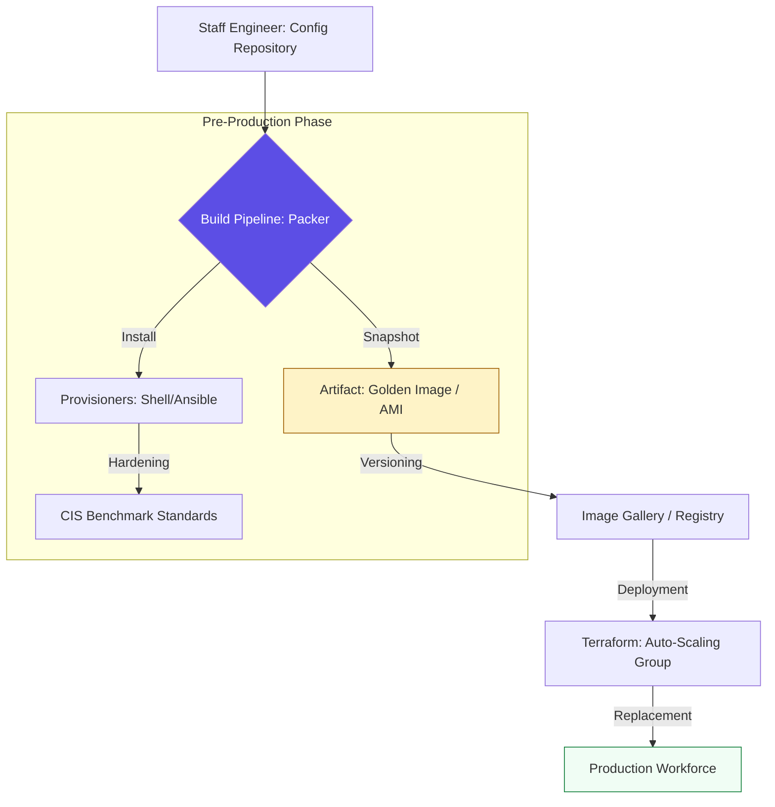

# 🧊 Immutable Infrastructure & Image Building

> **"A server is a software artifact, not a physical object. If you have to SSH into a production server to fix a bug, your process has failed. Build. Bake. Replace."**

Welcome to the **Immutable Infrastructure** module. This is the "Build Factory" of modern DevOps. You will master the **"Bake vs. Fry"** philosophy—moving away from long-lived, brittle servers towards throwaway, perfectly consistent artifacts. By using tools like **Packer** and **Cloud-Init**, you ensure that your production environment is exactly identical to your testing environment, every single time.

---

## 🏗️ The Immutable Lifecycle

In an immutable world, we move from **Patching** to **Provisioning Artifacts**.



---

## 🎭 Real-World DevOps Scenarios

### 🛡️ Scenario: The "Scaling" Sticker Shock
**The Incident:** A national news site experienced a 20x traffic surge during an election. Their existing auto-scaling setup was "Frying" (running a 10-minute Ansible playbook on every new server boot).
**The Failure:** By the time a new server was "Ready," the traffic had already overwhelmed the existing fleet. Users saw "504 Gateway Timeout" for 15 minutes during the peak.
**The Fix:** Transition to **Immutable Golden Images** using **Packer**. All software was pre-installed and security-hardened during the build phase.
**The Result:** New servers were "Ready" in 45 seconds instead of 10 minutes. The site handled the surge with zero downtime.

---

## 💻 DevOps Logic Snippets: "The Image Definition"

Modular imaging allows you to build for multiple clouds simultaneously.

```hcl
# 🚀 Standard: Multi-Cloud image template
source "amazon-ebs" "ubuntu" {
  ami_name      = "hardened-ubuntu-{{timestamp}}"
  instance_type = "t3.medium"
  region        = "us-east-1"
  ssh_username  = "ubuntu"
}

build {
  sources = ["source.amazon-ebs.ubuntu"]

  # 🛡️ Guard Clause: Always run a security scan
  provisioner "shell" {
    inline = ["sudo apt-get update", "sudo apt-get install -y fail2ban"]
  }

  # 🚀 Optimization: Pre-load the application binary
  provisioner "file" {
    source      = "./app.bin"
    destination = "/usr/local/bin/app"
  }
}
```

---

## 🎙️ Interview Preparation (Immutability)

1.  **"What is the 'Bake vs. Fry' philosophy in infrastructure?"**
    *   *Answer:* **Baking** is the process of installing all software and configurations into an image before it is deployed (using Packer). **Frying** is the process of configuring the server at boot time (using Cloud-Init or Ansible). Staff engineers prefer "Baking" for production because it is faster and more reliable.
2.  **"What is a 'Phoenix Server'?"**
    *   *Answer:* A server that is designed to be regularly destroyed and recreated from a "Golden Image." This prevents "Configuration Drift" and ensures that no malicious changes have persisted on the filesystem.
3.  **"Why Use Vagrant in a modern Cloud-First company?"**
    *   *Answer:* Vagrant provides developers with a local environment that is identical to the production environment. It eliminates the "It works on my machine" problem by ensuring every developer uses the same "Baked" image.
4.  **"How does Cloud-Init bridge the gap between Baking and Deployment?"**
    *   *Answer:* Even in a baked image, you often need "Last Mile" unique settings (like a unique hostname or an IP address). Cloud-Init executes at the first boot to apply these unique metadata-driven settings.
5.  **"Explain the benefit of 'Image Versioning' for Disaster Recovery."**
    *   *Answer:* If a new deployment fails, you don't "Roll Back" by trying to undo changes on the live server. You simply point your Load Balancer or Auto-Scaling group back to the **previous version** of the Golden Image.

---

## 🧠 Knowledge Check

1.  **Which tool is the industry standard for 'Baking' machine images?**
    *   [ ] Terraform
    *   [ ] Ansible
    *   [x] Packer
2.  **What is the 'Last Mile' of configuration?**
    *   [ ] Installing the entire OS.
    *   [x] Applying unique settings (hostname, keys) at the very first boot of an image.
    *   [ ] Shutting down the server.
3.  **True or False: In an Immutable model, we NEVER patch a running production server.**
    *   [x] True (We build a new image and replace the server).
    *   [ ] False
4.  **Which file is used by Cloud-Init to receive instructions from the cloud provider?**
    *   [ ] `config.yaml`
    *   [x] `User Data`
    *   [ ] `startup.sh`
5.  **What is a 'Golden Image'?**
    *   [x] A pre-configured, security-hardened, and tested machine image used as a template for all deployments.
    *   [ ] An image with a gold background.
    *   [ ] An image that costs more money.

---

[⬅️ Back to Config Management Index](../README.md) | [Next: Kubernetes Config](../05-Kubernetes-Config-Management/README.md) ➡️
