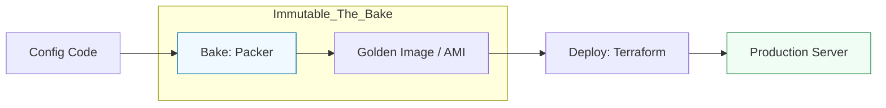

# 🧊 04: Immutable Infrastructure & Image Building

> **"Don't patch servers. Replace them."**

---

## 🏛️ The Immutable Lifecycle

Immutable infrastructure is a paradigm where servers are never modified after they are deployed. If a change is needed, a new "Image" is built, and the old servers are replaced.

### The "Bake" vs "Fry" Workflow

---

## 🌟 Overview

This module covers the "Factory Line" of DevOps. We move away from the traditional model of "Long-lived" servers towards **Immutable Artifacts**. By pre-configuring systems before they even boot, we drastically increase reliability and scaling speed.

### Key Tools:
1.  **[09-Packer](./09-Packer/README.md)**: The "Chef" of the Image world. It creates identical machine images for multiple platforms (AWS, Azure, VMWare) from a single source.
2.  **[05-Cloud-Init](./05-Cloud-Init/README.md)**: The "Last Mile" of configuration. A multi-distribution package that handles early-boot initialization of cloud instances.
3.  **[10-Vagrant](./10-Vagrant/README.md)**: Bringing Immutable principles to the developer laptop. Ensures "It works on my machine" because the machine is an identical, throwaway VM.

---

## 🚀 Intermediate Imaging Patterns

1.  **Golden Images**: Creating a base image that includes all security patches, monitoring agents, and common libraries.
2.  **Infrastructure Lifecycle Hooks**: Using `cloud-init` to talk to an API and register a server only once it has successfully booted and passed a local health check.
3.  **Multi-Cloud Artifacts**: Using Packer to build an AWS AMI and an Azure VHD simultaneously from the same configuration.

---

## 🏆 Real-World Scenario: The 2-Minute Scaling Record

**The Challenge**: A video streaming service sees a sudden 10x traffic spike when a famous influencer goes live. Their current servers take 15 minutes to boot because they run complex Ansible playbooks on every startup.
**The Solution**: The team switched to an **Immutable Workflow** using **Packer**:
1.  Every time the code changes, Packer builds a new "Hydrated" AMI with the app already installed.
2.  When traffic spikes, the **AWS Auto Scaling Group** simply launches the new AMIs.
**Result**: Boot time dropped from 15 minutes to **2 minutes**. The service handled the spike without dropping a single frame.

---

## ❓ Interview Preparation (Immutability)

1.  **Q: What is the 'Phoenix Server' pattern?**
    *A: It is the practice of regularly destroying and recreating servers from a base image to ensure that no "manual configuration" or "entropy" has crept into the system over time. A server that can be destroyed and reborn is a healthy server.*

2.  **Q: Explain the role of 'User Data' in Cloud-Init.**
    *A: User Data is a platform-agnostic way to pass a script or config to a server at launch. Cloud-Init reads this data to perform tasks like setting the hostname, adding SSH keys, or running a final bootstrap script.*

---

## 📝 Knowledge Check

1.  **Which tool is primarily used to build machine images (like AMIs)?**
    - [ ] a) Vagrant
    - [x] b) Packer
    - [ ] c) Cloud-Init

2.  **True or False: In an Immutable infrastructure, you should never SSH into a server to fix a bug.**
    - [x] True (You fix the code, rebuild the image, and redeploy)
    - [ ] False

---

## 🔗 Next Steps
Proceed to: **[Kubernetes Config Management](../05-Kubernetes-Config-Management/README.md)** →
