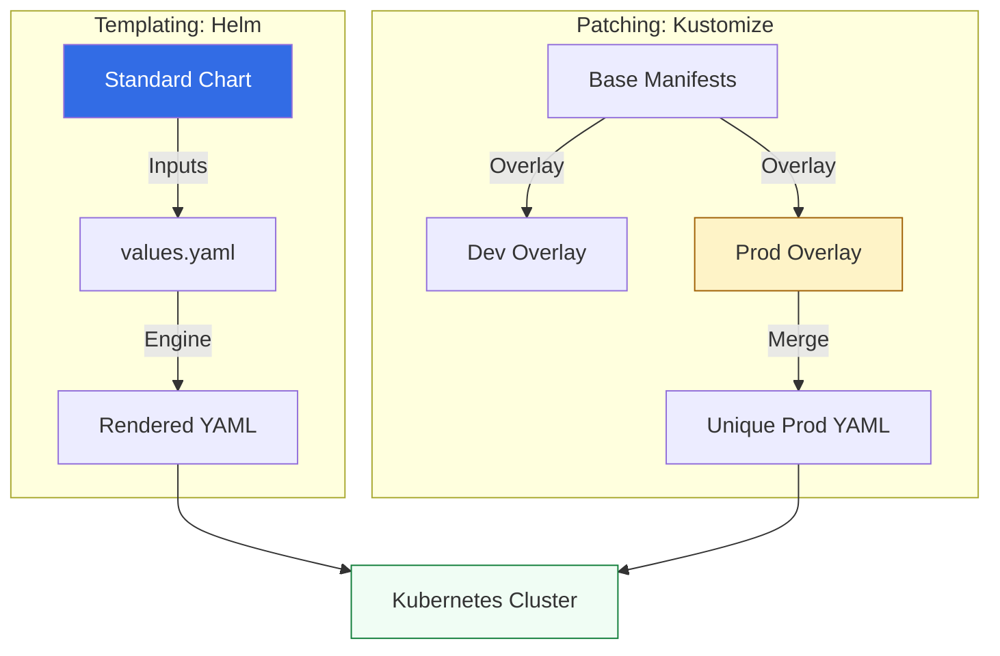

# ☸️ Kubernetes Config Management: Helm & Kustomize

> **"Kubernetes is the new Operating System. Helm and Kustomize are the new package managers. If you are managing raw YAML files, you aren't an engineer—you're a copy-paste technician."**

Welcome to the **Kubernetes Configuration** module. As application complexity scales from 2 to 2,000 services, managing raw YAML manifests becomes a catastrophic liability. You will master the two dominant paradigms of K8s management: **Templating (Helm)** and **Patching (Kustomize)**. We focus on building reusable application blueprints that can be deployed across multi-cloud clusters with absolute environment isolation.

---

## 🏗️ Orchestration Configuration Models

Modern K8s management relies on **Separation of Concerns**. We move from "Static Manifests" to **Dynamic blue-prints.**



---

## 🎭 Real-World DevOps Scenarios

### 🛡️ Scenario: The "Multi-Region" Deployment
**The Incident:** A global fintech company needed to deploy their core "Transfer API" to 15 different Kubernetes clusters across 3 continents.
**The Failure:** Each region required different database URLs, CPU limits, and replica counts. Initial attempts to maintain 15 separate sets of YAML files resulted in a "Drift" where the European cluster's security policy was accidentally applied to the US cluster, causing a massive latency spike.
**The Fix:** Transition to a single **Helm Chart** with regional `values.yaml` files.
**The Result:** The entire global fleet is now managed from one source of truth. A change to the "Core API" is pushed once, and regional differences are handled automatically during the CI/CD pipeline.

---

## 💻 DevOps Logic Snippets: "The Blueprint"

Master the use of templates and overlays to eliminate redundant code.

```yaml
# 🚀 Standard: Helm values.yaml abstraction
replicaCount: 3
image:
  repository: my-app
  tag: "1.2.0"
service:
  type: LoadBalancer
  port: 80

# 🛡️ Guard Clause: Resource Limits to prevent Cluster Crash
resources:
  limits:
    cpu: 500m
    memory: 1024Mi
  requests:
    cpu: 100m
    memory: 256Mi
```

---

## 🎙️ Interview Preparation (K8s Config)

1.  **"What is the core difference between Helm and Kustomize?"**
    *   *Answer:* Helm is a **Template Engine** (it replaces variables like `{{ .Values.name }}`). Kustomize is a **Patching Engine** (it takes a "Base" YAML and "Overlays" specific changes for different environments). Helm is better for sharing third-party apps, while Kustomize is often simpler for managing internal team-controlled apps.
2.  **"What is 'Helm Drift' and how do you detect it?"**
    *   *Answer:* Drift occurs when someone manually edits a Kubernetes resource using `kubectl edit` instead of updating the Helm Chart. You detect it by running `helm diff upgrade` or using GitOps tools like ArgoCD that constantly monitor for "Out-of-Sync" states.
3.  **"Explain the benefit of the 'Base and Overlay' pattern in Kustomize."**
    *   *Answer:* It follows the DRY (Don't Repeat Yourself) principle. You define the "Core" of your application once in the **Base**, and then use **Overlays** to define only the *differences* for Dev, Staging, and Production (e.g., adding more replicas in Prod).
4.  **"How does Helm handle rollbacks compared to raw kubectl?"**
    *   *Answer:* Helm maintains a "History" of releases in the cluster. If an update fails, you can run `helm rollback <release_name> <version>` to instantly revert the entire deployment to its previous known-safe state.
5.  **"What are 'Chart Dependencies' and why are they risky?"**
    *   *Answer:* Dependencies allow one chart to automatically install another (e.g., your App chart installs Redis). The risk is "Version Hell," where a change in the sub-chart breaks your parent chart. Best practice involves pinning strict versions in `Chart.yaml`.

---

## 🧠 Knowledge Check

1.  **Which command is used to see the rendered YAML of a Helm chart without applying it?**
    *   [ ] `helm apply`
    *   [x] `helm template`
    *   [ ] `helm view`
2.  **Which tool is built directly into kubectl via the `-k` flag?**
    *   [ ] Helm
    *   [x] Kustomize
    *   [ ] Ansible
3.  **True or False: Helm is often called the 'Package Manager' for Kubernetes.**
    *   [x] True
    *   [ ] False
4.  **What file in a Helm chart defines the default settings?**
    *   [ ] `settings.yaml`
    *   [ ] `data.yaml`
    *   [x] `values.yaml`
5.  **Which Kustomize file lists the resources and patches for an environment?**
    *   [ ] `manifest.yaml`
    *   [x] `kustomization.yaml`
    *   [ ] `overlay.yaml`

---

[⬅️ Back to Config Management Index](../README.md) | [Next: Assessments](../06-Assessments/README.md) ➡️
