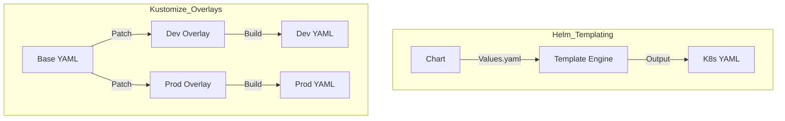

# ☸️ 05: Kubernetes Config Management

> **"Kubernetes is the new OS. Helm and Kustomize are the new package managers."**

---

## 🏛️ Orchestration Configuration Models

Kubernetes resources are defined in YAML. As your application grows from 1 service to 100, managing raw YAML files becomes impossible. This module focuses on the two ways to manage that complexity.

### Templates vs Overlays

---

## 🌟 Overview

This module covers the "Packaging" layer of modern DevOps. You will learn how to share application blueprints across multiple environments while maintaining strict environment isolation.

### Key Tools:
1.  **[04-Helm](./04-Helm/README.md)**: The "apt-get" of Kubernetes. Uses Go-templating to create re-usable "Charts."
2.  **[06-Kustomize](./06-Kustomize/README.md)**: The "Native" way to manage K8s config. Uses specialized YAML "Overlays" without needing a template engine. Built directly into `kubectl`.

---

## 🚀 Intermediate K8s Config Patterns

1.  **Value Abstraction**: Separating the "What" (the container image) from the "How" (CPU/Memory limits) using `values.yaml`.
2.  **Environment Overlays**: Creating a "Base" deployment and then using Kustomize to add more replicas or higher memory limits for Production.
3.  **Chart Dependencies**: Building complex stacks (e.g., "An App Chart" that automatically installs "A Database Chart" as a requirement).

---

## 🏆 Real-World Scenario: The Multi-Cluster Rollout

**The Challenge**: A company has 30 Kubernetes clusters across different regions. They need to deploy the same "Payment Service" to every cluster, but each cluster has a different DB endpoint and different scaling requirements.
**The Solution**: A **Helm Chart** combined with a **values-regional.yaml** strategy.
1.  The core logic is defined once in the Chart.
2.  Regional differences (IPs, replicas, secrets) are kept in small, 10-line YAML files.
3.  The CI/CD pipeline runs `helm upgrade --install payment-service ./chart -f values-us-east.yaml`.
**Result**: A unified deployment process with zero "Copy-Paste" errors.

---

## ❓ Interview Preparation (K8s Config)

1.  **Q: What is the main difference between Helm and Kustomize?**
    *A: Helm is a **Template** engine; it replaces placeholders in YAML with values. Kustomize is a **Patching** tool; it takes a base YAML file and applies "merges" or "patches" onto it. Helm is better for sharing modules with others (Charts), while Kustomize is often better for managing domestic app configurations without the complexity of Go-templates.*

2.  **Q: What is a 'Helm Template' and how do you debug it?**
    *A: A template is a YAML file with `{{ .Values.name }}` syntax. You debug it using `helm install --dry-run --debug` or `helm template`, which shows you the rendered YAML without actually sending it to the cluster.*

---

## 📝 Knowledge Check

1.  **Which command is the native Kubernetes way to apply a Kustomize overlay?**
    - [ ] a) `kubectl apply -f .`
    - [x] b) `kubectl apply -k .`
    - [ ] c) `kustomize deploy`

2.  **True or False: Helm can rollback a failed deployment to a previous version automatically.**
    - [x] True (`helm rollback`)
    - [ ] False

---

## 🔗 Next Steps
Proceed to: **[Assessments](../06-Assessments/README.md)** →
