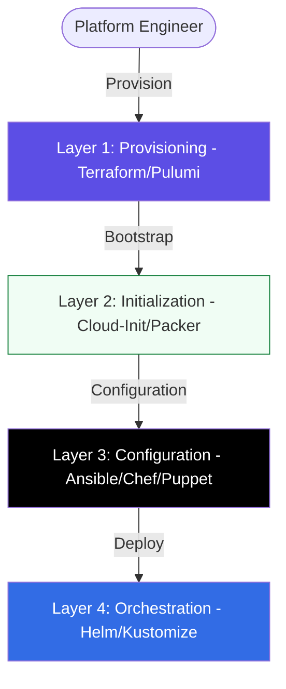

# 🔧 Configuration Management & IaC Mastery

Welcome to the **Config Management** track. This phase focuses on the **Architecture of Infrastructure**—moving beyond basic resource creation into stateful, declarative, and production-grade environment engineering.

## Core Concept: Provisioning vs. Configuration
**[REFERENCE: IaC Architecture Patterns](./REFERENCE/IaC-Architecture-Patterns-Ref.md)**

Professional infrastructure is built in layers:
- **Provisioning**: The "Outside" code (VPC, Subnet, VM Instance) - *Terraform/Pulumi*.
- **Configuration**: The "Inside" code (OS tuning, Package installation) - *Ansible/Chef*.
- **State Management**: The "Source of Truth" that prevents duplicate resources and manages dependencies.

## Enterprise Governance: The Immutable Standard
**[REFERENCE: Immutable Infrastructure Governance](./REFERENCE/Immutable-Infrastructure-Governance-Ref.md)**

At scale, we move from "Mutable" to "Immutable" patterns:
- **No Snowflakes**: We never update a production server in place. We replace it.
- **Golden Images**: We "Bake" our security patches and base code into images (AMI) using Packer.
- **Drift Prevention**: We use state-locking and automated re-provisioning to eliminate manual configuration tweaks.
- **Bake vs. Fry**: We prioritize build-time initialization (Baking) over run-time startup (Frying) for speed and reliability.

---

## 🏗️ The Infrastructure Stack

Professional DevOps involves a layered approach to resource management.

## 🗺️ Curriculum Path

### 1. [01-Introduction](./01-Introduction/README.md)

The shift from "Click-Ops" to Declarative Infrastructure. Understanding Idempotency, State, and the IaC Lifecycle.

### 2. [02-Infrastructure-Provisioning](./02-Infrastructure-Provisioning/README.md)

**Terraform, Pulumi, and Vendor Tools**. Focus on multi-cloud provisioning, state management, and modular infrastructure.

### 3. [03-Server-Configuration](./03-Server-Configuration/README.md)

**Ansible, Chef, Puppet, and SaltStack**. Focus on agent vs agentless management and policy-driven server hardening.

### 4. [04-Immutable-Infrastructure](./04-Immutable-Infrastructure/README.md)

**Packer, Vagrant, and Cloud-Init**. Moving away from "Snowflake" servers towards reproducible, baked images.

### 5. [05-Kubernetes-Config-Management](./05-Kubernetes-Config-Management/README.md)

**Helm and Kustomize**. Managing complexity in container environments using templates and overlays.

### 6. [06-Assessments](./06-Assessments/README.md)

Prepare for your next architecture review with technical interview questions, quizzes, and practical design challenges.

---

## 📂 Practical Code & Scripts

Accelerate your learning with real-world automation scripts:

- **[Ansible Lab Scripts](./Ansible/)**: Playbooks for health checks, MySQL setup, and inventory generation.
- **[Configuration Boilerplates](./Ansible/Boilerplates/)**: Reusable roles and variable files for enterprise environments.

---

## 🛡️ The "State" Standard

Everything in this track is designed to eliminate **Config Drift**. We treat infrastructure as a software product—versioned, tested, and automated.

---

[⬅️ Back to Infrastructure Automation](../README.md)
