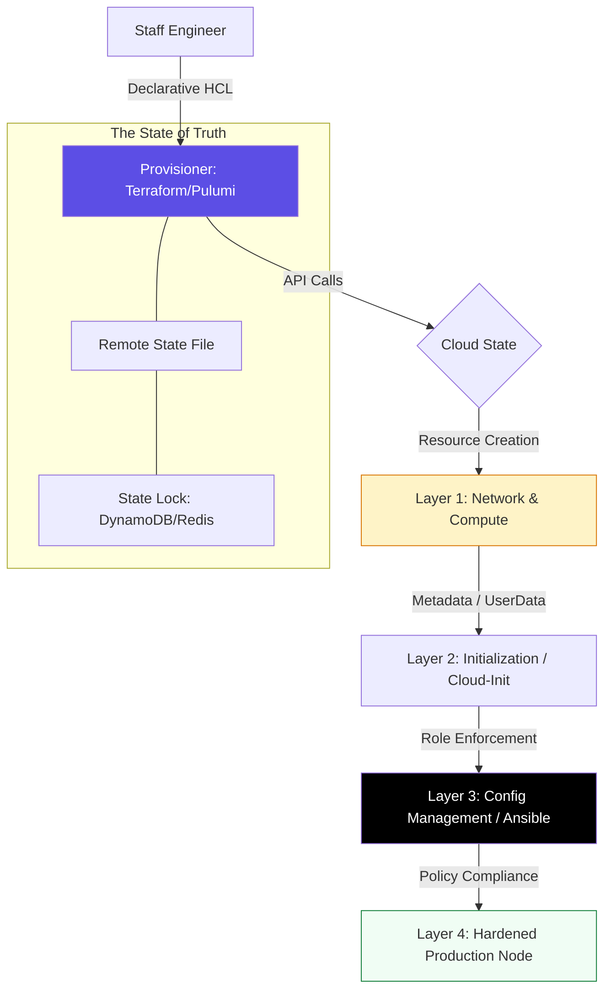

# 🔧 Configuration Management & IaC Mastery

> **"Infrastructure is not a place you go; it is a code you write. If you are clicking in a console, you are not scaling; you are just borrowing technical debt."**

Welcome to the **Config Management & Infrastructure-as-Code (IaC)** portal. This module represents the peak of modern platform engineering. You'll master the two critical layers of automation: **Provisioning** (creating the physical/virtual world) and **Configuration** (shaping the behavior of the software within that world). From Terraform's declarative states to Ansible's fleet-wide orchestration, this is where you build the foundation of a resilient enterprise.

---

## 🏗️ The Infrastructure Lifecycle

Professional DevOps engineers distinguish between **Provisioning** and **Configuration**. We move from "Mutable Snowflakes" to **Immutable Fleets**.

---

## 🎭 Real-World DevOps Scenarios

### 🛡️ Scenario 1: The "Manual Console" Disaster
**The Incident:** During a database migration, a senior admin manually increased the instance type and adjusted the Security Group via the AWS Console to save time.
**The Failure:** Two weeks later, a Terraform `apply` was run for an unrelated change. Terraform detected the "Drift" (the manual changes didn't match the code) and "corrected" the instance by reverting the type and deleting the manual security rule.
**The Crisis:** The database instantly lost connectivity, taking down the payment gateway.
**The Fix:** Mandatory **Remote State Locking** and automated **Drift Detection**. Changes are now *unfailing* because they go through Git, ensuring the "State" is never out of sync with reality.

### 🧱 Scenario 2: The "Golden Image" Speed-run
**The Incident:** A web-app auto-scaling event took 12 minutes to start a new server because the "Startup Script" was installing PHP, Nginx, and Chrome drivers from scratch every time.
**The Failure:** Users were hitting 502 errors for 10 minutes before the new server was "Ready."
**The Fix:** Implemented **Packer** to "Bake" Golden Images (AMIs). All software is now pre-installed.
**The Result:** Boot time dropped from 12 minutes to 45 seconds.

---

## 🗺️ Curriculum Path

### 01. [Infrastructure Provisioning](./02-Infrastructure-Provisioning/README.md)
Mastering the "Outside" code. Terraform, State Management, and Modular IaC design.

### 02. [Server Configuration](./03-Server-Configuration/README.md)
Mastering the "Inside" code. Ansible, Chef, and agentless management at scale.

### 03. [Immutable Infrastructure](./04-Immutable-Infrastructure/README.md)
The "Bake vs. Fry" philosophy. Using Packer to build hardened images.

### 04. [Kubernetes Config](./05-Kubernetes-Config-Management/README.md)
Helm and Kustomize: Orchestrating complexity in the container era.

### 05. [📚 Keyword Encyclopedia](./REFERENCE/README.md)
The technical manual for IaC architecture, state management, and immutable governance.

---

## 🎙️ Interview Preparation (Architecture)

1.  **"What is the difference between 'Mutable' and 'Immutable' infrastructure?"**
    *   *Answer:* Mutable infrastructure is updated in place (SSH in and run commands); it leads to configuration drift. Immutable infrastructure is never updated; you build a new image, deploy it, and delete the old one, ensuring 100% consistency.
2.  **"Why is 'State' so critical in Terraform compared to Ansible?"**
    *   *Answer:* Terraform is a **Lifecycle Manager**. It needs to know which resources it created so it can delete or update them later. Ansible is a **Task Executor**; it checks the immediate state of a server but doesn't usually maintain a historical "record" of what it owns.
3.  **"Explain 'Idempotency' in the context of Config Management."**
    *   *Answer:* An idempotent operation can be run multiple times without changing the result beyond the initial application. This allows us to run a playbook 100 times without accidentally creating 100 users or 100 databases.
4.  **"What is 'Configuration Drift' and how do you prevent it?"**
    *   *Answer:* Drift happens when the manual state of a server or cloud resource deviates from the code. It is prevented by enforcing "GitOps" (no manual access) and running scheduled "Drift Detection" jobs.
5.  **"When should you use 'Cloud-Init' vs 'Ansible'?"**
    *   *Answer:* Cloud-Init is best for **Bootstrapping** (one-time setup like hostname, SSH keys, or installing an agent). Ansible is better for **Ongoing Configuration** and complex multi-node orchestration.

---

## 🧠 Knowledge Check

1.  **Which tool is primarily used for 'Provisioning' cloud resources?**
    *   [ ] Ansible
    *   [x] Terraform
    *   [ ] Kubernetes
2.  **What is the 'Golden Image' pattern?**
    *   [ ] Using high-resolution icons in the UI.
    *   [x] Pre-installing software into an OS image (AMI/VHD) before deployment.
    *   [ ] Making sure your code is perfectly written.
3.  **True or False: IaC helps eliminate 'Snowflake Servers'.**
    *   [x] True
    *   [ ] False
4.  **Which keyword describes a tool that only makes changes if the current state differs from the desired state?**
    *   [ ] Procedural
    *   [x] Idempotent
    *   [ ] Sequential
5.  **What is 'State Locking' used for?**
    *   [x] Preventing multiple engineers from making conflicting changes to the same infrastructure.
    *   [ ] Encrypting passwords in the code.
    *   [ ] Shutting down servers at night.

---

[⬅️ Back to Infrastructure Automation](../README.md)
