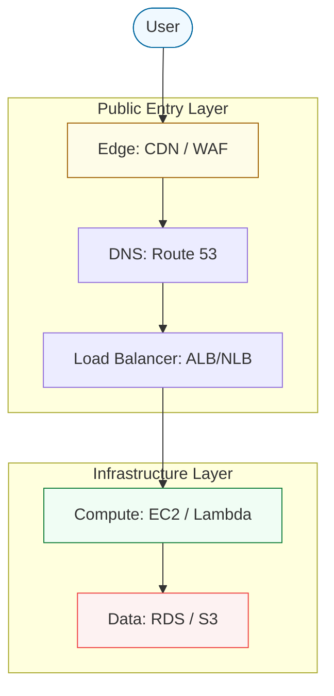

# ☁️ 01: Introduction to Cloud Platform Engineering

> **"A cloud administrator manages resources; a platform engineer builds the systems that manage themselves."**

---

## 🌟 Overview

Welcome to the Intermediate level of Cloud Engineering. In Phase 1, you learned how to create a VM, a Bucket, and a User. In Phase 2, we stop looking at resources in isolation and start looking at them as parts of a **Global Platform**.

Cloud Platform Engineering is the discipline of creating highly available, secure, and cost-effective environments that empower developers to ship code without worrying about the underlying hardware.

### Key Shifts from Beginner to Intermediate

- **From Manual to Declarative**: We no longer "create" resources; we "define" them via IaC.
- **From Single to Multi-AZ**: We design for failure. A server that lives in one rack is a liability.
- **From Admin to Architect**: We focus on how services interconnect (Latency, Bandwidth, Security).

---

## 🏛️ The Infrastructure Hierarchy

To build a professional platform, you must understand the relationship between the various cloud layers.

---

## 🚀 The DevOps Mindset: Self-Service

The goal of a Platform Engineer is to build **Internal Developer Platforms (IDPs)**. This means:

1. **Standardization**: Every app uses the same base VPC and Security Group logic.
2. **Automation**: New environments are spun up automatically via CI/CD.
3. **Governance**: Guardrails (Service Control Policies) are in place to prevent accidental data leaks or cost overruns.

---

## ❓ Interview Preparation (Introduction)

1.  **Q: What is the difference between a Cloud Administrator and a Cloud Architect?**
    *A: An Administrator focuses on maintaining existing resources (patching, user adds). An Architect focuses on the high-level design, ensuring the system meets performance, scalability, and availability requirements across regions and zones.*

2.  **Q: Why is 'Multi-AZ' critical for production workloads?**
    *A: Availability Zones are physically separate data centers within a region. If one data center has a power failure or flood, a Multi-AZ architecture ensures the application automatically fails over to the surviving zone with minimal-to-zero downtime.*

---

## 📝 Knowledge Check

1. **Which term describes the practice of managing cloud resources through machine-readable definition files?**

- [ ] a) Manual Ops
- [x] b) Infrastructure as Code (IaC)
- [ ] c) Cloud-Ops

1. **True or False: Availability Zones are connected to each other via low-latency private fiber.**

- [x] True
- [ ] False

---

## 🔗 Next Steps
Proceed to: **[Compute & Scale](../02-Compute-and-Scale/README.md)** →
