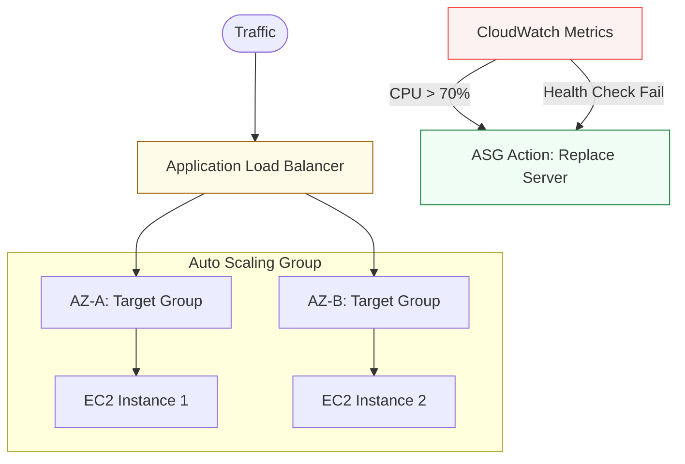

# 🚀 02: Compute & Scale

> **"Servers should be treated like cattle, not pets. If a compute node fails, the system should automatically replace it without human intervention."**

---

## 🏛️ The Scaling Workflow

At the intermediate level, we never deploy a single EC2 instance. We deploy **Auto Scaling Groups (ASGs)** behind **Load Balancers**.

### High Availability Architecture

---

## 🌟 Overview

This module focuses on the "Muscle" of the cloud. You will learn to manage fleets of virtual machines and serverless functions using automated scaling and traffic distribution.

### Key Intermediate Topics

1. **[01-Compute-and-Containers](./01-Compute-and-Containers/README.md)**: Deep dive into ECR, ECS/EKS foundations, and advanced Lambda patterns.
2. **[07-Load-Balancing-and-Scaling](./07-Load-Balancing-and-Scaling/README.md)**: Master ALB vs. NLB and the mechanics of Auto Scaling Policies (Target Tracking, Step Scaling).
3. **Spot Instances**: Leveraging spare capacity to reduce compute costs by up to 90%.
4. **Launch Templates**: Standardization of server configurations for large-scale deployments.

---

## 🏗️ Professional Patterns

### 1. The "Hydrated" Image (Golden AMI)
Injecting all application dependencies into a Machine Image (AMI) using Packer, ensuring your servers are "Bade-and-Ready" to serve traffic in under 2 minutes.

### 2. Multi-AZ Target Groups
Ensuring your Load Balancer health checks are rigorous enough to detect "Grey Failures" (where a server is up but the app is unresponsive).

---

## 🏆 Real-World Scenario: The 10x Traffic Spike

**The Challenge**: A marketing campaign goes viral, and concurrent users increase from 1,000 to 50,000 in 10 minutes.
**The Solution**: An **Auto Scaling Group** with **Target Tracking**.
1. **Metric**: Set to maintain 50% average CPU.
2. **Aggressive Scaling**: The ASG detects the spike and launches 20 new instances simultaneously across 3 zones.
3. **Health Verification**: The ALB automatically begins routing traffic to the new nodes only after they pass the `/health` check.
**Result**: The application stayed online without any manual human intervention.

---

## ❓ Interview Preparation (Compute & Scale)

1.  **Q: What is the difference between an Application Load Balancer (ALB) and a Network Load Balancer (NLB)?**
    *A: An ALB operates at Layer 7 (HTTP/HTTPS) and can route traffic based on URL paths or headers. An NLB operates at Layer 4 (TCP/UDP) and is designed for ultra-low latency and millions of requests per second.*

2.  **Q: How does a 'Health Check' differ from a 'Liveness Probe'?**
    *A: In a cloud context, a Health Check is used by the Load Balancer to see if it should send traffic to a node. If it fails, the node is removed from rotation. A Liveness Probe (often found in ASGs or K8s) determines if the node itself is 'dead' and needs to be terminated and replaced.*

---

## 📝 Knowledge Check

1. **Which scaling policy is best for keeping a specific metric (like CPU) at a constant level?**

- [ ] a) Scheduled Scaling
- [x] b) Target Tracking
- [ ] c) Step Scaling

2. **True or False: An Auto Scaling Group can span multiple AWS Regions.**

- [ ] True
- [x] b) False (An ASG is limited to a single Region, but multiple AZs)

---

## 🔗 Next Steps
Proceed to: **[Networking & Security](../03-Networking-and-Security/README.md)** →
