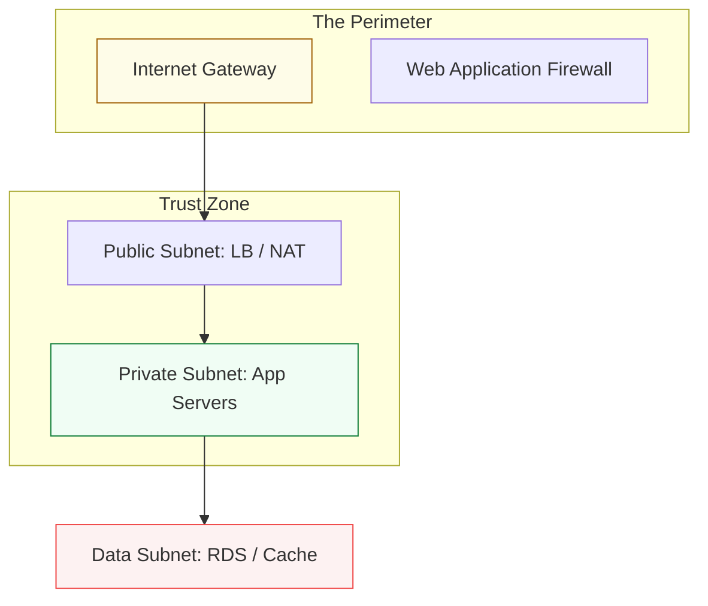

# 🛡️ 03: Networking & Security

> **"Identity is the new perimeter. If your network is open but your IAM is weak, you are already breached."**

---

## 🏛️ The Secure Connectivity Hub

Cloud networking is the "Vascular System" of your platform. It controls how data flows and who has access to the "Heart" of your infrastructure.

### The Secure Multi-Tier VPC

---

## 🌟 Overview

This module covers the "Walls and Gates" of your cloud environment. You will learn to architect complex VPCs, manage identity globally, and ensure compliance across hundreds of resources.

### Key Intermediate Topics

1. **[02-Networking-and-Edge](./02-Networking-and-Edge/README.md)**: VPC Peering, Transit Gateways, and Global Acceleration (CloudFront).
2. **[04-IAM-and-Security](./04-IAM-and-Security/README.md)**: AssumeRole, Attribute-Based Access Control (ABAC), and Cross-Account Roles.
3. **[06-Observability-and-Compliance](./06-Observability-and-Compliance/README.md)**: AWS Config and Service Control Policies (SCPs) for enterprise guardrails.
4. **KMS & Encryption**: Managing the keys to your kingdom and ensuring data is encrypted at rest and in transit.

---

## 🏗️ Professional Patterns

### 1. The "Transit Gateway" Hub
Moving away from messy "Mesh" peering towards a central hub that manages connectivity between dozens of VPCs and On-Premise data centers.

### 2. Least Privilege IAM
Designing policies that use `Conditions` (e.g., "Allow action only if IP matches Office VPN" or "Allow action only if resource is tagged 'Finance'").

---

## 🏆 Real-World Scenario: The Internal Data Leak

**The Challenge**: A contractor accidentally misconfigured an S3 bucket with "Public Read" access, exposing 50,000 sensitive customer records.
**The Solution**: A multi-layered **Security Guardrail**.
1.  **Block Public Access**: Enabled at the Account level via **Service Control Policies (SCP)**.
2.  **AWS Config**: An automated rule detects the change and triggers a Lambda function to immediately set the bucket to "Private".
3.  **IAM Role Check**: Ensuring only the specific EC2 instances have permission to read from that bucket.
**Result**: The leak was plugged automatically in under 60 seconds, and the security team was notified via SNS.

---

## ❓ Interview Preparation (Networking & Security)

1.  **Q: What is the difference between a Security Group and a NACL?**
    *A: A Security Group is **Stateful** (it remembers the connection) and operates at the Instance level. A Network ACL (NACL) is **Stateless** and operates at the Subnet level. Security Groups are your first line of defense; NACLs are your second, more rigid line.*

2.  **Q: Why use an IAM 'Role' instead of an IAM 'User' for an EC2 instance?**
    *A: IAM Roles use temporary security credentials that are automatically rotated by the cloud provider. IAM Users use long-lived Access Keys/Secret Keys which are easily stolen if stored on a server. Roles are significantly more secure.*

---

## 📝 Knowledge Check

1. **Which service allows you to connect multiple VPCs and On-Premise networks to a single central hub?**

- [ ] a) VPC Peering
- [x] b) Transit Gateway
- [ ] c) Direct Connect

1. **True or False: An IAM Policy with 'Allow' and an SCP with 'Deny' results in the action being Denied.**

- [x] True (Deny always wins)
- [ ] False

---

## 🔗 Next Steps
Proceed to: **[Data & Automation](../04-Data-and-Automation/README.md)** →
