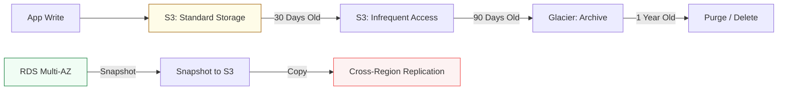

# 💾 04: Data & Automation

> **"Data is the gravity of your architecture. Automation is the engine that moves it."**

---

## 🏛️ The Data Lifecycle

Cloud Data Management is about more than just "Saving a file." It's about Durability, Lifecycle Management, and Automated State transitions.

### Automated State Workflow

---

## 🌟 Overview

This module focuses on the "Memory" of your cloud. You will learn to manage databases that never sleep and storage buckets that never lose a byte. We also explore how to use Cloud-native automation to bridge the gap between code and infrastructure.

### Key Intermediate Topics

1. **[03-Storage-and-Databases](./03-Storage-and-Databases/README.md)**: Master RDS Aurora (Serverless & Multi-AZ), DynamoDB Global Tables, and S3 Intelligent Tiering.
2. **[05-DevOps-and-Automation](./05-DevOps-and-Automation/README.md)**: Cloud-native CI/CD using AWS CodePipeline / Azure DevOps and infrastructure as code patterns.
3. **Messaging & Queues**: Using SQS and SNS to "Decouple" your application components, preventing a surge in traffic from Crashing your DB.

---

## 🏗️ Professional Patterns

### 1. Database Read Replicas
Offloading heavy analytical queries to a replicate database so that the production "Writer" can focus on customer transactions.

### 2. Event-Driven Automation
Using S3 Events to trigger Lambda functions (e.g., "When a user uploads a photo, automatically resize it and update the database").

---

## 🏆 Real-World Scenario: The Database Bottleneck

**The Challenge**: A popular e-commerce site crashes every time a "Flash Sale" starts because 10,000 customers are trying to read the inventory levels at the same time.
**The Solution**: A **Decoupled Architecture**.
1.  **Caching**: Introduced **ElastiCache (Redis)** to store inventory levels in memory.
2.  **Read Replicas**: Deployed 3 RDS Read Replicas to handle the viewing traffic.
3.  **SQS**: Placed orders in a queue (SQS) so the DB could process them at its own pace without crashing.
**Result**: The site handled the next sale with 0% downtime and improved page load speeds by 400%.

---

## ❓ Interview Preparation (Data & Automation)

1.  **Q: What is the difference between S3 'Standard' and 'Standard-IA'?**
    *A: Standard is for frequently accessed data. Standard-IA (Infrequent Access) has a lower storage cost but charges a retrieval fee per GB. It is intended for data that is accessed less than once a month but must be available instantly when needed.*

2.  **Q: Explain RDS Multi-AZ vs. Read Replicas.**
    *A: Multi-AZ is for **High Availability** (failover). It is a synchronous copy of your DB in a different zone. Read Replicas are for **Performance** (scalability). They are asynchronous copies used to offload read traffic.*

---

## 📝 Knowledge Check

1. **Which service is a NoSQL database that can scale to millions of requests per second with single-digit millisecond latency?**

- [ ] a) RDS
- [x] b) DynamoDB
- [ ] c) Redshift

2. **True or False: Using S3 Versioning protects you from accidental deletions.**

- [x] True
- [ ] False

---

## 🔗 Next Steps
Proceed to: **[Assessments](../05-Assessments/README.md)** →
