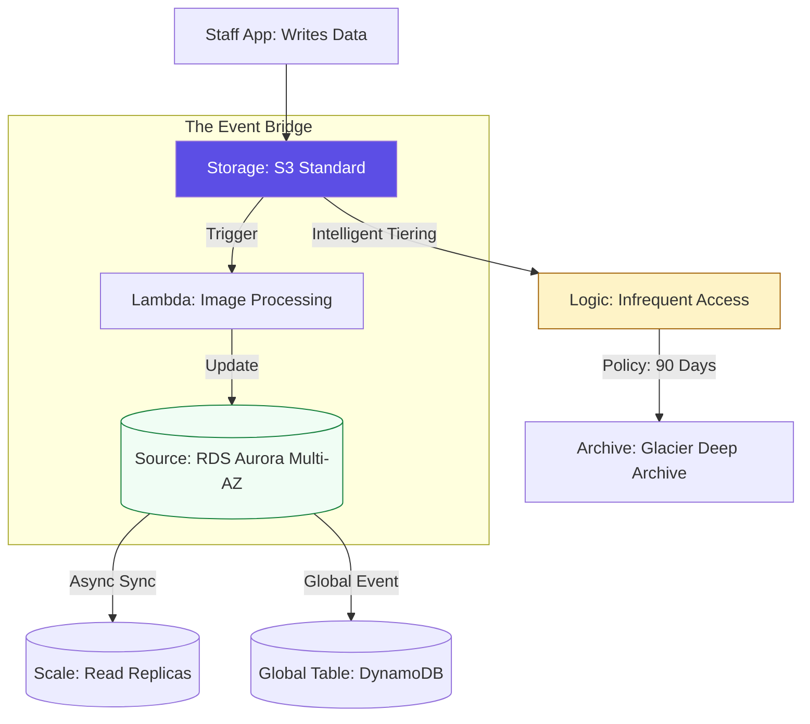

# 💾 Data & Automation: Orchestrating the Cloud Memory

> **"Data is the gravity of your architecture. If you don't control its lifecycle, its weight will eventually crush your agility. Automation is the engine that keeps the data moving and the platform healthy."**

Welcome to the **Data & Automation** module. This is the "Persistence" layer of the cloud. You will master the management of databases that never sleep, object storage that never loses a byte, and the **Event-Driven Automation** that bridges the gap between raw data and business logic. We focus on the shift from "Managing Instances" to **"Orchestrating Managed Data Services."**

---

## 🏗️ The Data Persistence & Lifecycle Engine

Professional data management relies on **Automated Tiering** and **Cross-Region Durability.**



---

## 🎭 Real-World DevOps Scenarios

### 🛡️ Scenario: The "Flash Sale" Database Collapse
**The Incident:** A popular e-commerce site crashed every time a discount was announced. 15,000 users would hit the "Availability" endpoint simultaneously.
**The Failure:** The application was querying a single RDS MySQL instance for inventory. The database hit 100% CPU and "Connection Refused" within 10 seconds of the sale starting.
**The Fix:** Transition to a **Decoupled Performance Strategy**. 
1. **Caching**: Inventory data was moved to **ElastiCache (Redis)**. 
2. **Read Replicas**: 3 RDS Read Replicas were added to handle analytical and viewing traffic. 
3. **SQS**: Order processing was moved to a **Queue (SQS)** to smooth out the write spikes.
**The Result:** The next sale handled 50,000 concurrent users with sub-second response times. The database "Writer" load stayed below 20%.

---

## 💻 DevOps Logic Snippets: "The Object Lifecycle"

Never pay for storage you aren't using. Automate your costs away.

```json
// 🚀 Standard: S3 Lifecycle Policy
// Moves logs from Expensive Standard to Cheap Glacier after 30 days
{
  "Rules": [
    {
      "ID": "MoveLogsToArchive",
      "Prefix": "logs/",
      "Status": "Enabled",
      "Transitions": [
        {
          "Days": 30,
          "StorageClass": "GLACIER"
        }
      ],
      "Expiration": {
        "Days": 365
      }
    }
  ]
}
```

---

## 🎙️ Interview Preparation (Data & Automation)

1.  **"What is the difference between 'S3 Versioning' and 'S3 Replication'?"**
    *   *Answer:* **Versioning** keeps a history of changes to the same object in the same bucket, protecting against accidental overwrites or deletions. **Replication** (CRR/SRR) copies objects to a different bucket (often in a different region) for disaster recovery and low-latency access.
2.  **"Explain the difference between RDS 'Multi-AZ' and 'Read Replicas'."**
    *   *Answer:* **Multi-AZ** is for **High Availability** (Disaster Recovery). It is a synchronous standby copy that AWS automatically fails over to if the primary dies. **Read Replicas** are for **Scaling** (Performance). They are asynchronous copies used to offload "Read" traffic from the primary instance.
3.  **"What is a 'Global Table' in DynamoDB?"**
    *   *Answer:* It is a fully managed, multi-region, multi-active database. It replicates your data across multiple AWS regions, allowing for local read/write performance for global users and providing 99.999% availability.
4.  **"How does 'Asynchronous Messaging' (SQS) improve system reliability?"**
    *   *Answer:* It "Decouples" components. If the producer (Web app) sends data faster than the consumer (Database) can process it, the data waits in the SQS queue instead of crashing the system. This is known as "Load Leveling."
5.  **"What is 'S3 Intelligent-Tiering' and why is it a Staff-level recommendation?"**
    *   *Answer:* It is a storage class that automatically moves objects between frequent and infrequent access tiers based on actual usage patterns, without any operational overhead. It eliminates the manual work of analyzing access patterns to save money.

---

## 🧠 Knowledge Check

1.  **Which database engine offers 'Serverless' options that scale to zero when not in use?**
    *   [ ] MySQL
    *   [ ] PostgreSQL
    *   [x] Amazon Aurora Serverless
2.  **What is the minimum storage duration for S3 Glacier Deep Archive?**
    *   [ ] 30 Days
    *   [ ] 90 Days
    *   [x] 180 Days
3.  **True or False: Using a Read Replica is a valid strategy for High Availability (Failover).**
    *   [ ] True
    *   [x] False (Read Replicas are for scale; Multi-AZ is for failover).
4.  **Which service allows you to trigger a Lambda function based on an S3 upload?**
    *   [x] S3 Event Notifications
    *   [ ] CloudWatch Logs
    *   [ ] IAM Roles
5.  **What happens to SQS messages if the consumer fails to process them?**
    *   [ ] They are deleted immediately.
    *   [x] They remain in the queue (or move to a Dead Letter Queue) after the visibility timeout expires.
    *   [ ] The entire system crashes.

---

[⬅️ Back to Cloud Platforms Index](../README.md) | [Next: Assessments](../05-Assessments/README.md) ➡️
