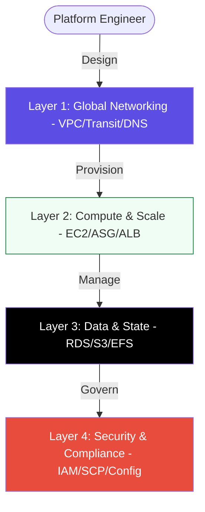

# ☁️ Cloud Platform Engineering (Intermediate)

> **"Infrastructure is no longer a physical rack of servers; it is a programmable API. Platform Engineering is the art of building the runway for software success."**

---

## 🏛️ The Cloud Maturity Lifecycle

Moving from Beginner to Intermediate means shifting from "Resource Creation" to "Platform Architecture."

## 📚 Overview

Cloud platforms are the foundation of modern DevOps. This module focuses on mastering the architectural patterns that ensure high availability, security, and scalability. We move beyond simple VMs into advanced topics like Multi-AZ deployments, cross-region replication, and complex identity hierarchies.

## 🎓 Learning Objectives

By the end of this module, you will be able to:

1. **Architect for Failure**: Design systems that survive the loss of an entire Availability Zone or Region.
2. **Scale Dynamically**: Implement automated load balancing and auto-scaling based on real-time metrics.
3. **Harden Identity**: Master IAM Policies, Roles, and Service Control Policies (SCPs) for least-privilege access.
4. **Manage Global Logic**: Utilize Edge Computing (CloudFront/Lambda@Edge) to reduce latency for global users.

---

## 🏗️ Module Roadmap

| Phase | Topic | Focus |
| :--- | :--- | :--- |
| **01** | [**Introduction**](./01-Introduction/README.md) | Platform Engineering vs. Cloud Admin. |
| **02** | [**Compute & Scale**](./02-Compute-and-Scale/README.md) | EC2, Auto-Scaling, and Load Balancing. |
| **03** | [**Networking & Security**](./03-Networking-and-Security/README.md) | VPC Deep-Dive, IAM, and Compliance. |
| **04** | [**Data & Automation**](./04-Data-and-Automation/README.md) | Managed DBs, S3, and Cloud-Native DevOps. |
| **05** | [**Assessments**](./05-Assessments/README.md) | Interview Prep, Quizzes, and Scenarios. |

---

## 🚀 Professional Standard

All architectures in this module follow the **Cloud Well-Architected Framework**:

- **Operational Excellence**
- **Security**
- **Reliability**
- **Performance Efficiency**
- **Cost Optimization**

---

## 📂 Practical Code & Scripts

Accelerate your platform engineering skills with real-world assets:

- **[Terraform Modules](./Terraform/)**: Reusable HCL modules for EKS, VPC, and S3.
- **[AWS Automation Scripts](./Aws/)**: CLI logic for EC2 tagging, bucket creation, and identity audits.
- **[YouTube Lessons](./Youtube_Lessons.md)**: Curated video tutorials.
- **[Real-Life Scenarios](./05-Assessments/Real-Life-Scenarios/README.md)**: Practical troubleshooting challenges.

---

[⬅️ Back to Infrastructure Automation](../README.md)
