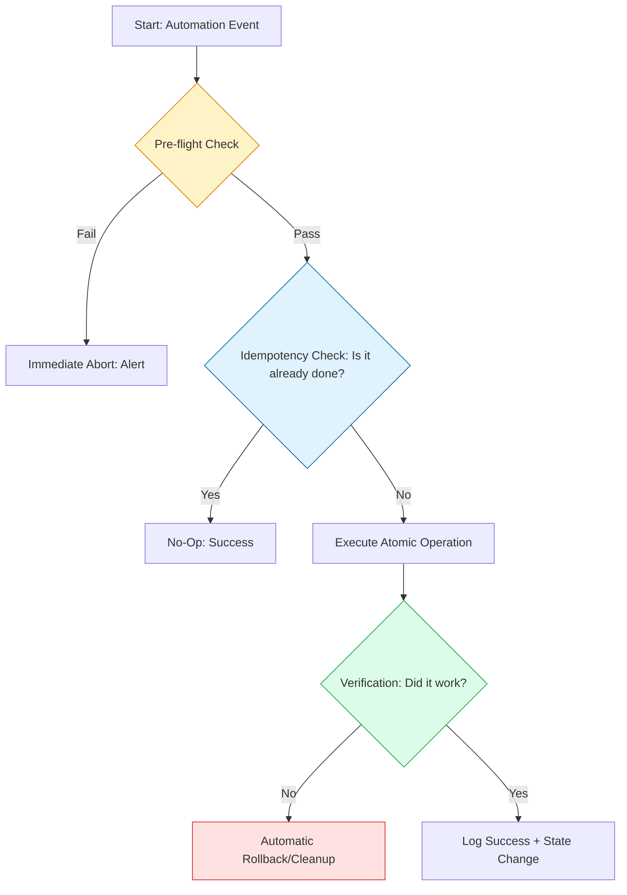

# 🛡️ Automation Best Practices: The Production Standard

> **"If you haven't automated it, you haven't understood it. If you have automated it without error handling, you just haven't broken it yet."**

Production-grade automation is the difference between a "script" and an "engineering asset." This module codifies the patterns used by Staff DevOps Engineers to ensure systems are **Idempotent**, **Atomic**, and **Observed**.

---

## 🏗️ The Reliability Blueprint

To build systems that scale, we follow the **Check-Act-Verify** methodology. Every operation must be repeatable without side effects.



---

## 🎭 Real-World DevOps Scenarios

### 🐍 Scenario 2: The Python Pivot
**The Incident:** A 1,500-line Bash script was used to scan AWS account resources and tag them for billing. It worked for 2 years until the account scaled from 100 resources to 50,000.
**The Failure:** The Bash script used sequential `aws` CLI calls. It hit API rate limits (Throttling) and took 14 hours to run. Error handling was nearly impossible to maintain in logic-heavy bash.
**The Pivot:** The team rewrote the tool as a structured Python module using `boto3`.
**The Win:** By implementing **Boto3 Paginators** and **Concurrent Futures**, the runtime dropped from 14 hours to 12 minutes. The code used **Type Hinting** and **Guard Clauses**, making it unit-testable and 90% easier to debug.

---

## 💻 DevOps Logic Snippets: "Idempotency in Python"

Using `boto3`, we check for the existence of a resource before attempting to create it.

```python
import boto3
from botocore.exceptions import ClientError

def ensure_s3_bucket(bucket_name: str, region: str = "us-east-1") -> bool:
    """
    Pattern: Check-Act-Verify
    Ensures an S3 bucket exists without raising errors if it already does.
    """
    s3 = boto3.client('s3', region_name=region)
    
    # 🔍 Check: Does it exist?
    try:
        s3.head_bucket(Bucket=bucket_name)
        print(f"✅ Bucket {bucket_name} already exists. Skipping.")
        return True
    except ClientError as e:
        # If 404, we must 'Act'
        if e.response['Error']['Code'] == '404':
            print(f"🚀 Creating bucket {bucket_name}...")
            s3.create_bucket(Bucket=bucket_name)
            return True
        raise e # Re-throw other errors (Permissions, etc.)
```

---

## 🗺️ Mastery Pillars

### 1. [Idempotency Patterns](./02-Idempotency-Patterns-Check-Act-Verify/README.md)
The "Check-Act-Verify" workflow. Understanding why `mkdir` is dangerous but `mkdir -p` is safe.

### 2. [Atomic Operations](./04-Failure-Handling-and-Atomicity/README.md)
Writing scripts that either complete 100% or fail safely without leaving a "half-baked" state (e.g., writing to a temp file and moving it).

### 3. [Observability & Dry Runs](./05-Observability-and-Logging/README.md)
Always include a `--dry-run` flag. Use structured logging (JSON) so your scripts can be monitored by Datadog or ELK.

---

## 🧪 Challenges

| Challenge | Topic | Description | Starter Code | Solution |
| :--- | :--- | :--- | :--- | :--- |
| **01. Idempotent Dir** | Idempotency | Create a safe folder manager that verifies state and avoids redundant actions. | [Link](./02-Idempotency-Patterns-Check-Act-Verify/challenges/challenge_01_idempotent_dir.py) | [Link](./02-Idempotency-Patterns-Check-Act-Verify/challenges/solutions/solution_01_idempotent_dir.py) |
| **02. Secure Env** | Secrets | Build a multi-source config loader that pulls secrets from Env Vars and local files securely. | [Link](./03-Parameterization-and-Secrets-Management/challenges/challenge_01_secure_env.py) | [Link](./03-Parameterization-and-Secrets-Management/challenges/solutions/solution_01_secure_env.py) |
| **03. Atomic Write** | Failure Handling| Implement an atomic file updater to prevent data corruption during script crashes. | [Link](./04-Failure-Handling-and-Atomicity/challenges/challenge_01_atomic_write.py) | [Link](./04-Failure-Handling-and-Atomicity/challenges/solutions/solution_01_atomic_write.py) |
| **04. Dry-Run Guard** | Observability | Develop a destructive cleanup utility with a safety-first `--dry-run` operation mode. | [Link](./05-Observability-and-Logging/challenges/challenge_01_dry_run.py) | [Link](./05-Observability-and-Logging/challenges/solutions/solution_01_dry_run.py) |
| **05. Self-Healing** | Resilience | Python watchdog with exponential backoff and JSON logging. | [Link](../CHALLENGES.md) | [Link](../01-Scripting-Automation/challenges/labs/solutions/self_healing_daemon.py) |
| **06. Zombie Hunter** | Cost-Ops | Idempotent multi-cloud resource tagging (Boto3). | [Link](../CHALLENGES.md) | [Link](../01-Scripting-Automation/challenges/labs/solutions/cloud_zombie_hunter.py) |
| **07. Transformer** | Pipelines | Atomic YAML-to-JSON transformer with K8s validation. | [Link](../CHALLENGES.md) | [Link](../01-Scripting-Automation/challenges/labs/solutions/manifest_transformer.py) |

---

## 🎙️ Interview Preparation (Best Practices)

1.  **"How do you make a script idempotent if the underlying tool doesn't support it?"**
    *   *Answer:* Wrap the tool in a conditional that checks the state first. For example, check if a line exists in a file before using `sed` to append it.
2.  **"What is the risk of a 'half-baked' state during automation?"**
    *   *Answer:* It creates "Environment Drift." If a script installs a package but fails to configure it, the next run might assume the package is ready, leading to hard-to-debug runtime errors.
3.  **"Why should you use structured logging (JSON) instead of plain text in automation?"**
    *   *Answer:* Structured logs are machine-readable. They allow Log Aggregators to easily filter by `severity`, `host`, or `error_code` without complex regex.
4.  **"Explain the 'Atomicity' of the `mv` command."**
    *   *Answer:* In Linux, the `rename` syscall (used by `mv`) is atomic on the same filesystem. This means a process reading the file will either see the old version or the new version, but never a corrupted partial file.
5.  **"What is 'Pre-flight Validation' and why is it critical for CI/CD?"**
    *   *Answer:* It's the process of verifying all requirements (API tokens, disk space, dependencies) BEFORE starting any long-running or destructive tasks. It saves time and prevents partial failures.

---

## 🧠 Knowledge Check

1.  **Which pattern ensures a script can be run multiple times safely?**
    *   [ ] Sequential Execution
    *   [x] Idempotency
    *   [ ] Redundancy
2.  **What is the primary benefit of 'Atomic Operations'?**
    *   [ ] Faster execution speed.
    *   [x] Prevention of partial system states on failure.
    *   [ ] Better encryption.
3.  **True or False: A script should silently ignore errors if they aren't 'critical'.**
    *   [ ] True
    *   [x] False (Always log and handle explicitly)
4.  **What does the 'Python Pivot' scenario teach us?**
    *   [x] Bash has limits for complex logic and large-scale API interaction.
    *   [ ] Python is always slower than Bash.
    *   [ ] APIs should never be throttled.
5.  **In the 'Check-Act-Verify' pattern, what is the 'Act' phase?**
    *   [ ] Validating inputs.
    *   [x] Performing the actual state change.
    *   [ ] Rolling back changes.

---

[⬅️ Back to Infrastructure Automation](../README.md)
