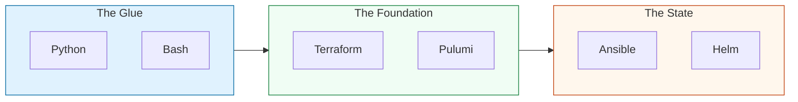

# 🏗️ Part 1: Infrastructure Automation

> **"If you have to do it thrice, automate it. If you have to do it twice, script it. If you have to do it once, document it so you can automate it next time."**

## 📖 Overview

Part 1 focuses on the core mechanics of Infrastructure as Code (IaC) and Configuration Management. We bridge the gap between manually typing commands into a terminal and managing thousands of cloud resources through declarative files.

## Core Concept: The "State" of the World
**[REFERENCE: IaC & State Management](./REFERENCE/IaC-State-Management-Ref.md)**

Infrastructure as Code is not just about scripts; it is about managing a desired state:
- **Declarative vs. Imperative**: Moving away from "Step-by-Step" instructions to "Final-State" definitions.
- **State Files**: Understanding the critical mapping between your code and the real cloud resources.
- **Idempotency**: Ensuring automation can be run repeatedly without causing duplicate or destructive side effects.

## Enterprise Governance: Infrastructure Compliance
**[REFERENCE: Infrastructure Compliance](./REFERENCE/Infrastructure-Compliance-Ref.md)**

Scaling infrastructure requires rigorous guardrails to prevent chaos:
- **Drift Detection**: Automatically identifying when manual changes have been made in the console, violating the code "Source of Truth."
- **Static Analysis (SAST-IaC)**: Scanning Terraform and Ansible code for security misconfigurations (Checkov, TFSec) before deployment.
- **Policy as Code**: Implementing automated gates (OPA/Sentinel) to enforce sizing, region, and security standards.
- **Immutable Infrastructure**: The discipline of replacing resources rather than patching them, ensuring consistency across the estate.

## 🎓 Learning Objectives

- **Advanced Logic**: Transition from simple scripts to modular, error-handled automation suites.
- **State Management**: Understand why "State" is the most important concept in Terraform and Ansible.
- **Cloud-Native IaC**: Deploy complex VPCs, EKS clusters, and RDS instances programmatically.
- **Audit & Compliance**: Learn to automatically scan your infrastructure for misconfigurations.

## 🔑 Key Modules

### 1. [Scripting Automation](./01-Scripting-Automation/README.md)
Advanced Bash patterns, Python for DevOps (Boto3/Request), and automation best practices.

### 2. [Config Management](./02-Config-Management/README.md)
The heavy hitters: Terraform, Ansible, Chef, Puppet, and the world of Helm/Kustomize.

### 3. [Cloud Platforms](./03-Cloud-Platforms/README.md)
Platform-specific engineering for AWS, Azure, and Google Cloud.

### 4. [System Administration](./04-System-Administration/README.md)
Lower-level auditing and Linux system compliance automation.

---

## 🚀 Professional Pattern: "The Declarative Switch"

In the past, engineers wrote **Imperative** scripts (Step 1: Do X, Step 2: If Y, do Z).  
**The Pro Standard** is **Declarative**: "I want a server with 4GB RAM and Nginx installed. I don't care how you get there."

Tools like Terraform and Ansible manage the *drift*—taking the current mess and forcing it to match your code perfectly.

---

## ❓ Knowledge Check

1. **What is 'Idempotency' in automation?**
   - It's the property where an operation can be applied multiple times without changing the result beyond the initial application. (e.g., Ansible only changes a file if its content doesn't match the source).

2. **Why use Terraform for Provisioning and Ansible for Configuration?**
   - Terraform is built to handle the lifecycle of resources (create/destroy). Ansible is built to handle the state *inside* those resources (packages/services).

---

## 🔗 Next Steps
Once you master the creation of infrastructure, you must learn how to protect the delivery of that code.

Proceed to: **[Part 2: Delivery & Governance](../Part-2-Delivery-and-Governance/README.md)** →
