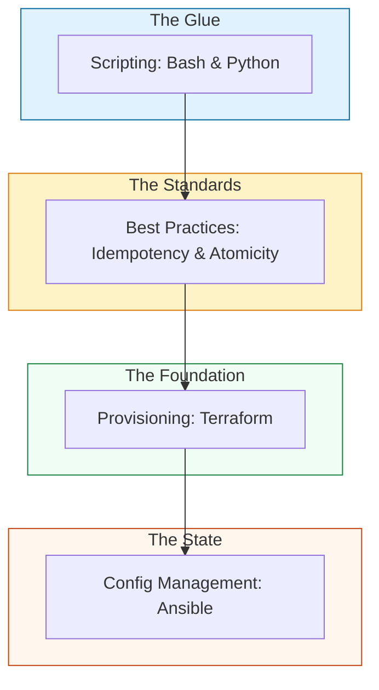

# 🏗️ Infrastructure Automation: The Architect's Portal

> **"A junior engineer writes scripts to automate tasks. A senior engineer architect's systems that automate themselves. A staff engineer designs the standards that make both possible."**

Welcome to the central hub for **Infrastructure Automation**. We are moving away from manual configuration toward a world where infrastructure is code, state is managed, and failures are handled before they happen.

---

## 🗺️ The Automation Ecosystem

This portal bridges the gap between raw scripting and enterprise-grade configuration management.

---

## 📂 Core Modules

### 1. [🤖 Scripting Automation](./01-Scripting-Automation/README.md)
Master the "Glue" of DevOps. Intermediate Shell patterns, Boto3 SDKs, and high-performance data parsing.

### 2. [🛡️ Automation Best Practices](./04-Automation-Best-Practices/README.md)
The production standard. Deep-dives into **Idempotency**, **Atomic Operations**, and the **Check-Act-Verify** pattern.

### 3. [⚙️ Config Management](./02-Config-Management/README.md)
Terraform, Ansible, and the world of Declarative infrastructure. Moving from "Steps" to "State."

### 4. [☁️ Cloud Platforms](./03-Cloud-Platforms/README.md)
Platform-specific engineering for AWS, Azure, and Google Cloud at scale.

### 5. [🖥️ System Administration](./05-System-Administration/README.md)
Lower-level auditing, Linux security hardening, and compliance automation.

---

## 🏆 Engineering Assets

- **[CHALLENGES.md](./CHALLENGES.md)**: "Hard-Mode" labs including Self-Healing Daemons and JSON/YAML Transformers.
- **[REFERENCE Hub](./REFERENCE/)**: Deep-dives into State Management, Compliance, and IaC design patterns.

---

## 🎙️ Staff Interview Preparation

1.  **"Why is 'State' the most important concept in modern automation?"**
    *   *Answer:* State allows tools to calculate the "Diff" between reality and code. Without state, you are just blindly running commands (imperative), which leads to drift and non-idempotent failures.
2.  **"How do you handle secrets in a multi-stage CI/CD pipeline?"**
    *   *Answer:* Use a centralized Secret Manager (Vault/AWS SM). Inject secrets as environment variables only at runtime, never commit them to git, and use short-lived tokens.
3.  **"What is the 'Declarative Switch' and why does it matter?"**
    *   *Answer:* It's moving from "Do X then Y" to "I want the system to look like Z." This allows tools to be self-healing—if someone changes a setting manually, the declarative tool sees the drift and reverts it.

---

## 🧠 Knowledge Check

1.  **Which pattern ensures a script doesn't break things if run twice?**
    *   [ ] Sequential Execution
    *   [x] Idempotency
    *   [ ] Redundancy
2.  **Infrastructure as Code (IaC) is primarily used for:**
    *   [x] Provisioning resources (Servers, Networks).
    *   [ ] Editing text files.
    *   [ ] Creating user accounts.
3.  **True or False: Shell scripts should be used for complex database migrations.**
    *   [ ] True
    *   [x] False (Use Python or specialized migration tools for complex logic).
4.  **In the context of reliability, what is 'Atomicity'?**
    *   [ ] Running a script very fast.
    *   [x] Ensuring a task completes 100% or not at all.
    *   [ ] Splitting code into small files.
5.  **Which command is part of the 'DevOps Fail-Fast Protocol'?**
    *   [ ] `set -x`
    *   [x] `set -euo pipefail`
    *   [ ] `rm -rf /`

---

[⬅️ Back to Phase 2](../../README.md)
