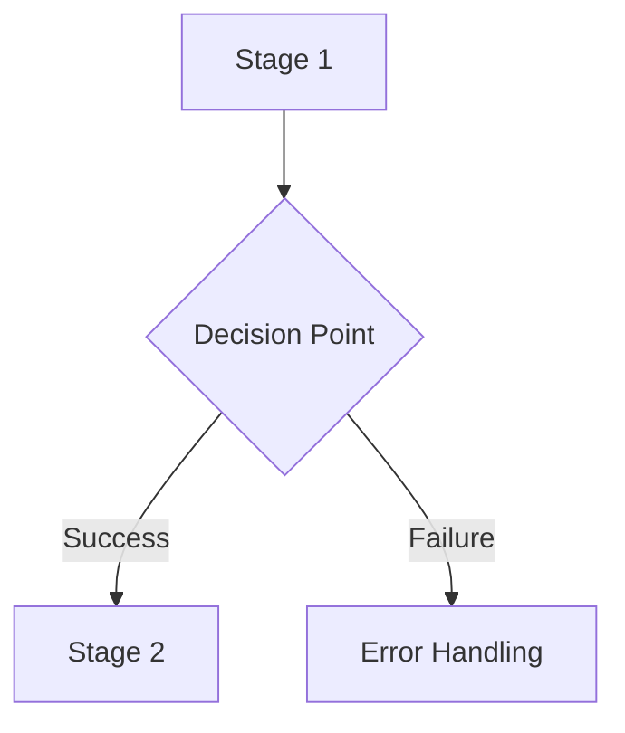

# README Enhancement Style Guide for Junior DevOps Engineers

## 🎯 Enhancement Pattern

Every enhanced README should follow this structure to create comprehensive learning materials:

### 📋 Standard Structure (10 Sections)

1. **Introduction & Why It Matters**
2. **Table of Contents**
3. **Core Concepts with Diagrams**
4. **Deep-Dive Technical Content**
5. **Real-World Scenarios (3+ incidents)**
6. **Security Best Practices**
7. **Common Pitfalls & Solutions**
8. **Hands-On Exercises (3+ exercises)**
9. **Interview Preparation (8+ questions)**
10. **Knowledge Check & Self-Assessment**

---

## 📝 Section-by-Section Guidelines

### 1. Introduction (200-300 words)

**Template**:
```markdown
# 🔧 [Module Title]: [Subtitle]

> **"[Impactful Quote about the topic]"**

[2-3 paragraph introduction]

**Why This Matters for Junior DevOps Engineers:**
- 🚨 **[Impact Category]**: [Specific statistic or fact]
- 💰 **[Impact Category]**: [Specific statistic or fact]
- 🎯 **[Impact Category]**: [Specific statistic or fact]
- 🔧 **[Impact Category]**: [Specific statistic or fact]
```

**Example**:
```markdown
**Why This Matters for Junior DevOps Engineers:**
- 🚨 **Production Impact**: 90% of API failures are from improper error handling
- 💰 **Cost Factor**: Rate limiting violations can cost $10k+ in overage fees
- 🎯 **Interview Weight**: REST API consumption is tested in 95% of DevOps interviews
- 🔧 **Daily Operations**: Average DevOps engineer makes 50+ API calls per day
```

---

### 2. Table of Contents

Always include these sections:
```markdown
## 📚 Table of Contents

1. [Core Concepts](#-core-concepts)
2. [Technical Deep-Dive](#-technical-deep-dive)
3. [Real-World Scenarios](#-real-world-scenarios)
4. [Security Best Practices](#-security-best-practices)
5. [Common Pitfalls](#-common-pitfalls--solutions)
6. [Hands-On Exercises](#-hands-on-exercises)
7. [Interview Preparation](#-interview-preparation)
8. [Knowledge Check](#-knowledge-check)
```

---

### 3. Core Concepts with Diagrams

**Include**:
- Mermaid diagrams (lifecycle/architecture)
- Breakdown for beginners
- Stage-by-stage explanation

**Template**:
```markdown
## 🏗️ [Topic] Lifecycle



### 🔍 Lifecycle Breakdown

**Stage 1: [Name]**
- **What**: [Description]
- **Why**: [Reason]
- **How**: [Method]
```

---

### 4. Technical Deep-Dive

**Structure**:
- Start with "Why Old Way vs New Way"
- Provide comprehensive code examples
- Show anti-patterns (❌) vs best practices (✅)
- Include 3-5 subsections

**Code Example Pattern**:
```markdown
### [Feature Name]

**The Old Way (Deprecated)**:
```python
# ❌ BAD - [Why it's bad]
[bad code example]
```

**The Modern Way**:
```python
# ✅ GOOD - [Why it's good]
[good code example]
```

**Production-Grade Implementation**:
```python
# Complete example with error handling
[comprehensive code]
```
```

---

### 5. Real-World Scenarios (Minimum 3)

**Required Elements**:
- Incident description
- Failure impact (quantified)
- Root cause analysis
- The fix (code)
- Lessons learned

**Template**:
```markdown
## 🎭 Real-World DevOps Scenarios

### 🛡️ Scenario 1: The "[Catchy Name]" Incident

**The Incident:** [What happened]

**The Failure:** [What broke]

**The Impact:**
- ❌ [Impact 1]
- ❌ [Impact 2]  
- ❌ [Quantified cost/time]

**The Root Cause:**
```python
# ❌ BROKEN CODE
[problematic code]
```

**The Fix:**
```python
# ✅ CORRECTED CODE
[fixed code with explanation]
```

**Lessons Learned:**
1. [Lesson 1]
2. [Lesson 2]
3. [Lesson 3]
```

**Example Scenarios to Include**:
- Security vulnerability discovered
- Performance issue at scale
- Data loss or corruption
- Cost overrun
- Compliance violation

---

### 6. Security Best Practices

**Include**:
- Common vulnerabilities
- Prevention techniques
- Code examples
- Reference to OWASP or industry standards

**Template**:
```markdown
## 🔒 Security Best Practices

### 1. [Vulnerability Name]

**The Risk**: [Description]

**Attack Example**:
```python
# ❌ VULNERABLE
[exploitable code]
```

**Mitigation**:
```python
# ✅ SECURE
[safe code]
```

**Detection**: How to find this in existing code
**Prevention**: How to avoid during development
```

---

### 7. Common Pitfalls & Solutions (Minimum 5)

**Template**:
```markdown
## ⚠️ Common Pitfalls & Solutions

### Pitfall 1: [Name]

**Problem**:
```python
# ❌ BAD
[incorrect code]
```

**Why It Fails**: [Explanation]

**Solution**:
```python
# ✅ GOOD
[correct code]
```

**Prevention**: [How to avoid]
```

**Common Categories**:
- Error handling mistakes
- Resource leaks
- Performance issues
- Security holes
- Configuration errors

---

### 8. Hands-On Exercises (Minimum 3)

**Exercise Types**:
1. **Guided Exercise**: Starter code with TODOs
2. **Challenge Exercise**: Requirements only
3. **Debugging Exercise**: Fix broken code

**Template**:
```markdown
## 🎯 Hands-On Exercises

### Exercise 1: [Name]

**Objective**: [Learning goal]

**Requirements**:
- [Requirement 1]
- [Requirement 2]
- [Requirement 3]

**Starter Code**:
```python
#!/usr/bin/env python3
"""
[Description]
"""

def main():
    # TODO: [Specific task]
    # TODO: [Specific task]
    pass

if __name__ == "__main__":
    main()
```

**Solution Hints**:
1. [Hint about approach]
2. [Hint about specific method]
3. [Hint about error handling]

**Verification**:
```bash
# Test your solution
python3 solution.py
# Expected output: [...]
```
```

---

### 9. Interview Preparation (Minimum 8 Questions)

**Question Categories**:
- Foundation (2-3 questions)
- Intermediate (2-3 questions)
- Advanced/Scenarios (2-3 questions)

**Template**:
```markdown
## 🎙️ Interview Preparation

### Foundation Questions

**1. "[Question]"**

**Answer**: 
[2-3 paragraph detailed answer]

**Example**:
```python
# Code demonstrating the concept
```

**Follow-up**: "[Related question]"
- [Follow-up answer]

---

**2. "[Question]"**
...

### Advanced Scenario Questions

**6. "[Complex scenario question]"**

**Answer**:
[Step-by-step solution]

```python
# Implementation
```

**Why it matters**: [Real-world relevance]
```

---

### 10. Knowledge Check & Self-Assessment

**Multiple Choice (5-8 questions)**:
```markdown
## 🧠 Knowledge Check

### Basic Concepts

**1. [Question]**
- [ ] Option A
- [ ] Option B
- [x] Option C (correct)
- [ ] Option D

**Explanation**: [Why C is correct]

---

### Advanced Scenarios

**6. What's wrong with this code?**
```python
[problematic code]
```

- [ ] Missing imports
- [x] [Actual problem]
- [ ] Bad naming
- [ ] Wrong algorithm

**Explanation**: [Detailed explanation]
```

**Self-Assessment Checklist**:
```markdown
## 🎓 Self-Assessment Checklist

Before moving to the next module, ensure you can:

- [ ] [Skill 1]
- [ ] [Skill 2]
- [ ] [Skill 3]
- [ ] [Skill 4]
- [ ] [Skill 5]
- [ ] [Skill 6]
- [ ] [Skill 7]
- [ ] [Skill 8]
- [ ] [Skill 9]
- [ ] [Skill 10]

**Score yourself**: 
- 8+/10 = Ready to advance 
- 5-7/10 = Review exercises 
- <5/10 = Practice more
```

---

## 📏 Length Guidelines

**Target Lengths**:
- **Minimum**: 800 lines
- **Optimal**: 1,000-1,500 lines
- **Maximum**: 2,000 lines (only for complex topics)

**Section Breakdown**:
- Introduction: 50-100 lines
- Technical Content: 400-800 lines
- Scenarios: 150-250 lines
- Exercises: 150-250 lines
- Interview Prep: 200-300 lines
- Knowledge Check: 100-150 lines

---

## 🎨 Formatting Standards

### Code Blocks

**Always include**:
- Shebang for scripts (`#!/usr/bin/env python3`)
- Docstrings
- Type hints
- Comments explaining non-obvious logic
- Error handling

**Example**:
```python
#!/usr/bin/env python3
"""
Module description.

Author: DevOps Team
Version: 1.0.0
"""

import logging
from typing import Dict, List, Optional

def process_data(input_data: List[Dict]) -> Optional[Dict]:
    """
    Process configuration data with validation.
    
    Args:
        input_data: List of configuration dictionaries
        
    Returns:
        Processed configuration or None on error
        
    Raises:
        ValueError: If input validation fails
    """
    # Validation
    if not input_data:
        logging.error("Empty input data")
        return None
    
    try:
        # Processing logic
        result = {}
        for item in input_data:
            # Process each item
            pass
        
        return result
        
    except Exception as e:
        logging.error(f"Processing failed: {e}")
        return None
```

### Visual Elements

**Use emojis consistently**:
- 🎯 Objectives/Goals
- ✅ Correct examples
- ❌ Incorrect examples
- 🚨 Warnings/Alerts
- 💡 Tips/Insights
- 🔒 Security
- 🎭 Scenarios
- 📊 Statistics/Data
- 🔥 Critical issues

### Headers

**Hierarchy**:
```markdown
# Main Title (H1) - Only once
## Major Section (H2)
### Subsection (H3)
#### Sub-subsection (H4) - rarely needed
```

---

## ✅ Quality Checklist

Before finalizing enhancement, verify:

### Content
- [ ] All 10 sections present
- [ ] Minimum 3 real-world scenarios
- [ ] Minimum 3 hands-on exercises
- [ ] Minimum 8 interview questions
- [ ] 10-item self-assessment checklist

### Technical Accuracy
- [ ] All code examples tested (or clearly marked as pseudocode)
- [ ] Type hints included
- [ ] Error handling demonstrated
- [ ] Security considerations addressed

### Junior Engineer Focus  
- [ ] Explains "why" not just "what"
- [ ] Includes beginner breakdowns
- [ ] Provides production context
- [ ] Links to real-world impact
- [ ] Clear progression from basic to advanced

### Formatting
- [ ] Consistent emoji usage
- [ ] Proper markdown formatting
- [ ] Code blocks have language specified
- [ ] Links work correctly
- [ ] Mermaid diagrams render

### Comprehensiveness
- [ ] Covers common pitfalls
- [ ] Includes troubleshooting
- [ ] Provides additional resources
- [ ] Has navigation links (prev/next)
- [ ] Target length achieved (800-1500 lines)

---

## 🔄 Enhancement Workflow

1. **Read Original**: Understand current content
2. **Identify Gaps**: What's missing for junior engineers?
3. **Research**: Find real-world examples and incidents
4. **Structure**: Organize into 10-section template
5. **Write**: Create comprehensive content
6. **Review**: Check against quality checklist
7. **Test**: Verify code examples work
8. **Finalize**: Polish and format

---

## 📖 Example Enhancements

See these completed enhancements as reference:
- `01-Python-Environment-and-Basics/README.md` (1,380 lines)
- `02-System-and-File-Operations/README.md` (1,500 lines)

Both follow this guide exactly.

---

**Remember**: The goal is to create learning materials so comprehensive that a junior engineer can:
1. Understand the concept deeply
2. Apply it in production
3. Troubleshoot issues
4. Pass interviews
5. Assess their own progress

Make every README a complete learning experience! 🚀
