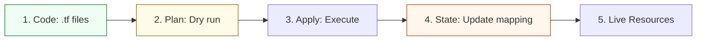

# IaC & State Management Reference

**Doc Version:** 1.0.0
**Role:** Infrastructure Architect
**Scope:** Terraform, State Management, and Resource Lifecycles

---

## 1. The Declarative Philosophy

Infrastructure as Code (IaC) shifts infrastructure management from manual "snowflake" server configuration to a version-controlled, automated process.

### Imperative vs. Declarative
- **Imperative (Task-based)**: "Step 1: Create a VM. Step 2: Install Nginx. Step 3: Open Port 80." (e.g., Shell scripts, AWS CLI).
- **Declarative (State-based)**: "I want 3 VMs with Nginx and Port 80." (e.g., Terraform, CloudFormation, Kubernetes YAML).

**The Benefit**: In a declarative system, the tool calculates the "Plan" (diff) between the current state and requested state and performs only the necessary actions.

---

## 2. The Golden Concept: "State"

The most critical component of provisioning tools like Terraform is the **State File** (`terraform.tfstate`).

### What is State?
- It is a mapping between your configuration file and the real-world resources in the cloud provider.
- It stores metadata (IP addresses, IDs, dependencies) that cannot be derived from code alone.

### State Governance
- **Locking**: Always use a remote backend (S3/DynamoDB, Azure Blob) to prevent two engineers from modifying the same resource simultaneously.
- **Secrecy**: State files often contain sensitive data (database passwords, private keys) in plain text. They must be encrypted at rest and never committed to Git.
- **Drift**: When someone manually modifies a resource in the AWS Console, the code and state become "out of sync." This is known as **Configuration Drift**.

---

## 3. Provisioning vs. Configuration Management

| Feature | Provisioning (e.g., Terraform) | Config Management (e.g., Ansible) |
| :--- | :--- | :--- |
| **Primary Goal** | Create/Destroy infrastructure | Install/Configure software |
| **Focus** | Immutable resources (VPCs, RDS, EC2) | Mutable state (Packages, Users, Files) |
| **Logic** | Declarative | Hybrid (Declarative modules, Imperative tasks) |
| **Pattern** | "The Foundation" | "The Polish" |

---

## 4. Visualizing the IaC Lifecycle

---

## 5. Idempotency and Safety

Automation must be safe. A script that creates a duplicate server every time it runs is dangerous.

- **Idempotency Rule**: Running the same script multiple times should result in the same final state.
- **Dry-Run first**: Always review the output of `terraform plan` or `ansible --check` before applying changes to production.

---

## 6. Enterprise Patterns

- **Modularization**: Break infrastructure into reusable components (Modules). Don't define a VPC 10 times; write one VPC module and call it with different parameters.
- **DRY (Don't Repeat Yourself)**: Use tools like **Terragrunt** to manage multiple environments (Dev/QA/Prod) without duplicating code.
- **Testing IaC**: Use `tflint` for static analysis and `terratest` for functional testing of your infrastructure code.

> **Enterprise Pattern**: Implement **State Isolation**. Every environment (Dev, Staging, Production) must have its own separate state file and its own separate cloud account (or VPC) to prevent an accidental `terraform destroy` in Dev from impacting Production.
