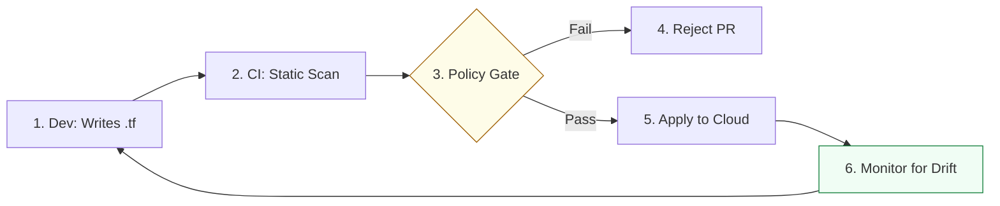

# Infrastructure Compliance & Governance Reference

**Doc Version:** 1.0.0
**Role:** DevSecOps Engineer / Compliance Officer
**Scope:** Scanning, Drift, and Policy Enforcement

---

## 1. The Compliance Shift-Left

Infrastructure compliance means ensuring that every resource created in the cloud meets organizational security and cost standards *before* it is even created.

### Standards include:
- **Networking**: No public S3 buckets, no port 22 open to 0.0.0.0/0.
- **Cost**: Every resource must have an `Owner` and `CostCenter` tag.
- **Resilience**: Every production database must have encrypted backups enabled.

---

## 2. Drift Detection & Self-Healing

**Drift** occurs when the real-world state of a resource deviates from its defined code.

### Managing Drift:
1.  **Detection**: Run regular `terraform plan` schedules via CI to identify differences.
2.  **Notification**: Alert the engineering team when drift is detected.
3.  **Remediation (Self-Healing)**:
    - **Re-Apply**: Automatically run `terraform apply` to overwrite the manual change.
    - **GitOps**: Use tools like Flux/ArgoCD for Kubernetes to continuously reconcile the cluster state.

---

## 3. Static Analysis for Infrastructure (SAST-IaC)

Before running `terraform apply`, we scan the code for vulnerabilities.

| Tool | Focus | Usage |
| :--- | :--- | :--- |
| **Checkov** | Multi-cloud Security | Scan HCL, Terraform, Kubernetes, ARM, and Bicep. |
| **TFLint** | Terraform Logic | Find provider-specific errors and enforce naming conventions. |
| **TFSec** | Security Risks | Specialized security scanning for Terraform. |
| **Infracost** | Cost Analysis | Estimate the monthly cost of a change before it's applied. |

---

## 4. Visualizing the Compliance Pipeline

---

## 5. The "Policy as Code" Standard (Sentinel/Rego)

Advanced organizations use policy engines to enforce complex rules.

- **HashiCorp Sentinel**: Embedded into Terraform Cloud to block non-compliant runs (e.g., "Only allow t3.medium instances in Prod").
- **OPA (Open Policy Agent)**: A generic language (**Rego**) that can be used to validate infrastructure, Kubernetes manifests, and authorization logic.

---

## 6. Enterprise Governance: The "Cloud Guardrails"

- **Immutable Infrastructure**: Once a server is deployed, never SSH into it to fix it. If you need a change, update the code, bake a new image (AMI), and redeploy.
- **Multi-Account Strategy**: Isolate workloads into separate cloud accounts to limit the "Blast Radius" of a security breach or accidental deletion.
- **Service Control Policies (SCPs)**: Use cloud-native guardrails to prevent anyone (even root) from performing dangerous actions (e.g., disabling CloudTrail).

> **Enterprise Pattern**: Implement **Automated Tag Enforcement**. Any resource created without a valid `ProjectID` and `Environment` tag is automatically terminated within 15 minutes by an automated Lambda script. This forces compliance through "Positive Reinforcement" of company standards.
