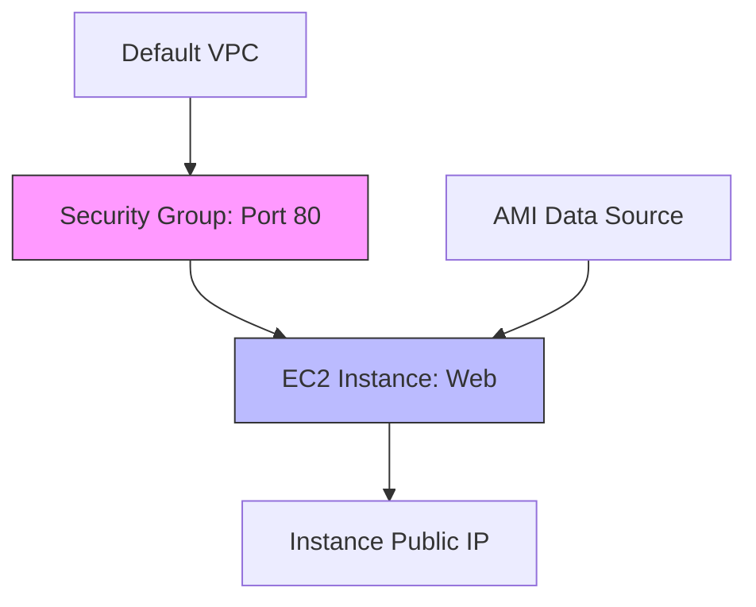

Practical examples to get you started with Terraform. These snippets are designed to be "Copy-Paste-Ready" while teaching the fundamental building blocks of infrastructure.
## 📚 Example Catalog

| # | Example | Key Concepts | Resources Used |
| :--- | :--- | :--- | :--- |
| **01** | **[Simple S3 Bucket](#1-simple-s3-bucket)** | Global uniqueness, Tags | `aws_s3_bucket` |
| **02** | **[EC2 Web Server](#2-web-server-with-security-group)** | VPC, Security Groups, Dependencies | `aws_instance`, `aws_security_group` |
| **03** | **[Random Provider](#3-using-random-ids)** | Local resources, unique suffixes | `random_id`, `random_string` |
| **04** | **[Local Files](#4-manipulating-local-files)** | Managing non-cloud resources | `local_file` |

---
## 🏗️ Resource Dependency Graph

---
## 🏗️ Real-Life Scenarios

### Scenario 1: The "Copy-Paste" Disaster
**Problem**: An engineer copied a "Basic Example" for an S3 bucket and ran it in the production account.
**Crisis**: Because the bucket name was hardcoded as `my-test-bucket`, the deployment failed because the name was already taken globally by another AWS user.
**Outcome**: The deployment pipeline was blocked for 2 hours while they manually changed the code.
**Solution**: Use the **Random Provider**. Add a `random_id` resource and append the hex result to the bucket name to guarantee uniqueness across the globe.
**Result**: The team standardized on "Dynamic Naming" for all shared resources, eliminating naming conflicts forever.
### Scenario 2: The "Forgot the Firewall" Outage
**Problem**: A developer deployed a "Basic EC2" from a tutorial.
**Crisis**: They forgot to attach a Security Group. The instance was running, but they couldn't SSH into it or reach the web server.
**Outcome**: The developer wasted 3 hours thinking the AMI was broken.
**Solution**: Use **Implicit Dependencies**. By referencing `vpc_security_group_ids = [aws_security_group.web.id]`, Terraform ensures the firewall is created FIRST and attached correctly.
**Result**: The team learned that "Standalone" resources are rare; infrastructure is a web of dependencies.
### Scenario 3: The "Accidental Deletion" Gameday
**Problem**: During a training exercise, a junior admin ran `terraform destroy` on a "Basic Example" folder.
**Crisis**: They didn't realize that a critical production database was (improperly) managed in that same folder.
**Outcome**: High-value data was deleted in seconds.
**Solution**: Implement the **Lifecycle Prevent Destroy** hook. In every critical resource block, add `lifecycle { prevent_destroy = true }`.
**Result**: Operations now have a safety net that requires two levels of manual code change before a critical resource can be touched by `terraform destroy`.

---

## ❓ Interview Questions

1.  **How do you handle 'Global Uniqueness' for resources like S3 buckets in Terraform?**
    - *Answer*: You should use the `random_id` or `random_pet` resource from the Random provider. By appending a random suffix to your resource names, you prevent "Name already exists" errors when deploying to different accounts or regions.
2.  **Explain the difference between a 'Resource' and a 'Data Source' in a basic example.**
    - *Answer*: A **Resource** (e.g., `aws_instance`) tells Terraform to *create and manage* something. A **Data Source** (e.g., `data "aws_ami"`) tells Terraform to *lookup and fetch* information about something that already exists.
3.  **Why do we use 'tags' in almost every AWS example?**
    - *Answer*: Tags are essential for cost allocation, security filtering, and general organization. In production, policies often require tags like `Environment`, `Owner`, and `Project` for any resource to be allowed to exist.
4.  **How do you reference the ID of a resource created in the same file?**
    - *Answer*: You use the format `<RESOURCE_TYPE>.<RESOURCE_NAME>.<ATTRIBUTE>`. For example, `aws_instance.web.id`. You do NOT use quotes around this reference.
5.  **What is 'User Data' in an EC2 instance resource?**
    - *Answer*: It is a script (usually Shell or Cloud-Init) that runs exactly once when the instance is first launched. It's used for basic bootstrapping, like installing Nginx or updating the OS.
6.  **Can you manage a file on your local laptop using Terraform?**
    - *Answer*: Yes, using the `local` provider and the `local_file` resource. This is a great way to generate local configuration files or SSH keys that are derived from your cloud infrastructure.

---

## 🧠 Comprehensive Quiz (25 Questions)

<b>1. Which block is used to create an AWS S3 bucket?</b>

Show Answer

Answer: B

<b>2. True/False: S3 bucket names must be globally unique across all AWS accounts.</b>

Show Answer

Answer: A

<b>3. To reference a variable named 'instance_type', you use:</b>

Show Answer

Answer: B

<b>4. How do you add a description to a resource in the code?</b>

Show Answer

Answer: A

<b>5. Which resource type is used to generate a random string?</b>

Show Answer

Answer: B

<b>6. 'ami' stands for:</b>

Show Answer

Answer: A

<b>7. True/False: A single Terraform file can contain multiple resource blocks.</b>

Show Answer

Answer: A

<b>8. Which attribute allows an EC2 instance to accept a security group?</b>

Show Answer

Answer: B

<b>9. To see the value of an 'output' block after apply, you run:</b>

Show Answer

Answer: B

<b>10. What does 'instance_type = "t3.micro"' define?</b>

Show Answer

Answer: B

<b>11. Which provider is used to create a file on the local disk?</b>

Show Answer

Answer: B

<b>12. 'Tags' are usually provided as which data type?</b>

Show Answer

Answer: B

<b>13. How do you 'Destroy' only the resources in your basic example?</b>

Show Answer

Answer: B

<b>14. True/False: Terraform resources are created in the order they appear in the file.</b>

Show Answer

Answer: A

<b>15. Which block is used to fetch the ID of the 'Default VPC'?</b>

Show Answer

Answer: A

<b>16. 'count = 3' in a resource block will:</b>

Show Answer

Answer: B

<b>17. How do you provide a 'Default Value' for a variable?</b>

Show Answer

Answer: A

<b>18. Which symbol is used for 'Interpolation' in HCL?</b>

Show Answer

Answer: B

<b>19. 'ingress' in a security group defines:</b>

Show Answer

Answer: B

<b>20. True/False: You can manage resources in multiple regions in one file.</b>

Show Answer

Answer: A

<b>21. 'cidr_blocks = ["0.0.0.0/0"]' means:</b>

Show Answer

Answer: B

<b>22. Which command helps you check if your basic example has syntax errors?</b>

Show Answer

Answer: B

<b>23. The 'Public IP' of an instance is usually fetched via:</b>

Show Answer

Answer: B

<b>24. Basic examples are the _____ of complex architectures.</b>

Show Answer

Answer: B

<b>25. Code reuse starts with _____ examples.</b>

Show Answer

Answer: B

