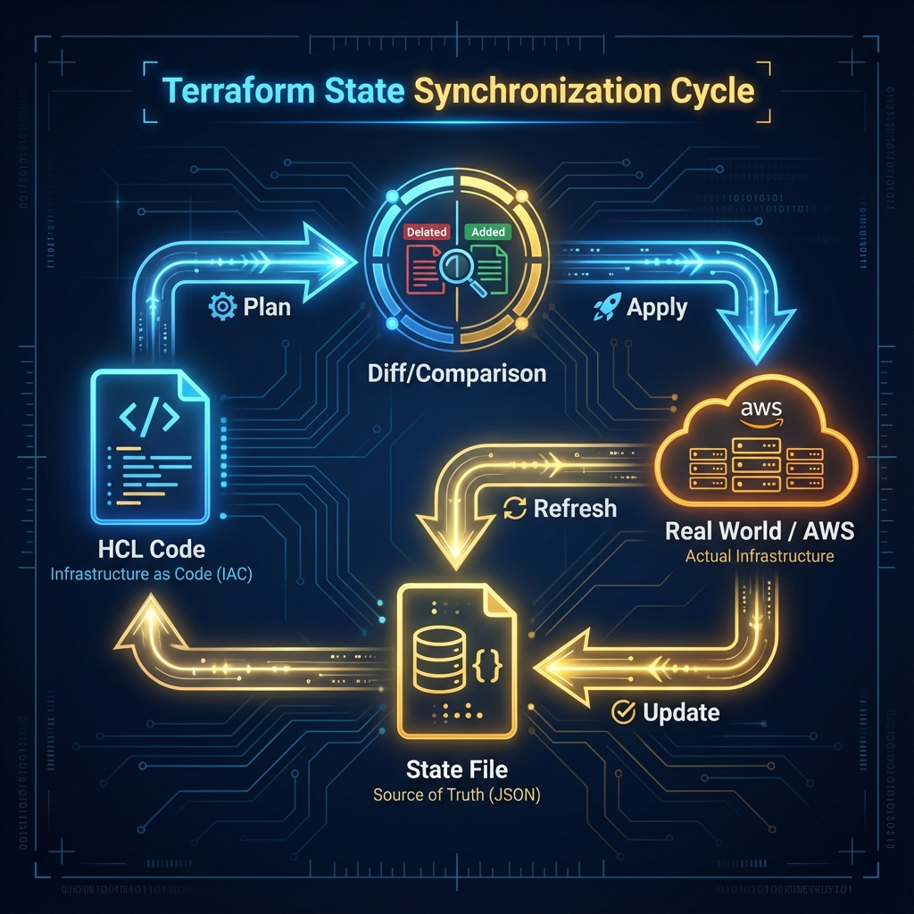

# The Mind of Terraform

Terraform State is the "Source of Truth" for your infrastructure. It is a JSON file that maps your code to real-world resources, ensuring that your infrastructure remains predictable and manageable.

## 🚠 The Sync Cycle (Code vs State vs Cloud)
Terraform's job is to make the **Real World** match your **Desired State (Code)**, using the **State File** as the bridge between the two.

---

## 🛡️ Security & Reliability Features

1.  **Immutability**: While the state file changes, previous versions should be immutable (achieved via Versioning) to allow rollbacks.
2.  **Validation**: Terraform performs a schema check and a serial number check against the state file before every operation to ensure integrity.
3.  **Sensitive Data Marking**: The state file is the valid source of truth for "Sensitivity". Even if your terminal output hides a password, the State File **must** record it to manage it, making encryption critical.
4.  **Locking Mechanism**: The state file format supports a "Lock" metadata field that backends use to prevent race conditions.

---

## 🌟 Best Practices

1.  **Never Edit Manually**: The `.tfstate` file contains calculated hashes and dependency graphs. Editing it manually breaks these calculations and can corrupt the state permanently. Use `terraform state` commands instead.
2.  **Commit Code, Not State**: Never `git commit` your `terraform.tfstate` file. It contains secrets and environment-specific IDs. Add `*.tfstate` and `*.tfstate.backup` to your `.gitignore`.
3.  **Review Plans**: Always review the `terraform plan` output. It essentially shows you the "Diff" between your Code and the State. Understanding this Diff prevents accidental deletions.
4.  **Backup Before Operations**: If performing dangerous operations like `state mv` or `import`, confirm you have a backup (or meaningful S3 version) to restore from if things go wrong.

---

## 🏗️ Real-Life Scenarios

### Scenario 1: The "Ghost" Resource Outage
**Problem**: An engineer manually deleted a critical VPC Peering connection in the AWS console to "fix" a routing issue.
**Crisis**: Terraform still had the connection in its state file. When another user ran `terraform apply` for a different service, Terraform assumed the peering still existed and didn't attempt to fix it, but the routing remained broken.
**Outcome**: The cross-vpc communication was down for 4 hours because the team didn't realize the "Source of Truth" was out of sync.
**Solution**: Run `terraform refresh` or a regular `terraform plan`. These commands query the cloud API to update the state file metadata.
**Result**: The drift was detected immediately, and a single `terraform apply` recreated the missing peering connection.
### Scenario 2: The "Version Jump" Corruption
**Problem**: A team was using Terraform v0.11 and decided to upgrade to v1.5 overnight without testing.
**Crisis**: Terraform v1.5 uses a completely different state version format (Version 4). Once the first user ran `apply`, the state file was upgraded. 
**Outcome**: The rest of the team, still using v0.11, could no longer read the state file, halting all production changes for 2 days.
**Solution**: Use a **State Backup** and **Version Pinning**. Always backup your `.tfstate` before a major upgrade and enforce a specific `required_version` in the project.
**Result**: The team recovered from the backup and performed a staged migration following the official HashiCorp upgrade path.

### Scenario 3: The "Accidental Plain-Text Secret"
**Problem**: A developer used Terraform to create a Database and an RDS user, using the `random_password` resource. 
**Crisis**: An auditor noted that the "Secret" password was stored in the `.tfstate` file in plain text, even though it was marked as `sensitive` in the outputs.
**Outcome**: The security team flagged the entire IaC repository as a critical risk.
**Solution**: Enabled **Bucket-Level Encryption (KMS)** and **Least Privilege IAM** for the S3 backend. State is NEVER fully secret to those who can read the file; therefore, access to the file must be strictly controlled.
**Result**: Security was satisfied once the state file was moved to a hardened S3 bucket where only the CI/CD pipeline and lead SREs had access.

---
## ❓ Interview Questions

1.  **What is the 'Lineage' field in the state file used for?**
    

    
Answer
 Lineage is a unique ID assigned when a state file is first created. It stays consistent throughout the life of the state. It allows Terraform to ensure you aren't accidentally trying to apply a completely different state file (from a different project) to your current environment.

2.  **Explain the significance of the 'Serial' number in state.**
    

    
Answer
 The serial number is an integer that increments every time the state is modified. It acts as a version marker. If two people try to update the state, Terraform checks the serial; if the version you have locally is older than the one in the backend, it prevents the update to avoid data loss.
    

3.  **Does the state file improve performance? How?**
    

    
Answer
 Yes. For large infrastructures with thousands of resources, querying the cloud API for every single resource takes a long time. Terraform uses the state as a cache for resource attributes. When you run `plan`, it can use this cached data (or refresh it selectively) to build the dependency graph much faster.
    

4.  **Is it possible to have multiple state files for a single project?**
    

    
Answer
 Yes, this is often done to reduce "Blast Radius." Instead of one massive state file, you split infrastructure into layers (e.g., networking, database, app). Each layer has its own state file, so an error in the "App" state won't accidentally corrupt the "Networking" state.
    

5.  **What is 'State Refresh' and when does it happen?**
    

    
Answer
 Refreshing happens by default before every `plan` and `apply`. Terraform queries the cloud providers to see if anything has changed outside of Terraform. The state file is updated to reflect the "Actual" state before the "Desired" state logic is applied.
    

6.  **Why should you NEVER edit the JSON in the state file manually?**
    

    
Answer
 The state file includes complex metadata (serial, lineage, checksums, and dependency mappings). Manual edits are prone to syntax errors or logical inconsistencies that will corrupt the file and make Terraform unable to manage your infrastructure. Always use `terraform state` CLI commands instead.
    

---

## 🧠 Comprehensive Quiz (25 Questions)

<b>1. Terraform state is primarily stored in which technical format?</b>
- A) YAML
- B) XML
- C) JSON
- D) Binary

Show Answer

Answer: C

<b>2. True/False: The state file contains local file paths from the developer's machine.</b>
- A) True (for module sources)
- B) False (it only stores cloud IDs)
- C) True (but only for Provisioners)
- D) False (paths are relative)

Show Answer

Answer: B

<b>3. Which field increments every time a new version of the state is pushed?</b>
- A) version
- B) serial
- C) lineage
- D) terraform_version

Show Answer

Answer: B

<b>4. 'terraform refresh' will update which of the following?</b>
- A) The actual infrastructure resources
- B) The version of Terraform binary
- C) The state file with real-world attributes
- D) The .tf configuration files

Show Answer

Answer: C

<b>5. If 'lineage' doesn't match between your local and remote state, Terraform will:</b>
- A) Automatically merge them
- B) Refuse to run potentially destructive actions
- C) Delete the remote state
- D) Create a new workspace

Show Answer

Answer: B

<b>6. Which AWS service is commonly used to store state files remotely?</b>
- A) EC2 Instace Store
- B) S3 (Simple Storage Service)
- C) RDS (Relational Database Service)
- D) Lambda

Show Answer

Answer: B

<b>7. True/False: State files should be committed to public Git repositories.</b>
- A) True, for collaboration
- B) False, it may contain sensitive secrets
- C) True, but only if encrypted
- D) False, because binary files break Git

Show Answer

Answer: B

<b>8. What is the current standard 'version' of the state file format (as of 2024)?</b>
- A) Version 1
- B) Version 3
- C) Version 4
- D) Version 12

Show Answer

Answer: C

<b>9. 'Metadata' in the state file includes which information?</b>
- A) The AWS Credentials
- B) The cost of resources
- C) The Terraform version and Serial number
- D) The IAM User's password

Show Answer

Answer: C

<b>10. What does 'Drift' mean in Terraform?</b>
- A) Moving code from one folder to another
- B) The difference between the State/Code and the Real World infrastructure
- C) Upgrading Terraform versions
- D) Deleting a state file

Show Answer

Answer: B

<b>11. Which CLI command lists all resources tracked in the state file?</b>
- A) terraform list
- B) terraform state list
- C) terraform show resources
- D) terraform plan -list

Show Answer

Answer: B

<b>12. When does Terraform write an updated state file?</b>
- A) Only after `terraform apply`
- B) After `terraform apply` and `terraform refresh`
- C) After every command
- D) Only when you manually save it

Show Answer

Answer: B

<b>13. How can you view the 'Raw JSON' of your current state?</b>
- A) terraform view
- B) cat terraform.tfstate
- C) terraform show -json
- D) terraform output -json

Show Answer

Answer: B (or C for formatted JSON output)

<b>14. True/False: Sensitive data in state is encrypted by Terraform by default.</b>
- A) True
- B) False (it is stored in plain text JSON)
- C) True, but only for passwords
- D) False, unless you use Terraform Enterprise

Show Answer

Answer: B

<b>15. 'Implicit Dependencies' are determined by:</b>
- A) The `depends_on` meta-argument
- B) One resource referencing the attribute of another resource
- C) The order of resources in the file
- D) Alphabetical naming

Show Answer

Answer: B

<b>16. Which of these is NOT a primary role of the state file?</b>
- A) Performance Caching
- B) Mapping Real World to Code
- C) Storing backup copies of application data
- D) Tracking Metadata

Show Answer

Answer: C

<b>17. What is 'Blast Radius' in the context of state files?</b>
- A) The cost of an S3 bucket
- B) The amount of infrastructure damage a single bad command can cause
- C) The size of the JSON file
- D) The number of developers on a team

Show Answer

Answer: B

<b>18. True/False: Terraform can manage resources without any mapping in the state file.</b>
- A) True
- B) False (If it's not in state, Terraform doesn't know it manages it)
- C) True, using the `import` block only
- D) False, unless you use the `-state=false` flag

Show Answer

Answer: B

<b>19. The '.terraform.tfstate.lock.info' file indicates:</b>
- A) The state is corrupted
- B) Another operation is currently running and holding the lock
- C) The state is encrypted
- D) The backend is unreachable

Show Answer

Answer: B

<b>20. 'Backend' in Terraform refers to:</b>
- A) The database server
- B) Where the state file is stored and how logic is executed
- C) The background process of the CLI
- D) The API Gateway

Show Answer

Answer: B

<b>21. Which flag allows you to skip the refresh step during a plan?</b>
- A) -no-refresh
- B) -refresh=false
- C) -skip-refresh
- D) -fast

Show Answer

Answer: B

<b>22. If you want to rename a resource in your code and keep the real resource, you must use:</b>
- A) terraform apply -rename
- B) terraform state mv
- C) Manually edit the state file
- D) Delete and recreate the resource

Show Answer

Answer: B

<b>23. 'terraform state pull' is used to:</b>
- A) Download the remote state to stdout
- B) Upload local state to remote
- C) Delete state
- D) Merge states

Show Answer

Answer: A

<b>24. The state file is essentially the '_____' of the Architect.</b>
- A) Blueprint
- B) Source of Truth
- C) Backup
- D) Log file

Show Answer

Answer: B

<b>25. Reliable IaC is impossible without a _____ state file.</b>
- A) Encrypted
- B) Consistent and Synchronized
- C) Large
- D) Binary

Show Answer

Answer: B

