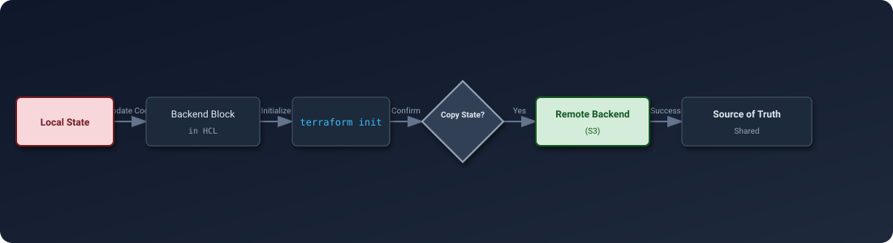

# Evolution Without Loss
Moving state between backends and managing state versions are critical skills for maintaining infrastructure reliability and enabling team collaboration. Migration allows your infrastructure to grow, while versioning ensures you can always go back in time if a mistake happens.

---
## 🗺️ Migration Life Cycle
Migration is the process of moving the "Source of Truth" from one location (e.g., your laptop) to another (e.g., AWS S3).

  

---
## 🛡️ Security & Reliability Features

### 1. State Locking During Migration
*   **Feature**: When running terraform init -migrate-state, Terraform locks the *source* state and the *destination* state (if supported).
*   **Why**: This prevents a "split-brain" scenario where one developer is writing to the old local file while another is migrating it to S3, ensuring data consistency during the transfer.
### 2. Encryption of the 'Backup' File
*   **Feature**: When migrating to a remote backend, Terraform often leaves a **terraform.tfstate.backup** file on the local disk.
*   **Risk**: If your state contained secrets (RDS passwords), they are now in plain text on your laptop.
*   **Mitigation**: Always assume the local backup is **Sensitive**. Delete it immediately after verifying the migration, or encrypt your local disk (BitLocker/FileVault).
### 3. Cross-Region Replication (CRR)
*   **Feature**: For mission-critical infrastructure, enable CRR on your S3 state bucket to a secondary region (e.g., `us-east-1` -> `us-west-2`).
*   **Reliability**: If AWS `us-east-1` S3 service goes down completely, you can manually point Terraform to the replica bucket to perform emergency updates.
### 4. Integrity Verification (Checksums)
*   **Feature**: Terraform calculates a checksum (**MD5/SHA**) of the state blob during transfer.
*   **Why**: Ensures that the file stored in S3 is bit-for-bit identical to the one on your machine, protecting against network corruption during the upload.
---
## � Best Practices

### 1. 💾 Backup Before Migrating
**Rule**: Always run **cp terraform.tfstate terraform.tfstate.pre-migrationbefore** running **terraform init**.
*   **Why**: If the migration command fails or corrupts data (rare, but possible), you have a hard copy to fall back on.
### 2. 📢 Communicate "Code Freeze"
**Rule**: Notify your team before performing a state migration.
*   **Why**: If a developer runs `terraform apply` during your migration, the lock might fail or the state lineage could diverge, requiring complex manual recovery.
### 3. 🧪 Use -migrate-state vs -reconfigure Properly
*   **Use `-migrate-state`**: When you want to **KEEP** your existing resources and just move the management file.
*   **Use `-reconfigure`**: When you want to **DISCARD** the connection to the old backend and start fresh (uncommon in production).
### 4. 🧹 Clean Up Local Files
**Rule**: After confirming `terraform plan` works against the new backend, delete the local `terraform.tfstate` and `terraform.tfstate.backup`.
*   **Why**: Prevents accidental usage of old data and security leaks.
### 5. 🏷️ Enable Versioning *Before* Migration
**Rule**: Ensure S3 Versioning is enabled on the destination bucket *before* you push the state.
*   **Why**: If the initial push is corrupted, you can't roll back if versioning wasn't already on.
---
## �🏗️ Real-Life Scenarios
### Scenario 1: The "Local to Team" Leap
**Problem**: A startup started with one developer using local **terraform.tfstate**. They just hired three more SREs.
**Crisis**: Developers were overwriting each other's changes because everyone had their own "Source of Truth" locally on their laptops.
**Outcome**: Infrastructure became inconsistent, with orphaned subnets and duplicate VPCs.
**Solution**: Migrated to **S3 with DynamoDB Locking**. 
**Result**: The team now shares a single state file, and Terraform prevents two people from applying changes at the same time.
### Scenario 2: The "Regional Split" Refactor
**Problem**: A massive state file containing 500 resources across us-east-1 and eu-west-1 became slow and risky. A mistake in the US networking could break the EU applications.
**Crisis**: The "Blast Radius" was too high.
**Outcome**: High anxiety during deployments.
**Solution**: Use terraform state rm to remove EU resources from the US state, and terraform import them into a new, dedicated EU state file.
**Result**: Deployment times dropped by 60%, and the team achieved "Blast Radius Isolation."
### Scenario 3: The "Accidental State Deletion" Recovery
**Problem**: A developer mistakenly ran `terraform state rm module.eks` instead of `terraform state show module.eks`. 
**Crisis**: Terraform "forgot" the entire production Kubernetes cluster. The next `plan` wanted to recreate it from scratch (causing a total wipe).
**Outcome**: Potential for 24-hour downtime to rebuild the cluster.
**Solution**: Since the S3 backend had **Versioning** enabled, the team searched the S3 version history, found the state file from 5 minutes ago, and downloaded it.
**Result**: They ran `terraform state push restored.tfstate`, and management was restored in minutes with zero impact on the real cluster.

---
## ❓ Interview Questions
1.  **What is the specific command to move from local state to an S3 backend?**
    

    
Answer

     terraform init. Once you add the backend "s3" block to your code and run init, Terraform will detect the change and ask if you want to migrate your existing local state to the new backend.
    

2.  **Explain the difference between `-migrate-state` and `-reconfigure`.**
    

    
Answer

    `-migrate-state` attempts to copy your current state data into the new backend. `-reconfigure` tells Terraform to ignore the previous state entirely and just start fresh with the new backend configuration.
    

3.  **Why should you enable S3 Bucket Versioning for state storage?**
    

    
Answer

    State corruption or accidental resource removal (`state rm`) can be catastrophic. Versioning allows you to instantly "roll back" the state file to a previous healthy version if a management error occurs.
    

4.  **Can you migrate state between different cloud providers?**
    

    
Answer

    Yes. You can migrate from an AWS S3 backend to an Azure Blob backend. Terraform is backend-agnostic when it comes to migration; it handles the JSON transfer regardless of the storage technology.
    

5.  **What happens to your 'Local' state file after a successful migration to S3?**
    

    
Answer

    Terraform creates a backup of your local file (e.g., `terraform.tfstate.backup`) and then treats the remote S3 file as the primary source. You can safely delete or archive the local file afterward.
    

6.  **How do you restore a previous version of state from S3?**
    

    
Answer

    1. Locate the Version ID in the S3 console. 2. Download that specific version. 3. Use `terraform state push filename` to upload that version as the current "Latest" state.
    

---
## 🧠 Comprehensive Quiz (25 Questions)
<b>1. Which command triggers the state migration process?</b>
- A) terraform migrate
- B) terraform init
- C) terraform push
- D) terraform apply

Show Answer

Answer: B

<b>2. True/False: Migration actually moves real cloud resources between regions.</b>
- A) False (It only moves the JSON metadata file)
- B) True

Show Answer

Answer: A

<b>3. Which flag forces Terraform to 'start fresh' with a new backend?</b>
- A) -migrate-state
- B) -reconfigure
- C) -force
- D) -new

Show Answer

Answer: B

<b>4. To restore an old state file from a local backup, use:</b>
- A) terraform state restore
- B) terraform state push
- C) terraform import
- D) terraform apply

Show Answer

Answer: B

<b>5. S3 Versioning protects against:</b>
- A) Network latency
- B) Accidental deletion/corruption of the state file
- C) DDoS attacks
- D) Cost overruns

Show Answer

Answer: B

<b>6. True/False: You must manually create the S3 bucket before migrating state to it.</b>
- A) True (Terraform does not create the bucket for you)
- B) False

Show Answer

Answer: A

<b>7. Which command allows you to download the current remote state as JSON?</b>
- A) terraform state download
- B) terraform state pull
- C) terraform get
- D) terraform fetch

Show Answer

Answer: B

<b>8. If you change the 'key' in an S3 backend, you are performing a:</b>
- A) Resource rename
- B) State migration (to a new file path)
- C) Provider change
- D) Lock operation

Show Answer

Answer: B

<b>9. What is 'Blast Radius' in the context of state files?</b>
- A) The size of the file
- B) The amount of infrastructure risk if a state file is damaged
- C) The cost of the S3 bucket
- D) The number of developers

Show Answer

Answer: B

<b>10. Splitting state files is primarily done to _____ risk.</b>
- A) Increase
- B) Reduce
- C) Ignore
- D) Duplicate

Show Answer

Answer: B

<b>11. True/False: You can use 'terraform login' to migrate to Terraform Cloud.</b>
- A) True (It authenticates you for the migration)
- B) False

Show Answer

Answer: A

<b>12. When prompted to migrate state, you should type:</b>
- A) yes
- B) no
- C) confirm
- D) apply

Show Answer

Answer: A

<b>13. A 'Monolithic' state file is one that contains _____ .</b>
- A) Only one resource
- B) All resources for the entire infrastructure/company
- C) No resources
- D) Binary data

Show Answer

Answer: B

<b>14. What happens if a migration is interrupted?</b>
- A) The cloud resources are deleted
- B) The state might be left locked or partially copied; check the local directory for backups
- C) The internet breaks
- D) Terraform uninstalls itself

Show Answer

Answer: B

<b>15. 'State Pull' outputs data to:</b>
- A) S3
- B) Standard Output (Stdout)
- C) A log file
- D) DynamoDB

Show Answer

Answer: B

<b>16. True/False: You can migrate state from v0.11 to v1.5 directly.</b>
- A) False (You often need to upgrade through major versions step-by-step)
- B) True

Show Answer

Answer: A

<b>17. Which backend attribute defines the 'Folder' structure in S3?</b>
- A) bucket
- B) key (e.g., "prod/app/terraform.tfstate")
- C) region
- D) encrypt

Show Answer

Answer: B

<b>18. Versioning should be enabled on the storage _____ .</b>
- A) Object
- B) Bucket
- C) Region
- D) Key

Show Answer

Answer: B

<b>19. What is the risk of using '-reconfigure' instead of '-migrate-state'?</b>
- A) None
- B) It disconnects your code from the existing state, potentially causing Terraform to try and create duplicate resources
- C) It deletes the bucket
- D) It deletes the code

Show Answer

Answer: B

<b>20. True/False: Each 'Workspace' in Terraform has its own state file.</b>
- A) True (Managed automatically by the backend)
- B) False

Show Answer

Answer: A

<b>21. 'Lifecycle Policies' in S3 can help _____ old state versions.</b>
- A) Create
- B) Delete/Archive (to save costs)
- C) Encrypt
- D) Accelerate

Show Answer

Answer: B

<b>22. Which command shows the 'Lineage' and 'Serial' of a state?</b>
- A) terraform state list
- B) terraform state pull (inside the JSON)
- C) terraform show lineage
- D) terraform serial

Show Answer

Answer: B

<b>23. 'State Splitting' is often done by service _____ .</b>
- A) Name
- B) Boundary (Microservices/Layers)
- C) Cost
- D) Color

Show Answer

Answer: B

<b>24. Migration is the '_____ of Growth' for Terraform projects.</b>
- A) End
- B) Enabler
- C) Enemy
- D) Stop

Show Answer

Answer: B

<b>25. A project without versioning is a _____ waiting to happen.</b>
- A) Success
- B) Disaster
- C) Milestone
- D) Feature

Show Answer

Answer: B

