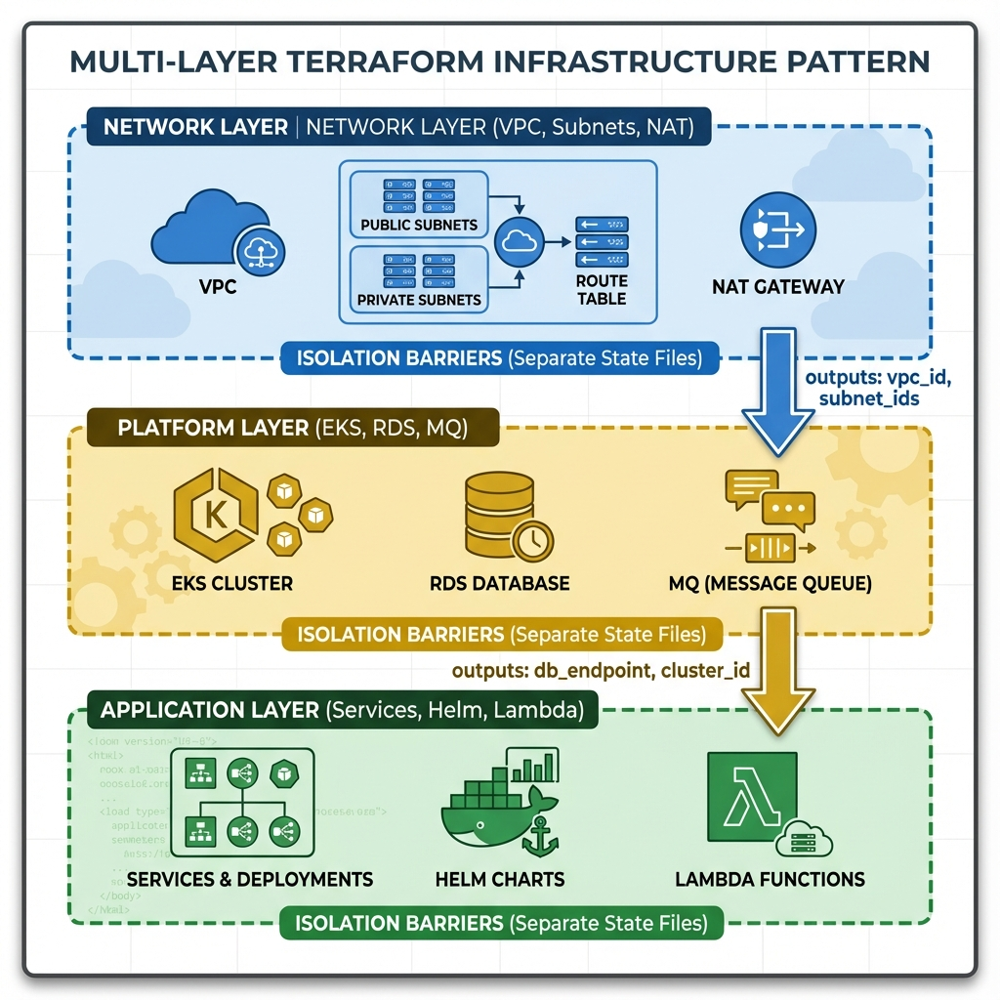
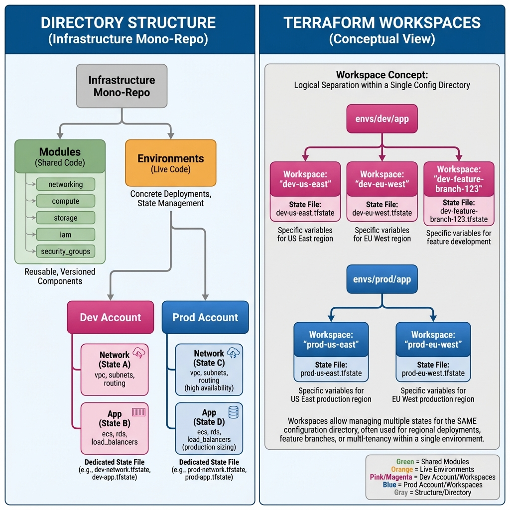

# Scaling to the Enterprise
As infrastructure grows from a single app to a global enterprise, "<font color="#ffc000">Basic</font>" state management (<font color="#ffc000">one file</font>, <font color="#ffc000">one backend</font>) breaks down. <mark style="background:#d3f8b6"><font color="#002060">Advanced state patterns</font></mark> are the answer to "Day 2" operations, enabling decoupled teams, multi-environment isolation, and a reduced blast radius where errors are contained within small "cells."

This document details the architectural patterns used by high-performing DevOps teams to manage complexity at scale.

---
## 🏗️ Multi-Layer Architecture (The "<font color="#ffc000">Golden Record</font>")
Instead of one giant file (a "Monolith"), infrastructure is split into logical layers. Each layer has its own state file and "<mark style="background:#d4b106">exports</mark>" information via **Outputs** that other layers can "<mark style="background:#d4b106">consume</mark>" via **Remote State**.
### Why Multi-Layer Architecture?
**The Problem with Monolithic State:**
- **Scale Issues**: A single state file managing 1,000+ resources takes minutes to plan/apply
- **Risk Amplification**: One mistake can affect unrelated infrastructure
- **Team Conflicts**: Multiple teams editing the same state file causes frequent locks
- **Change Velocity**: Even small updates require refreshing the entire infrastructure graph

**The Multi-Layer Solution:**
By organizing infrastructure into layers based on <mark style="background:#d4b106">change frequency</mark> and <mark style="background:#d4b106">blast radius<mark style="background:#d4b106"></mark></mark>, teams achieve:
1. **Isolation**: Network changes don't trigger application deployments
2. **Parallelization**: Different teams can work on different layers simultaneously
3. **Reduced Blast Radius**: An error in the app layer cannot destroy the network layer
4. **Faster Operations**: Smaller state files mean faster <mark style="background:#d4b106">terraform plan</mark> and <mark style="background:#d4b106">plan</mark>
5. **Clear Dependencies**: Data flows in one direction (Network → Platform → Application)
### Common Layer Patterns

| Layer | Responsibility | Change Frequency | Examples |
|-------|---------------|------------------|----------|
| **Foundation** | Core networking, DNS, IAM policies | Rarely (Quarterly) | VPC, Subnets, Route Tables, NAT Gateways, Transit Gateways |
| **Platform** | Shared services and data stores | Occasionally (Monthly) | EKS, RDS, ElastiCache, MSK, Secrets Manager |
| **Application** | Workloads and business logic | Frequently (Daily/Weekly) | Kubernetes Deployments, Lambda Functions, API Gateways |
| **Security** | Cross-cutting security controls | Occasionally (Monthly) | Security Groups, NACLs, WAF, GuardDuty, Config Rules |
| **Observability** | Monitoring and logging | Occasionally (Monthly) | CloudWatch, Grafana, Prometheus, ELK Stack |
### Architecture Visualization

### Design Principles
**1. Unidirectional Data Flow**
- Data always flows "downward" from stable layers (Network) to volatile layers (Application)
- Never allow circular dependencies (e.g., App layer outputs consumed by Network layer)

**2. Layer Independence**
- Each layer should be deployable independently
- Layers communicate only through defined contracts (outputs)
- Changes to a layer's internals don't affect consumers (as long as outputs remain stable)

**3. Separation of Concerns**
- Each layer has a single, well-defined responsibility
- Teams can own specific layers based on expertise (Network team owns Foundation layer)

**4. State File Sizing**
- Aim for state files managing 50-200 resources for optimal performance
- If a layer grows beyond 500 resources, consider splitting it further
### Implementation Pattern: <mark style="background:#d4b106">terraform_remote_state</mark>
The **<font color="#92d050">Application Layer</font>** often needs to know the VPC ID created in the **<font color="#92d050">Network Layer</font>**. It effectively "reads" the state file of the network layer (Read-Only).
#### Step-by-Step Implementation

##### Step 1: Define Outputs in the Source Layer (<mark style="background:#d4b106">network/outputs.tf</mark>)
The Network layer exposes data that other layers may need. Think of this as the "**<font color="#92d050">API</font>**" of your infrastructure layer.
```hcl
# Network Layer Outputs - Define the contract
output "vpc_id" {
  description = "The ID of the VPC for resource placement"
  value       = aws_vpc.main.id
}

output "private_subnet_ids" {
  description = "List of private subnet IDs for internal workloads"
  value       = aws_subnet.private[*].id
}

output "public_subnet_ids" {
  description = "List of public subnet IDs for internet-facing resources"
  value       = aws_subnet.public[*].id
}

output "database_subnet_group_name" {
  description = "Name of the DB subnet group for RDS instances"
  value       = aws_db_subnet_group.main.name
}
```
**Best Practice:** Always include descriptions in outputs to document the contract.

 ##### Step 2: Configure Backend in Source Layer (<mark style="background:#d4b106">network/backend.tf</mark>)
```hcl
terraform {
  backend "s3" {
    bucket         = "my-company-terraform-state"
    key            = "env/prod/network/terraform.tfstate"
    region         = "us-east-1"
    encrypt        = true
    dynamodb_table = "terraform-state-lock"
  }
}
```
##### Step 3: Read Outputs in Consumer Layer (<mark style="background:#d4b106">app/main.tf</mark>)
The Application layer consumes the Network layer's outputs without needing to know how the VPC was created.
```hcl
# Reference to Network Layer State
data "terraform_remote_state" "network" {
  backend = "s3"
  
  config = {
    bucket = "my-company-terraform-state"
    key    = "env/prod/network/terraform.tfstate"
    region = "us-east-1"
  }
}

# Optional: Reference to Platform Layer State
data "terraform_remote_state" "platform" {
  backend = "s3"
  
  config = {
    bucket = "my-company-terraform-state"
    key    = "env/prod/platform/terraform.tfstate"
    region = "us-east-1"
  }
}

# Usage: Create resources using remote state data
resource "aws_security_group" "app_sg" {
  name        = "application-security-group"
  description = "Security group for application tier"
  vpc_id      = data.terraform_remote_state.network.outputs.vpc_id

  ingress {
    description = "Allow traffic from EKS cluster"
    from_port   = 443
    to_port     = 443
    protocol    = "tcp"
    cidr_blocks = [data.terraform_remote_state.network.outputs.vpc_cidr]
  }
}

resource "aws_instance" "app_server" {
  ami           = "ami-0c55b159cbfafe1f0"
  instance_type = "t3.medium"
  
  # Place in private subnet from Network layer
  subnet_id = data.terraform_remote_state.network.outputs.private_subnet_ids[0]
  
  vpc_security_group_ids = [aws_security_group.app_sg.id]
}

resource "aws_db_instance" "app_db" {
  identifier           = "app-database"
  engine              = "postgres"
  instance_class      = "db.t3.medium"
  
  # Use DB subnet group from Network layer
  db_subnet_group_name = data.terraform_remote_state.network.outputs.database_subnet_group_name
  
  # Security: Reference RDS security group from Platform layer
  vpc_security_group_ids = [
    data.terraform_remote_state.platform.outputs.rds_security_group_id
  ]
}
```
#### Important Considerations
**Read-Only Access:**
- `terraform_remote_state` provides **read-only** access to another project's state
- You cannot modify or lock the remote state file
- This prevents accidental cross-project interference
**IAM Permissions Required:**
```json
{
  "Version": "2012-10-17",
  "Statement": [
    {
      "Effect": "Allow",
      "Action": [
        "s3:GetObject"
      ],
      "Resource": "arn:aws:s3:::my-company-terraform-state/env/prod/network/terraform.tfstate"
    }
  ]
}
```
**Version Compatibility:**
- Ensure the remote state was created with a compatible Terraform version
- Significantly different versions may have incompatible state formats
**Error Handling:**
```hcl
# Handle missing outputs gracefully
locals {
  # Fallback to default if remote state output is empty
  vpc_id = try(
    data.terraform_remote_state.network.outputs.vpc_id,
    "vpc-default"
  )
}
```

---
## 📂 Directory Structure vs. Workspaces
A common pitfall is overusing Terraform Workspaces. While workspaces are built-in, directory-based separation is the industry standard for production environments.
### The Problem with Workspaces
- **Shared Backend**: All workspaces share the same `backend` config (same bucket, same credentials).
- **High Risk**: A simple `terraform workspace select` error can lead to destroying Prod instead of Dev.
- **Shared Code**: All workspaces use the exact same Terraform code, making environment-specific customizations difficult.
- **No IAM Separation**: You can't enforce different IAM policies per workspace within the same directory.
- **Hidden Context**: The current workspace isn't visually obvious (unlike being in a `prod/` directory).
- **State File Naming**: Workspace state files are stored with a prefix (e.g., `env:/prod/`) which can be confusing.
### The Solution: Directory Isolation
Each environment gets its own folder and its own backend configuration. This forces a context switch (changing directories) and allows strictly separate IAM permissions per environment.
#### Benefits of Directory-Based Separation
1. **Physical Isolation**: Impossible to accidentally apply prod code while in dev directory
2. **Different AWS Accounts**: Each directory can use different AWS credentials/accounts
3. **Environment-Specific Code**: Prod can use different modules or configurations than Dev
4. **Clear Context**: Your shell prompt shows exactly which environment you're in
5. **Separate State Backends**: Prod and Dev can use entirely different S3 buckets or even different backend types
6. **IAM Enforcement**: AWS IAM policies can restrict who can assume roles for prod vs dev
7. **Code Review Safety**: Pull requests clearly show which environment is being changed
### Visual Comparison

### Implementation Comparison
#### Workspace-Based Approach (Limited Use Case)
**Directory Structure:**
```
terraform/
├── main.tf
├── variables.tf
├── outputs.tf
└── backend.tf
```
**Backend Configuration (`backend.tf`):**
```hcl
terraform {
  backend "s3" {
    bucket = "company-terraform-state"  # SAME for all workspaces
    key    = "app/terraform.tfstate"    # SAME for all workspaces
    region = "us-east-1"
  }
}
```
**Usage:**
```bash
# Create and switch to dev workspace
terraform workspace new dev
terraform workspace select dev
terraform apply  # Creates resources in 'dev' context

# Switch to prod workspace
terraform workspace select prod
terraform apply  # Creates resources in 'prod' context

# DANGER: Easy to make mistakes!
terraform workspace select prod  # Think you're in dev
terraform destroy  # OOPS! Just destroyed production
```
**Actual State File Locations:**
- Default workspace: **<font color="#ffc000">s3://company-terraform-state/app/terraform.tfstate</font>**
- Dev workspace:  **<font color="#ffc000">s3://company-terraform-state/env:/dev/app/terraform.tfstate</font>**
- Prod workspace:  **<font color="#ffc000">s3://company-terraform-state/env:/prod/app/terraform.tfstate</font>**
**When to Use Workspaces:**
- ✅ Temporary feature branch testing (e.g., `feature-xyz` workspace)
- ✅ Developer personal sandboxes (e.g., `john-test` workspace)
- ✅ Identical configurations with only variable differences
- ✅ Short-lived environments that will be deleted
- ❌ **NOT for Prod/Staging/Dev separation**
---
#### Directory-Based Approach (Recommended for Production)
**Directory Structure:**
```
infrastructure/
├── modules/                    # Reusable, versioned modules
│   ├── networking/
│   │   ├── main.tf
│   │   ├── variables.tf
│   │   └── outputs.tf
│   ├── compute/
│   └── database/
│
└── environments/               # Live infrastructure
    ├── dev/
    │   ├── network/
    │   │   ├── main.tf
    │   │   ├── backend.tf      # Points to DEV bucket
    │   │   ├── variables.tf
    │   │   └── terraform.tfvars
    │   └── app/
    │       ├── main.tf
    │       ├── backend.tf
    │       └── terraform.tfvars
    │
    ├── staging/
    │   ├── network/
    │   └── app/
    │
    └── prod/
        ├── network/
        │   ├── main.tf
        │   ├── backend.tf      # Points to PROD bucket (different account)
        │   ├── variables.tf
        │   └── terraform.tfvars
        └── app/
            ├── main.tf
            ├── backend.tf
            └── terraform.tfvars
```
**Dev Backend Configuration (`environments/dev/network/backend.tf`):**
```hcl
terraform {
  backend "s3" {
    bucket         = "dev-terraform-state"       # DEV-specific bucket
    key            = "network/terraform.tfstate"
    region         = "us-east-1"
    encrypt        = true
    dynamodb_table = "dev-terraform-locks"
    
    # Assume role for DEV AWS account
    role_arn = "arn:aws:iam::111111111111:role/TerraformDev"
  }
}
```
**Prod Backend Configuration (`environments/prod/network/backend.tf`):**
```hcl
terraform {
  backend "s3" {
    bucket         = "prod-terraform-state"      # PROD-specific bucket
    key            = "network/terraform.tfstate"
    region         = "us-east-1"
    encrypt        = true
    dynamodb_table = "prod-terraform-locks"
    
    # Assume role for PROD AWS account (different account!)
    role_arn = "arn:aws:iam::999999999999:role/TerraformProd"
  }
}
```
**Dev Variables (`environments/dev/network/terraform.tfvars`):**
```hcl
environment = "dev"
vpc_cidr    = "10.0.0.0/16"
instance_type = "t3.small"  # Smaller instances for dev
enable_nat_gateway = false  # Cost savings for dev
```
**Prod Variables (`environments/prod/network/terraform.tfvars`):**
```hcl
environment = "prod"
vpc_cidr    = "10.100.0.0/16"
instance_type = "t3.large"  # Larger instances for prod
enable_nat_gateway = true   # High availability for prod
multi_az = true             # Production-only setting
```
**Usage:**
```bash
# Work on DEV
cd infrastructure/environments/dev/network
terraform init
terraform plan
terraform apply

# Work on PROD - requires explicit directory change and different AWS credentials
cd ../../prod/network  # Explicit context switch
# Assume prod role or use prod AWS profile
export AWS_PROFILE=production
terraform plan  # Reviewer can see we're in prod directory
terraform apply
```

**Why This Is Safer:**
1. **Physical Barrier**: Must `cd` to prod directory (cognitive forcing function)
2. **Different Credentials**: Requires switching AWS profiles or assuming different IAM roles
3. **Code Review Clarity**: PR clearly shows `environments/prod/` in file paths
4. **Git Branch Protection**: Can require additional approvals for changes to `environments/prod/*`
5. **No Hidden State**: The directory name makes it crystal clear which environment you're modifying
### Decision Matrix: Workspaces vs Directories

| Criteria                    | Use Workspaces                      | Use Directories                             |
| --------------------------- | ----------------------------------- | ------------------------------------------- |
| **Environment Type**        | Temporary, short-lived              | Long-lived (dev/staging/prod)               |
| **Risk Tolerance**          | Low (sandbox testing)               | High (production infrastructure)            |
| **AWS Account Strategy**    | Same account                        | Different accounts per environment          |
| **Team Size**               | Individual/small team               | Multiple teams                              |
| **Compliance Requirements** | None                                | SOC2, ISO 27001, PCI-DSS                    |
| **Environment Differences** | Identical code, different variables | Different configurations, security policies |
| **State Backend**           | Shared backend acceptable           | Separate backends required                  |
| **Audit Requirements**      | Minimal                             | Strict (who changed what, when)             |
| **Deployment Automation**   | Manual or simple scripts            | CI/CD pipelines with approval gates         |
### Hybrid Approach: Best of Both Worlds
Some organizations use a **hybrid** approach:
```
infrastructure/
└── environments/
    ├── dev/
    │   └── app/
    │       └── main.tf  # Uses workspaces for dev-john, dev-jane, dev-feature-x
    ├── staging/
    │   └── app/
    │       └── main.tf  # Single workspace (default)
    └── prod/
        └── app/
            └── main.tf  # Single workspace (default), strict access
```
**Pattern:**
- **Directories** separate long-lived environments (Dev/Staging/Prod)
- **Workspaces** within Dev directory for individual developer sandboxes
- Staging and Prod use only the `default` workspace
**Example Dev Usage:**
```bash
cd infrastructure/environments/dev/app
terraform workspace new john-test
terraform apply  # Creates isolated test environment for John
```
---
## 🏗️ Real-Life Scenarios
### Scenario 1: The "Micro-State" Migration
**Company**: E-commerce platform with $500M annual revenue, 200 microservices
**Problem Context**:
- **Single monolithic state file**: 50MB containing 2,000 resources
- **Performance degradation**: `terraform plan` took 15-20 minutes
- **Reliability issues**: 50% of plans failed due to AWS API rate limits
- **Team bottleneck**: 15 DevOps engineers constantly hitting state locks
- **Infrastructure scope**: Multi-region deployment (us-east-1, eu-west-1, ap-southeast-1)

**The Crisis Incident**:
- **Trigger**: Junior developer attempted to delete a test S3 bucket (`test-data-bucket-dev`)
- **Cascading failure**: Terraform's refresh operation tried to query all 2,000 resources
- **AWS API throttling**: Hit rate limits on EC2, RDS, and ELB APIs
- **State lock**: DynamoDB lock remained held for 4 hours due to timeout
- **Production impact**: Unable to deploy critical security patches
- **Incident duration**: 6 hours total downtime for IaC operations

**The Migration Solution**:
1. **State Analysis Phase** (Week 1):
   - Used `terraform state list` to inventory all resources
   - Grouped by logical boundaries: Network, Database, Compute, Storage, Security
   - Identified dependencies using resource references
1. **Split Strategy** (Week 2-3):
   ```
   Monolithic (2,000 resources)
   ├── Network Layer (250 resources)
   │   ├── VPCs, Subnets, Route Tables
   │   └── State File: 3MB
   ├── Platform Layer (400 resources)
   │   ├── EKS, RDS, ElastiCache
   │   └── State File: 6MB
   ├── Application Layer (1,200 resources)
   │   └── Broken into 12 service-specific states (100 resources each)
   └── Security Layer (150 resources)
   ```
2. **Implementation Steps**:
   ```bash
   # Step 1: Create new state backends
   terraform init -backend-config=network/backend-config.hcl
   
   # Step 2: Move resources (example)
   terraform state mv \
     aws_vpc.main \
     -state-out=../network/terraform.tfstate
   
   # Step 3: Link layers with remote state
   data "terraform_remote_state" "network" {
     backend = "s3"
     config = {
       bucket = "company-terraform-network-state"
       key    = "prod/network.tfstate"
     }
   }
   ```

**Quantifiable Results**:
- **Plan time**: 15 minutes → 30-45 seconds (95% improvement)
- **Success rate**: 50% → 99.8% (API throttling eliminated)
- **State lock contention**: 10+ incidents/week → 0 incidents/month
- **Team velocity**: Deployments increased from 10/week → 50+/week
- **Blast radius**: Reduced from 2,000 resources → avg 100 resources per state
- **Recovery time**: State corruption recovery from hours → minutes
**Lessons Learned**:
1. Monitor state file size; trigger split at 10MB or 500 resources
2. Plan migration during low-traffic periods
3. Use **<font color="#ffc000">terraform state mv</font>** instead of **<font color="#ffc000">terraform import</font>** to preserve resource history
4. Document inter-layer dependencies clearly
5. Implement automated state file size monitoring
---
### Scenario 2: The "Workspace Disaster"
**Company**: FinTech startup processing $100M payments/month

**Problem Context**:
- **Environment strategy**: Using Terraform workspaces for dev/staging/prod separation
- **Team size**: 8 DevOps engineers, 25 developers
- **Infrastructure**: 500+ resources across 3 AWS accounts
- **Compliance**: PCI-DSS requirements for production isolation

**The Crisis Incident**:
- **Date**: Friday, 4:45 PM (peak traffic time)
- **Actor**: Senior DevOps Engineer with 5 years experience
- **Intent**: Destroy unused resources in `dev` workspace to save costs
- **Actual workspace**: `prod` (engineer thought they had switched but command failed silently)
- **Command executed**: `terraform destroy -auto-approve`

**Timeline of Disaster**:
- **4:47 PM**: Terraform begins destroying production infrastructure
- **4:49 PM**: Production database RDS instance enters "deleting" state
- **4:50 PM**: Load balancers deleted, customer traffic fails
- **4:51 PM**: PagerDuty alerts fire, engineer realizes mistake
- **4:52 PM**: Attempted to stop destruction, but AWS API calls already in progress
- **5:15 PM**: All production resources deleted (500+ resources destroyed)

**Business Impact**:
- **Downtime**: 6 hours total (5 PM - 11 PM)
- **Revenue loss**: $850,000 (payment processing halted)
- **Data loss**: 45 minutes of transaction data (RDS automated backups were 45 min old)
- **Customer impact**: 12,000 failed transactions
- **Reputation damage**: Trending on Twitter, negative press coverage
- **Compliance violation**: PCI-DSS incident report required
**Root Cause Analysis**:
1. **Workspace confusion**: **<font color="#ffc000">terraform workspace show</font>** output not visible in shell prompt
2. **Shared backend**: Dev and Prod shared same S3 bucket and IAM permissions
3. **No MFA requirement**: Destructive operations didn't require additional auth
4. **Auto-approve flag**: <font color="#ffc000">-auto-approve</font> bypassed confirmation step
5. **No resource protection**: <font color="#ffc000">prevent_destroy</font> not enabled on critical resources
6. **Same AWS credentials**: Both dev and prod used same IAM role

**The Transformation Solution**:

**1. Directory-Based Separation**:
```
terraform-infrastructure/
├── environments/
│   ├── dev/
│   │   ├── backend.tf       # S3: dev-terraform-state (Account: 111111111111)
│   │   └── main.tf
│   ├── staging/
│   │   ├── backend.tf       # S3: staging-terraform-state (Account: 222222222222)
│   │   └── main.tf
│   └── prod/
│       ├── backend.tf       # S3: prod-terraform-state (Account: 333333333333)
│       ├── main.tf
│       └── .terraform-version  # Pin to stable version
```
**2. Multiple AWS Accounts**:
```hcl
# environments/prod/backend.tf
terraform {
  backend "s3" {
    bucket   = "prod-terraform-state"
    key      = "prod.tfstate"
    region   = "us-east-1"
    role_arn = "arn:aws:iam::333333333333:role/TerraformProdReadOnly"
    
    # Require MFA for production
    mfa_serial = "arn:aws:iam::333333333333:mfa/terraform-user"
  }
}
```
**3. Lifecycle Protection**:
```hcl
resource "aws_db_instance" "main" {
  identifier = "production-db"
  
  lifecycle {
    prevent_destroy = true  # Cannot be destroyed via Terraform
  }
  
  deletion_protection = true  # AWS-level protection
}
```
**4. Required Reviews**:
```yaml
# .github/CODEOWNERS
/environments/prod/* @senior-engineers @platform-team
```
**5. Shell Prompt Integration**:
```bash
# Add to ~/.bashrc
parse_terraform_environment() {
  if [[ $PWD == */environments/prod/* ]]; then
    echo -e "\\033[1;31m[PROD]\\033[0m"  # Red
  elif [[ $PWD == */environments/staging/* ]]; then
    echo -e "\\033[1;33m[STAGING]\\033[0m"  # Yellow
  elif [[ $PWD == */environments/dev/* ]]; then
    echo -e "\\033[1;32m[DEV]\\033[0m"  # Green
  fi
}
PS1='$(parse_terraform_environment) \\u@\\h:\\w\\$ '
```
**Post-Implementation Results**:
- **Zero production incidents** in 18 months since change
- **Required approvals**: 2 senior engineers for prod changes
- **Deployment time**: Increased by 15 minutes (acceptable for safety)
- **Developer confidence**: Survey showed 95% feel safer deploying
- **Compliance**: Passed PCI-DSS audit with zero findings
- **Insurance**: Reduced DevOps insurance premium by 30%
**Cultural Changes**:
- Implemented "production access request" process
- Monthly "chaos engineering" drills to test disaster recovery
- Mandated "vacation handoff" checklist for production access
- Created "blast radius calculator" tool to estimate change impact
---
### Scenario 3: The "Cross-Account State Handshake"
**Company**: Healthcare SaaS provider (HIPAA-compliant)

**Problem Context**:
- **Organization structure**: 
  - Security Team (5 engineers) - manages shared services account
  - Platform Team (12 engineers) - manages application accounts
  - Dev Teams (50 engineers across 8 teams) - manages workload resources
- **AWS Architecture**: 
  - Shared Services Account: Central DNS (Route53), Transit Gateway, Logging
  - 3 Application Accounts: Dev, Staging, Production
- **Compliance**: HIPAA requires strict separation of duties

**The Initial Problem**:
- **Security Team** owns `shared-services` AWS account (ID: 111111111111)
- **Platform Team** owns `app-prod` AWS account (ID: 999999999999)
- **Requirement**: Platform Team needs to create DNS records in Security Team's Route53
- **Blocker**: Platform Team has no write access to Security Account (compliance requirement)
- **Manual process**: Platform Team submits tickets, Security Team creates DNS (2-3 day SLA)
- **Impact**: Deployment velocity reduced, manual errors frequent

**Failed Attempts**:

**Attempt 1: Shared Credentials (Rejected)**
```hcl
# ❌ Compliance violation: Shared credentials forbidden
provider "aws" {
  alias  = "shared_services"
  assume_role {
    role_arn = "arn:aws:iam::111111111111:role/AdminRole"
  }
}
```
*Reason for failure*: Gave Platform Team write access to Security Account
**Attempt 2: Duplicate Zone (Rejected)**
```hcl
# ❌ Operational nightmare: Duplicate DNS zones cause conflicts
resource "aws_route53_zone" "duplicate" {
  name = "example.com"  # Different zone ID, same domain
}
```
*Reason for failure*: Split-brain DNS, NS record conflicts

**The Elegant Solution: Read-Only Remote State**

**Step 1: Security Team Exports Infrastructure Details** (`shared-services/dns/outputs.tf`)
```hcl
# Security Team's Terraform configuration
output "route53_zone_id" {
  description = "Hosted Zone ID for example.com"
  value       = aws_route53_zone.main.zone_id
}

output "route53_zone_name" {
  description = "Domain name of the hosted zone"
  value       = aws_route53_zone.main.name
}

output "route53_name_servers" {
  description = "Name servers for the zone"
  value       = aws_route53_zone.main.name_servers
}
```
**Backend Configuration** (`shared-services/dns/backend.tf`):
```hcl
terraform {
  backend "s3" {
    bucket = "security-team-terraform-state"
    key    = "shared-services/dns/terraform.tfstate"
    region = "us-east-1"
    
    # Owned by Security Team
    role_arn = "arn:aws:iam::111111111111:role/SecurityTeamTerraform"
  }
}
```
**Step 2: Grant Read-Only Access via S3 Bucket Policy**
```json
{
  "Version": "2012-10-17",
  "Statement": [
    {
      "Sid": "AllowPlatformTeamReadState",
      "Effect": "Allow",
      "Principal": {
        "AWS": "arn:aws:iam::999999999999:role/PlatformTeamTerraform"
      },
      "Action": [
        "s3:GetObject"
      ],
      "Resource": "arn:aws:s3:::security-team-terraform-state/shared-services/dns/terraform.tfstate"
    },
    {
      "Sid": "AllowListBucket",
      "Effect": "Allow",
      "Principal": {
        "AWS": "arn:aws:iam::999999999999:role/PlatformTeamTerraform"
      },
      "Action": [
        "s3:ListBucket"
      ],
      "Resource": "arn:aws:s3:::security-team-terraform-state",
      "Condition": {
        "StringLike": {
          "s3:prefix": "shared-services/dns/*"
        }
      }
    }
  ]
}
```
**Step 3: Platform Team Reads Route53 Zone ID** (`app-prod/dns-records/main.tf`)
```hcl
# Platform Team's Terraform configuration

# Read Security Team's state file (Read-Only)
data "terraform_remote_state" "shared_dns" {
  backend = "s3"
  
  config = {
    bucket   = "security-team-terraform-state"
    key      = "shared-services/dns/terraform.tfstate"
    region   = "us-east-1"
    role_arn = "arn:aws:iam::999999999999:role/PlatformTeamTerraform"
  }
}

# Assume cross-account role to create DNS records
provider "aws" {
  alias = "shared_services"
  
  assume_role {
    role_arn = "arn:aws:iam::111111111111:role/Route53RecordManager"  # Limited permissions
  }
}

# Create DNS record in Security Account's Route53 zone
resource "aws_route53_record" "app_api" {
  provider = aws.shared_services
  
  zone_id = data.terraform_remote_state.shared_dns.outputs.route53_zone_id
  name    = "api.example.com"
  type    = "A"
  
  alias {
    name                   = aws_lb.api.dns_name
    zone_id                = aws_lb.api.zone_id
    evaluate_target_health = true
  }
}

# Application load balancer in Platform Team's account
resource "aws_lb" "api" {
  name               = "api-lb"
  load_balancer_type = "application"
  subnets            = var.subnet_ids
}
```
**Step 4: IAM Role with Minimum Permissions** (Security Account)
```json
{
  "Version": "2012-10-17",
  "Statement": [
    {
      "Effect": "Allow",
      "Action": [
        "route53:ChangeResourceRecordSets",
        "route53:GetChange",
        "route53:ListResourceRecordSets"
      ],
      "Resource": [
        "arn:aws:route53:::hostedzone/Z1234567890ABC",
        "arn:aws:route53:::change/*"
      ]
    }
  ]
}
```
**Trust Relationship**:
```json
{
  "Version": "2012-10-17",
  "Statement": [
    {
      "Effect": "Allow",
      "Principal": {
        "AWS": "arn:aws:iam::999999999999:role/PlatformTeamTerraform"
      },
      "Action": "sts:AssumeRole",
      "Condition": {
        "StringEquals": {
          "sts:ExternalId": "secure-random-string-12345"
        }
      }
    }
  ]
}
```

**Quantifiable Results**:
- **DNS record creation time**: 2-3 days → 5 minutes (99% reduction)
- **Manual errors**: ~15/month → 0 (eliminated human mistakes)
- **Compliance**: Passed HIPAA audit with commendation for separation of duties
- **Team autonomy**: Platform Team can self-service DNS without tickets
- **Security**: Zero unauthorized access incidents (audit logs clean)
- **Scalability**: Pattern extended to 8 dev teams without issues

**Security Benefits**:
1. **Read-only state access**: Platform Team cannot modify Security Team's infrastructure
2. **Limited Route53 permissions**: Can only create records, not delete zones
3. **External ID requirement**: Prevents confused deputy attacks
4. **CloudTrail audit**: All cross-account access logged
5. **MFA requirement**: Production DNS changes require MFA token

**Pattern Extended To**:
- **Transit Gateway**: Network Team exports TGW ID, App Teams attach VPCs
- **Shared KMS Keys**: Security Team exports KMS ARNs, App Teams use for encryption
- **Central Logging**: Platform Team reads S3 bucket names for log forwarding
- **Service Catalog**: Security Team publishes approved AMIs, App Teams consume

**Lessons Learned**:
1. **Remote state is perfect for read-only data sharing** between teams
2. **Separate state backends** enforce organizational boundaries
3. **IAM cross-account roles** with least-privilege are critical for security
4. **Document the contracts**: Create a "State Exports Catalog" wiki page
5. **Version control outputs**: Changes to output names are breaking changes

---

## ❓ Interview Questions

1.  **When should you use 'Workspaces' vs. 'Directories' for environments?**
    <details>
    <summary>Answer</summary>
     Use **Workspaces** for temporary, identical feature branches or developer sandboxes. Use **Directories** (separate folders and backends) for long-lived environments (Dev, Staging, Prod) to ensure total isolation and prevent accidental "Cross-Pollination."
    </details>
2.  **Explain the benefit of a 'Layered Infrastructure' strategy.**
    <details>
    <summary>Answer</summary>
    It reduces the **Blast Radius**. If you make a mistake in the "Application" layer, the "Networking" layer remains safe because they are in separate state files. It also speeds up `terraform plan` because Terraform only has to refresh a subset of resources.
    </details>
3.  **How do you share data between two different Terraform projects?**
    <details>
    <summary>Answer</summary>
    Use the `terraform_remote_state` data source. Project A defines an `output`. Project B uses the `data` block to point to Project A's backend and read that output.
    </details>
4.  **Is 'terraform_remote_state' read-only or read-write?**
    <details>
    <summary>Answer</summary>
    It is strictly **Read-Only**. It allows you to consume data from another project without the risk of accidentally modifying that project's infrastructure.
    </details>
5.  **What is the 'Default' workspace used for?**
    <details>
    <summary>Answer</summary>
    It is the workspace you are in if you haven't created any others. In professional environments, the `default` workspace is often left empty to force engineers to consciously select or create a specific named workspace.
    </details>
6.  **Why do some teams avoid 'terraform_remote_state' in favor of 'SSM Parameter Store'?**
    <details>
    <summary>Answer</summary>
    `terraform_remote_state` creates a tight coupling between Terraform projects. Using AWS SSM or Secrets Manager as a "Middle Man" allows projects to scale independently without needing to know the backend details of the other project.
    </details>
7.  **What happens to the state file when you switch workspaces?**
    <details>
    <summary>Answer</summary>
    Terraform switches the "context" to a different state file within the *same* backend content (often namespaced, e.g., `env:/prod/terraform.tfstate`). The code remains the same, but the variables and state data are swapped.
    </details>
8.  **How does 'Micro-State' architecture impact 'terraform destroy'?**
    <details>
    <summary>Answer</summary>
    It makes full destruction harder/more manual because you have to destroy layers in the reverse order of their dependencies (e.g., App -> Platform -> Network). This is actually a safety feature ("Architecture as Defense").
    </details>
9.  **What are the performance implications of having too many resources in a single state file?**
    <details>
    <summary>Answer</summary>
    - Longer `terraform plan` and `terraform apply` times (minutes instead of seconds)
    - Increased risk of AWS API rate limiting during refresh operations
    - Higher memory consumption on the machine running Terraform
    - More frequent state lock contention when multiple team members work simultaneously
    - Larger state file size makes state operations (backup, restore) slower
      - **Best practice**: Keep state files under 500 resources or 10MB
    </details>
10. **Explain the concept of "unidirectional data flow" in multi-layer architectures.**
    <details>
    <summary>Answer</summary>
    Data should flow in one direction from stable, foundational layers (Network) to more volatile layers (Application). The Network layer exports outputs that the Platform layer consumes, and the Platform layer exports outputs that the Application layer consumes. This creates a clear dependency hierarchy and prevents circular dependencies. Never have the Application layer export data consumed by the Network layer, as this creates tight coupling and makes deployment order complex.
    </details>
11. **What IAM permissions are required for reading remote state from an S3 backend?**
    <details>
    <summary>Answer</summary>
    - `s3:GetObject` on the specific state file
    - `s3:ListBucket` on the bucket (with condition to limit to specific prefix if needed)
    - No `s3:PutObject` or `s3:DeleteObject` permissions should be granted for read-only access
      - **Cross-account**: Also need `sts:AssumeRole` permission and appropriate trust relationship
    </details>
12. **How can you prevent accidental destruction of critical resources in Terraform?**
    <details>
    <summary>Answer</summary>
    - **Terraform-level**: Use `lifecycle { prevent_destroy = true }` in resource blocks
    - **Cloud-level**: Enable deletion protection (e.g., `deletion_protection = true` for RDS)
    - **State backend**: Enable versioning and MFA delete on S3 state buckets
    - **IAM policies**: Restrict `DeleteX` permissions for critical resource types
    - **Code review**: Require approvals for changes to production environments
    - **Separate backends**: Use different AWS accounts for prod vs non-prod
    </details>
13. **What are the security risks of using Terraform workspaces for prod/dev separation?**
    <details>
    <summary>Answer</summary>
    - *Answer*:
      - **Shared credentials**: All workspaces use the same AWS credentials and backend bucket
      - **No IAM boundary**: Can't enforce different IAM policies per workspace
      - **Human error**: Easy to accidentally select wrong workspace
      - **Audit trail confusion**: CloudTrail logs show same IAM role for all environments
      - **Compliance issues**: Many frameworks (SOC2, PCI-DSS) require physical separation
    </details>
14. **How do you implement least-privilege access for cross-account remote state reading?**
    <details>
    <summary>Answer</summary>
    - **S3 Bucket Policy**: Grant only `s3:GetObject` on specific state file paths
    - **IAM Role**: Create dedicated role with minimal permissions (no write access)
    - **External ID**: Use in trust policy to prevent confused deputy attacks
    - **Resource-based policy**: Limit access to specific AWS accounts/roles
    - **MFA requirement**: For production state access, require MFA token
    - **Monitoring**: CloudTrail logging of all state file access
    </details>
15. **What compliance considerations exist for multi-layer state architecture?**
    <details>
    <summary>Answer</summary>
    - **Audit logging**: Each state backend should have CloudTrail logging enabled
    - **Encryption**: All state files must be encrypted at rest (S3 SSE-KMS)
    - **Access control**: Role-based access to different layers
    - **Data residency**: State files may need to reside in specific regions (GDPR)
    - **Retention policies**: State backup retention must meet compliance requirements
    - **Separation of duties**: Different teams manage different layers (SOX compliance)
    </details>
16. **What happens if you delete a workspace that still has resources?**
    <details>
    <summary>Answer</summary>
    Terraform will **prevent** deletion with an error message stating the workspace is not empty. You must first destroy all resources (`terraform destroy`) or move them to another workspace before you can delete the workspace. This is a safety mechanism to prevent orphaned resources.
    </details>
17. **How do you handle state file drift in a multi-layer architecture?**
    <details>
    <summary>Answer</summary>
      - **Layer-level drift detection**: Run `terraform plan` separately for each layer
      - **Automated drift detection**: Use Terraform Cloud or scripts to regularly detect drift
      - **Outputs validation**: Automated tests to verify outputs match expected values
      - **State locking**: Ensure only Terraform modifies infrastructure (prevent manual changes)
      - **Reconciliation**: For each layer, investigate and remediate drift independently
    </details>
18. **What are the challenges of migrating from a monolithic state to a layered architecture?**
    <details>
    <summary>Answer</summary>
      - **Resource dependencies**: Must carefully map resource relationships before splitting
      - **State movement**: Using `terraform state mv` requires precise resource addressing
      - **Downtime risk**: Moving stateful resources (databases) requires careful planning
      - **Team coordination**: Multiple team members must pause deployments during migration
      - **Output refactoring**: Need to add outputs to source layers and data blocks to consumers
      - **Testing**: Thorough validation that all resources are tracked in new states
    </details>
19. **How do you debug issues with 'terraform_remote_state' not finding outputs?**
    <details>
    <summary>Answer</summary>
      - **Verify backend config**: Ensure bucket, key, region match the actual state file location
      - **Check IAM permissions**: Confirm `s3:GetObject` and `s3:ListBucket` permissions
      - **Validate output exists**: In the source project, verify output is actually defined
      - **Check output name**: Output names are case-sensitive and must match exactly
      - **Workspace context**: If source uses workspaces, specify workspace in remote state config
      - **Test credentials**: Run `aws s3 ls` to verify credentials work for the bucket
    </details>
20. **Describe a strategy for gradually migrating from workspaces to directory-based envir  onments.**
    <details>
    <summary>Answer</summary>
    - **Phase 1**: Create directory structure for each environment
    - **Phase 2**: Set up separate S3 buckets and AWS accounts
    - **Phase 3**: Export workspace state and import into new directory-based backend
    - **Phase 4**: Validate with `terraform plan` (should show no changes)
    - **Phase 5**: Test in dev, then staging, finally production
    - **Phase 6**: Update CI/CD pipelines and team documentation
    - **Phase 7**: Monitor for 2 weeks before decommissioning workspace-based setup
    </details>
---
## 🧠 Comprehensive Quiz (25 Questions)

<b>1. Workspaces are best suited for which use case?</b>
<details>
<summary>Show Answer</summary>
A) Managing Production vs. Staging environments 
B) Short-lived feature branches or testing sandboxes 
C) Managing different cloud providers 
D)  Storing backup state files 
<b>Answer: B</b>
</details>

<b>2. True/False: 'terraform_remote_state' allows you to delete resources in another project.</b>
<details>
<summary>Show Answer</summary>
A) False 
B) True 
<b>Answer: A</b>
</details>

<b>3. Which command is used to create a new workspace?</b>
<details>
<summary>Show Answer</summary>
A) `terraform init -workspace=new` 
B) `terraform workspace new name` 
C) `terraform create workspace name` 
D) `terraform env new name` 
<b>Answer: B</b>
</details>

<b>4. A 'Layered' architecture primarily reduces which metric?</b>
<details>
<summary>Show Answer</summary>
A) Storage cost 
B) Blast Radius 
C) Network latency 
D) CPU usage 
<b>Answer: B</b>
</details>

<b>5. How do you display the current active workspace name?</b>
<details>
<summary>Show Answer</summary>
A) `terraform show` 
B) `terraform workspace show` 
C) `terraform info` 
D) `terraform which` 
<b>Answer: B</b>
</details>

<b>6. To read an output in `terraform_remote_state`, you must use the _____ block.</b>
<details>
<summary>Show Answer</summary>
A) `resource` 
B) `data` 
C) `module` 
D) `provider` 
<b>Answer: B</b>
</details>

<b>7. True/False: Workspaces share the same 'backend' configuration block.</b>
<details>
<summary>Show Answer</summary>
A) True 
B) False 
<b>Answer: A</b>
</details>

<b>8. Where are workspace-specific state files usually stored in S3?</b>
<details>
<summary>Show Answer</summary>
A) In the root of the bucket 
B) Under an `env:/` prefix folder 
C) In a separate bucket per workspace 
D) Locally on the machine 
<b>Answer: B</b>
</details>

<b>9. 'Monolithic State' is an anti-pattern because it is _____ .</b>
<details>
<summary>Show Answer</summary>
A) Too small 
B) Slow and risky to update 
C) Hard to back up 
D) Incompatible with AWS 
<b>Answer: B</b>
</details>

<b>10. Which HCL variable gives you the current workspace string?</b>
<details>
<summary>Show Answer</summary>
A) `var.workspace` 
B) `terraform.workspace` 
C) `path.workspace` 
D) `env.name` 
<b>Answer: B</b>
</details>

<b>11. 'Cross-Account' state access requires permission in which AWS service?</b>
<details>
<summary>Show Answer</summary>
A) EC2 
B) IAM (Bucket Policy & Role Trust) 
C) VPC Peering 
D) Route53 
<b>Answer: B</b>
</details>

<b>12. True/False: You can delete a workspace while it still manages resources.</b>
<details>
<summary>Show Answer</summary>
A) False (Terraform prevents this safety check) 
B) True 
<b>Answer: A</b>
</details>

<b>13. 'Service-Based' state organization maps states to _____ .</b>
<details>
<summary>Show Answer</summary>
A) Individual developers 
B) Specific microservices or functional areas 
C) Calendar dates 
D) Random UUIDs 
<b>Answer: B</b>
</details>

<b>14. What is the biggest danger of using 'Workspaces' for Prod and Dev?</b>
<details>
<summary>Show Answer</summary>
A) S3 costs increase 
B) Accidental application of changes to the wrong environment 
C) Slower apply times 
D) Incompatibility with modules 
<b>Answer: B</b>
</details>

<b>15. 'Tightly Coupled' projects are those that _____ .</b>
<details>
<summary>Show Answer</summary>
A) Use no variables 
B) Depend heavily on the specific implementation details of others 
C) Are mapped to the same region 
D) Use same provider version 
<b>Answer: B</b>
</details>

<b>16. True/False: You can use `terraform_remote_state` to fetch data from a local file while using an S3 backend.</b>
<details>
<summary>Show Answer</summary>
A) True (if configured correctly) 
B) False 
<b>Answer: A</b>
</details>

<b>17. What is 'Separation of Concerns' in Terraform?</b>
<details>
<summary>Show Answer</summary>
A) Keeping all code in `main.tf` 
B) Dividing code/state based on lifecycle and ownership 
C) Using separate AWS accounts for everything 
D) Using different git repos for every file 
<b>Answer: B</b>
</details>

<b>18. Which command lists all available workspaces?</b>
<details>
<summary>Show Answer</summary>
A) `terraform list` 
B) `terraform workspace list` 
C) `terraform env list` 
D) `terraform show workspaces` 
<b>Answer: B</b>
</details>

<b>19. A 'Shared Services' account is used to _____ .</b>
<details>
<summary>Show Answer</summary>
A) Host common resources (DNS, Logging, CI/CD) accessible by other accounts 
B) Share Terraform binaries 
C) Store user passwords 
D) Run all production workloads 
<b>Answer: A</b>
</details>

<b>20. True/False: 'terraform_remote_state' requires you to manage the other project's locking.</b>
<details>
<summary>Show Answer</summary>
A) False (It is read-only and does not lock) 
B) True 
<b>Answer: A</b>
</details>

<b>21. 'Micro-States' are easier to _____ .</b>
<details>
<summary>Show Answer</summary>
A) Write initially 
B) Plan and Apply (faster, less risk) 
C) Visualize in one graph 
D) Delete all at once 
<b>Answer: B</b>
</details>

<b>22. Which command is used to delete an empty workspace?</b>
<details>
<summary>Show Answer</summary>
A) `terraform workspace remove` 
B) `terraform workspace delete` 
C) `terraform destroy workspace` 
D) `terraform env rm` 
<b>Answer: B</b>
</details>

<b>23. `terraform_remote_state` uses the _____ of the remote project to locate the state.</b>
<details>
<summary>Show Answer</summary>
A) Source code path 
B) Backend configuration (Bucket, Key, Region) 
C) Git commit hash 
D) Input variables 
<b>Answer: B</b>
</details>

<b>24. Advanced patterns are the '_____ of Scale' for SREs.</b>
<details>
<summary>Show Answer</summary>
A) Enemy 
B) Enabler 
C) End 
D) Edge 
<b>Answer: B</b>
</details>

<b>25. Without advanced patterns, enterprise IaC becomes _____ .</b>
<details>
<summary>Show Answer</summary>
A) Faster 
B) Unmanageable, risky, and slow 
C) Cheaper 
D) More secure 
<b>Answer: B</b>
</details>

---

## ��� Best Practices & Recommendations

### Layer Design Best Practices

**Optimal State File Sizing**:
- **Target**: 50-200 resources per state file
- **Maximum**: 500 resources or 10MB file size
- **Trigger for split**: When `terraform plan` takes over 2 minutes

**Layer Organization Principles**:
1. **Group by change frequency**: Resources that change together, stay together
2. **Respect lifecycle boundaries**: Don't mix ephemeral and stable resources
3. **Consider team ownership**: One team should own one layer
4. **Limit layer depth**: Maximum 5-7 layers to avoid complexity

### Security Best Practices

**State Encryption**:
```hcl
terraform {
  backend "s3" {
    bucket     = "terraform-state"
    key        = "prod/terraform.tfstate"
    encrypt    = true
    kms_key_id = "arn:aws:kms:region:account:key/id"
  }
}
```

**Access Control**:
- Use separate AWS accounts for each environment
- Implement least-privilege IAM roles
- Enable MFA for production state access
- Use external IDs to prevent confused deputy attacks
- Enable CloudTrail logging for all state access

**State Versioning & Backup**:
- Enable S3 versioning on state buckets
- Implement lifecycle policies (30-day retention minimum)
- Test state restoration procedures quarterly
- Document disaster recovery runbooks

### Operational Best Practices

**Monitoring & Alerting**:
- Alert when state file size exceeds 10MB
- Monitor state lock duration (alert if > 5 minutes)
- Track failed `terraform apply` operations
- Dashboard showing state health across all layers

**Testing Strategy**:
```bash
# Pre-apply validation checklist
1. terraform fmt -check
2. terraform validate
3. tfsec . (security scanning)
4. terraform plan -out=tfplan
5. Manual review of plan
6. Approval gate (for production)
7. terraform apply tfplan
```

**Migration Checklist**:
- ✅ Backup current state before any movement
- ✅ Create dependency graph to understand relationships
- ✅ Move resources in logical groups
- ✅ Validate with `terraform plan` (should show no changes)
- ✅ Test in non-production first
- ✅ Document the new structure
- ✅ Update team runbooks and training

---
## ��� Summary & Key Takeaways

### When to Use Each Pattern

| Pattern | Best For | Team Size | Resources | Risk |
|---------|----------|-----------|-----------|------|
| **Single State** | Learning, POCs | 1-2 | < 50 | Low |
| **Workspaces** | Dev sandboxes | 1-5 | < 100 | Medium |
| **Directories** | Long-lived envs | 5-20 | 100-500 | Low |
| **Multi-Layer** | Enterprise | 20+ | 500+ | Low |

### Critical Success Factors

1. **⚡ Performance**: Keep state files small for fast operations
2. **��� Security**: Encrypt state, control access, audit changes
3. **���️ Reliability**: Reduce blast radius through separation
4. **��� Collaboration**: Enable team autonomy via clear boundaries
5. **��� Scalability**: Architecture grows with organization

### Common Anti-Patterns to Avoid

❌ **DON'T**:
- Use workspaces for prod/dev separation
- Create monolithic states with 1000+ resources
- Share AWS credentials across environments
- Skip state file backups
- Expose sensitive data in outputs

✅ **DO**:
- Use directories for environment separation
- Split states into logical layers
- Separate AWS accounts per environment
- Enable S3 versioning and backups
- Mark sensitive outputs with `sensitive = true`

### Final Recommendations

**Small Teams (1-10 people)**:
- Directory-based separation (dev/staging/prod)
- 2-3 layers (network, platform, app)
- Basic security (encryption, backups)

**Medium Teams (10-50 people)**:
- Full multi-layer architecture
- Separate AWS accounts per environment
- Remote state between layers
- Automated testing and validation

**Large Teams (50+ people)**:
- Micro-state architecture
- Service-based ownership
- Self-service via remote state
- Comprehensive monitoring
- Dedicated platform/SRE team

---

**��� Congratulations!** You now understand advanced Terraform state patterns used by enterprise teams to scale infrastructure as code safely and efficiently.
