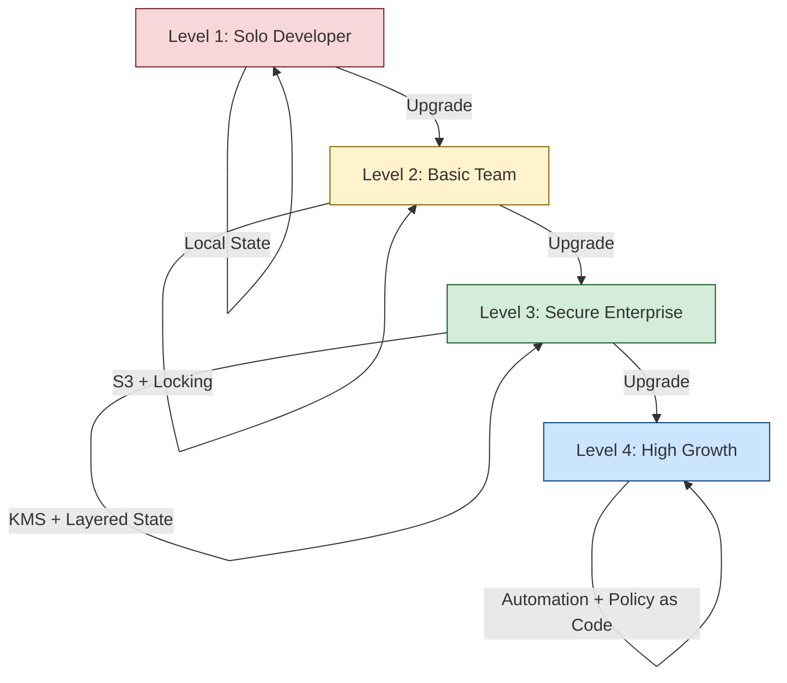

# The DevOps Golden Rules

State is the "Mind" of your infrastructure. If it becomes corrupted, insecure, or out of sync, your entire automation strategy fails. Following these best practices ensures that your infrastructure remains predictable, secure, and ready for team collaboration.

---

## 🏗️ The Best Practices Maturity Model

---

## 🏗️ Real-Life Scenarios
### Scenario 1: The "Secret" Leak Audit
**Problem**: An internal security audit found that the company's Terraform code for an RDS database used a plain-text variable for the `password`.
**Crisis**: Even though they added the variable to the `.gitignore`, the auditor proved the password was still in plain text in the `.tfstate` file stored in a shared developer bucket.
**Outcome**: The company failed the security audit.
**Solution**: Moved all secrets to **AWS Secrets Manager** and enabled **S3 Bucket Encryption with KMS**. 
**Result**: The state file still technically contains the data, but it is now encrypted at rest with a key that only the CI/CD pipeline and the Head of Security can access.
### Scenario 2: The "Monolith" Bottleneck
**Problem**: A growing retail company had everything (VPC, DB, EKS, Apps) in one giant state file.
**Crisis**: Every time the "App Team" wanted to change a small tag on their container, they had to wait 15 minutes for a full VPC/Database refresh.
**Outcome**: Developers started bypassing Terraform and making manual changes to move faster, causing massive drift.
**Solution**: **State Decomposition**. The SRE team split the monolith into four separate projects: `networking`, `datastore`, `platform`, and `apps`.
**Result**: Plan times dropped from 15 minutes to 45 seconds. Development velocity increased by 10x.
### Scenario 3: The "Accidental State Overwrite"
**Problem**: During a manual migration, a developer ran `terraform state push old_state.json` instead of the new one.
**Crisis**: The state was rolled back to a version from three months ago. Terraform now "thought" that 50 new production instances didn't exist and would try to delete them if `apply` was run.
**Outcome**: Massive risk of a total production wipe.
**Solution**: Since the state was in S3 with **Versioning Enabled**, the team simply went to the S3 bucket, found the version from 10 minutes ago, and restored it as the "latest."
**Result**: The error was reversed in minutes, avoiding a multi-million dollar outage.

---

## ❓ Interview Questions

1.  **Why should you never commit state files to Git?**
    - *Answer*: State files contain sensitive information (like passwords and private IPs in plain text) and are prone to merge conflicts that can lead to infrastructure corruption. Remote backends are designed to solve these issues.
2.  **Explain the importance of 'Least Privilege' for the state bucket.**
    - *Answer*: Only the CI/CD runner and SRE leads should have `Write` access to the state bucket. Developers should only have `Read` access (for plan/debug) to prevent accidental deletions or manual overwrites.
3.  **What is the 'Golden Rule' of modifying a state file?**
    - *Answer*: **Never edit the JSON manually.** Always use the Terraform CLI (`state mv`, `state rm`, `import`) to ensure metadata like checksums and serial numbers remain valid.
4.  **How do you prevent 'Stuck Locks' in a high-concurrency team?**
    - *Answer*: 1. Use a robust backend like S3+DynamoDB. 2. Automate deployments through a CI/CD pipeline (like GitLab or Jenkins) so that runs are serialized and don't conflict. 3. Document the `force-unlock` procedure for emergencies.
5.  **Which is more secure: SSE-S3 or SSE-KMS for state encryption?**
    - *Answer*: **SSE-KMS**. It allows you to use a Customer Managed Key (CMK) which provides an audit trail in CloudTrail, showing exactly who decrypted the state and when.
6.  **What is 'Blast Radius' and how does state management affect it?**
    - *Answer*: Blast radius is the total amount of infrastructure affected by a single error. One large state file has a huge blast radius. Splitting state into smaller, layered files ensures that a corruption in the "App" state doesn't affect the core "Networking" state.

---

## 🧠 Comprehensive Quiz (25 Questions)

<b>1. What is the #1 rule of Terraform State?</b>

Show Answer

Answer: B

<b>2. True/False: S3 Versioning is optional for production state.</b>

Show Answer

Answer: A

<b>3. Which encryption type provides a full audit trail of state access?</b>

Show Answer

Answer: B

<b>4. 'Least Privilege' for state access means:</b>

Show Answer

Answer: B

<b>5. Which folder should be in your .gitignore for every Terraform project?</b>

Show Answer

Answer: B

<b>6. To split a large state into smaller ones, you use:</b>

Show Answer

Answer: B

<b>7. True/False: You should use different state buckets for Dev and Prod.</b>

Show Answer

Answer: A

<b>8. Which command is used to adopted existing manual resources?</b>

Show Answer

Answer: B

<b>9. 'MFA Delete' on an S3 bucket prevents:</b>

Show Answer

Answer: B

<b>10. What is a 'Monolith' State?</b>

Show Answer

Answer: B

<b>11. Which service is used to centralize secrets and avoid state exposure?</b>

Show Answer

Answer: B

<b>12. True/False: You should manually edit the .tfstate JSON to fix errors.</b>

Show Answer

Answer: A

<b>13. A 'Locking Error' is a sign that:</b>

Show Answer

Answer: B

<b>14. What is the recommended state refresh strategy for large projects?</b>

Show Answer

Answer: B

<b>15. 'State Pull' and 'State Push' are used for _____ .</b>

Show Answer

Answer: B

<b>16. True/False: Public S3 buckets are acceptable for 'dev' state files.</b>

Show Answer

Answer: A

<b>17. Which tag in HCL hides data from the terminal output?</b>

Show Answer

Answer: B

<b>18. What is the value of 'State Integrity'?</b>

Show Answer

Answer: B

<b>19. Which tool can enforce 'Best Practices' automatically before apply?</b>

Show Answer

Answer: A

<b>20. True/False: You should store state in the same region as your resources.</b>

Show Answer

Answer: A

<b>21. A 'State Audit' involves checking:</b>

Show Answer

Answer: B

<b>22. 'Infrastructure Drift' is the enemy of _____ .</b>

Show Answer

Answer: B

<b>23. Which command formats your HCL code to standard before commit?</b>

Show Answer

Answer: B

<b>24. Best practices are the '_____ Shield' for your production.</b>

Show Answer

Answer: B

<b>25. A team that ignores state best practices will eventually _____ .</b>

Show Answer

Answer: B

