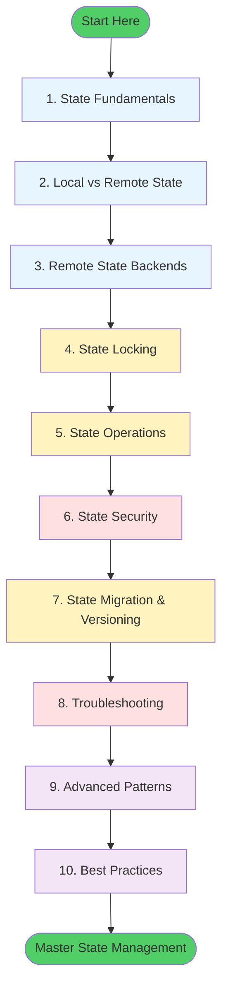

# Terraform State Management

Terraform State is the most critical component of your Infrastructure as Code lifecycle. It serves as the memory of your infrastructure, mapping your code to reality.

## 🗺️ Learning Path Visualization

---

## 📚 Learning Path

| # | Topic | Description | Key Concepts |
| :--- | :--- | :--- | :--- |
| **01** | [**Fundamentals**](./01-State-Fundamentals/State%20Fundamentals.md) | Understanding State | Anatomy, Metadata, Sync Cycle |
| **02** | [**Local vs. Remote**](./02-Local-vs-Remote-State/Local%20vs.%20Remote%20State.md) | Storage Strategies | Backends, Multi-user, Sharing |
| **03** | [**Remote Backends**](./03-Remote-State-Backends/Remote%20State%20Backends.md) | Standard Implementation | S3/DynamoDB, Azure, GCS, Cloud |
| **04** | [**State Locking**](./04-State-Locking/State%20Locking.md) | Concurrency Control | DynamoDB Schema, Stuck Locks |
| **05** | [**State Operations**](./05-State-Operations/State%20Operations.md) | CLI Mastery | mv, rm, import, show, list |
| **06** | [**State Security**](./06-State-Security/State%20Security.md) | Protection | KMS, Secrets, Attack Vectors |
| **07** | [**Migration**](./07-State-Migration/State%20Migration%20&%20Versioning.md) | Backend Switching | move, push, backup, versioning |
| **08** | [**Troubleshooting**](./08-Troubleshooting/Troubleshooting%20State%20Issues.md) | Recovery | Drift, Corruption, Stuck Lock fix |
| **09** | [**Advanced Patterns**](./09-Advanced-Patterns/Advanced%20State%20Patterns.md) | Scaling | Workspaces, Remote Data Sources |
| **10** | [**Best Practices**](./10-Best-Practices/State%20Best%20Practices.md) | Production Rules | The 7 Golden Rules |

---

## 🏗️ Module Features
- **250+ Total Quiz Questions**: Comprehensive mastery with interactive collapsible answers.
- **60+ High-Stakes Interview Questions**: Advanced prep for DevOps and Cloud Architect roles.
- **30+ Real-Life "War Stories"**: Lessons learned from state corruption, leaked secrets, and global lock outages.
- **15+ Visual Workflows**: Mermaid diagrams visualizing locking logic, security pipelines, and migration flows.

---

## 🎯 What You'll Learn
By the end of this module, you will:
- ✅ **Design**: Configure secure, highly-available remote backends.
- ✅ **Operate**: Master complex CLI commands to manipulate state without losing data.
- ✅ **Protect**: Implement encryption-at-rest and in-transit for sensitive infrastructure metadata.
- ✅ **Recover**: Systematically diagnose and fix corrupted states and stuck locking sessions.

---

## ❓ Master Interview Questions

1.  **Why is Terraform State considered a 'Security Liability'?**
    - *Answer*: State files often contain sensitive information in plain text (even if encrypted at rest), such as database passwords, SSH keys, or API tokens generated during resource creation. If an attacker gains access to the state file, they have the keys to your entire infrastructure.
2.  **Explain the difference between 'Implicit' and 'Explicit' dependency in state.**
    - *Answer*: Implicit dependencies are discovered by Terraform by analyzing resource references (e.g., `vpc_id = aws_vpc.main.id`). Explicit dependencies are manually defined using the `depends_on` meta-argument. Terraform uses both to build the Directed Acyclic Graph (DAG) saved in the state.
3.  **What is 'State Drift' and how do you resolve it?**
    - *Answer*: Drift occurs when the actual infrastructure in the cloud differs from what is recorded in the state file (usually due to manual changes in the console). You resolve it by running `terraform plan` to identify differences and then either `terraform apply` to overwrite changes or `terraform import` to update the state to match reality.
4.  **Can you run Terraform without a state file?**
    - *Answer*: Technically, no. Terraform always creates a state file. However, you can use a `null` backend or a local file you delete, but you lose the ability to manage existing resources safely. Terraform's entire value proposition relies on state.
5.  **How do you handle 'Workspaces' vs. 'File-Based' environment separation?**
    - *Answer*: Workspaces are built-in and store multiple states in one backend. File-based separation (different directories/folders) is often preferred for production because it provides better isolation and prevents a mistake in "Dev" from accidentally affecting "Prod" via shared backend logic.
6.  **What is the 'import' block in Terraform 1.5+?**
    - *Answer*: It is an evolution of the `terraform import` command. It allows for "Declarative Imports" inside your HCL code. You specify the resource ID and the target address, and Terraform can even generate the HCL code for you using the `-generate-config-out` flag.

---

## 🧠 Master Assessment (25 Questions)

<b>1. Terraform State is stored in which file format?</b>

Show Answer

Answer: B

<b>2. True/False: By default, sensitive outputs are hidden in the state file.</b>

Show Answer

Answer: A

<b>3. Which command updates the state file to match real-world infrastructure?</b>

Show Answer

Answer: B

<b>4. Locking the state prevents:</b>

Show Answer

Answer: B

<b>5. Which AWS service is commonly used for State Locking?</b>

Show Answer

Answer: B

<b>6. The 'serial' number in a state file is used for:</b>

Show Answer

Answer: B

<b>7. True/False: Local state is recommended for production environments.</b>

Show Answer

Answer: B

<b>8. Which command is used to move a resource from one address to another in state?</b>

Show Answer

Answer: B

<b>9. 'Remote State Data Source' allows you to:</b>

Show Answer

Answer: B

<b>10. What happens if a state file is 'Corrupted'?</b>

Show Answer

Answer: B

<b>11. Which block is used to configure where state is stored?</b>

Show Answer

Answer: B

<b>12. 'terraform state rm' will:</b>

Show Answer

Answer: B

<b>13. How do you 'force-unlock' a state if the process crashed?</b>

Show Answer

Answer: B

<b>14. True/False: You should commit your '.tfstate' file to Git.</b>

Show Answer

Answer: A

<b>15. Which command lists all resources currently tracked in the state?</b>

Show Answer

Answer: B

<b>16. 'State Versioning' in S3 allows you to:</b>

Show Answer

Answer: B

<b>17. What is the 'terraform.tfstate.backup' file?</b>

Show Answer

Answer: B

<b>18. Azure backends use which service for state storage?</b>

Show Answer

Answer: B

<b>19. In Terraform 1.5, 'import' is a:</b>

Show Answer

Answer: B

<b>20. True/False: Workspaces share the same state file.</b>

Show Answer

Answer: A

<b>21. 'Sensitive' attributes in state are:</b>

Show Answer

Answer: C

<b>22. Which command shows a human-readable version of the state?</b>

Show Answer

Answer: B

<b>23. 'terraform_remote_state' is a:</b>

Show Answer

Answer: B

<b>24. State is the '_____ of Truth' for Terraform.</b>

Show Answer

Answer: A

<b>25. Losing your state file is a '_____ Event'.</b>

Show Answer

Answer: B

---
*The state is the mind of the manager. Protect it well.*