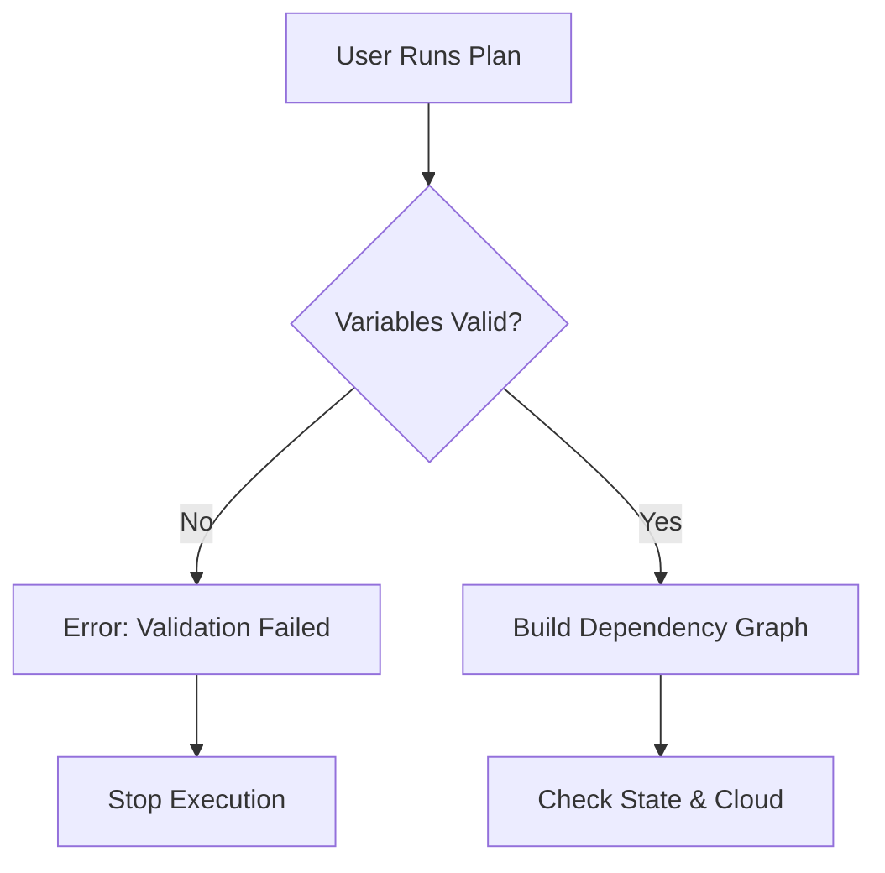

Building a module is more than just moving code into a folder. It involves creating a clean *interface* (variables) and ensuring *reliability* (validation).
## 1. The Module Creation Workflow
When building a module from scratch, follow this 3-step cycle:
1.  **Define Interface (`variables.tf`)**: What data do I need from the user?
2.  **Implement Logic (`main.tf`)**: Create resources using those inputs.
3.  **Expose Data (`outputs.tf`)**: What attributes will the user need back?
---
## 2. Step-by-Step: Building a Robust S3 Module

### Step 1: The Interface (<font color="#ff0000">Inputs</font>)
Use `validation` blocks to reject bad data *before* `terraform apply` runs. This is "<font color="#ffff00">Shift Left</font> " testing.
```hcl
variable "bucket_name" {
  type        = string
  description = "Global unique name of the bucket"
  
  validation {
    condition     = length(var.bucket_name) > 3 && length(var.bucket_name) < 63
    error_message = "Bucket name must be between 3 and 63 characters."
  }
}

variable "environment" {
  type        = string
  description = "Environment (dev, staging, prod)"
  
  validation {
    condition     = contains(["dev", "staging", "prod"], var.environment)
    error_message = "Environment must be one of: dev, staging, prod."
  }
}
```
### Step 2: The Logic (<font color="#ff0000">Implementation</font>)
Use `locals` to handle complex logic, tagging strategies, or conditional defaults so your resource blocks remain clean.
```hcl
locals {
  # Common tags for all resources in this module
  common_tags = {
    ManagedBy   = "Terraform"
    Environment = var.environment
    Project     = "DataLake"
  }
}

resource "aws_s3_bucket" "this" {
  bucket = var.bucket_name
  tags   = local.common_tags
}
```
### Step 3: The Result (<font color="#ff0000">Outputs</font>)
Always output IDs and ARNs. It costs nothing and saves users from having to ask for them later.
```hcl
output "bucket_id" {
  description = "The name of the bucket"
  value       = aws_s3_bucket.this.id
}

output "bucket_arn" {
  description = "The ARN of the bucket"
  value       = aws_s3_bucket.this.arn
}
```
___
## 3. Advanced Module Logic

### validation Logic Flow
Terraform checks variable validation *before* checking the state or cloud provider.



### `count` vs `for_each` inside Modules
You often need to create multiple similar resources inside a module based on input.
-   **Avoid `count` based on list length**: If items are removed from the middle of the list, Terraform may destroy/recreate resources due to index shifting.
-   **Prefer `for_each`**: Use maps or sets where the key is stable (e.g., username, subnet ID).
```hcl
# BAD (Risky)
resource "aws_iam_user" "users" {
  count = length(var.user_names)
  name  = var.user_names[count.index]
}

# GOOD (Safe)
resource "aws_iam_user" "users" {
  for_each = toset(var.user_names)
  name     = each.key
}
```
___
## 4. Real-Life Scenarios

### Scenario 1: The Typo that Cost $1,000 (<font color="#ff0000">Validation</font>)
**Problem**: An EC2 module accepts any string for `instance_type`. A junior dev typos `t3.large` as `m5.metal` (a very expensive bare-metal server).
**Result**: The code is syntactically valid. AWS launches the server. The bill skyrockets.
**The Fix**: Add validation to `variables.tf`:
```hcl
validation {
  condition = can(regex("^(t3|t2)", var.instance_type))
  error_message = "Only t3 and t2 types are allowed."
}
```
### Scenario 2: The "Optional" Variable Confusion (<font color="#ff0000">Defaults</font>)
**Problem**: You want to make `logging_bucket` optional.
**Solution**: Use `default = null`.
```hcl
variable "logging_bucket" {
  type    = string
  default = null
}

resource "aws_s3_bucket_logging" "example" {
  count  = var.logging_bucket != null ? 1 : 0
  bucket = aws_s3_bucket.this.id
  target_bucket = var.logging_bucket
}
```
This creates the logging resource *only* if the user provides a bucket name.
### Scenario 3: The Hard-coded Naming Conflict
**Problem**: A module hard-codes `name = "my-app-server"`.
**Consequence**: You can only use this module ONCE in an entire AWS region. The second time you call it, AWS rejects the duplicate name.
**The Fix**:
1.  Accept a `name_prefix` variable.
2.  Or use `random_id` resource.
3.  Or use `name_prefix` argument in resources instead of `name`.
___
## 5. ❓ Interview Questions

1.  **What happens if you define a variable but don't use it in `main.tf`?**
    *   **Answer**: Nothing bad happened in older versions, but current Terraform versions (and linters) will warn you about "unused declarations." It’s bad hygiene.

2.  **How do you ensure a module user only passes valid AZ names?**
    *   **Answer**: Use the `validation` block with a `regex` condition or `contains` function to check against a list of allowed zones.

3.  **Explain "Shift Left" in the context of Terraform Modules.**
    *   **Answer**: "Shift Left" means catching errors as early as possible. Using variable `validation` and `type` constraints catches errors during `plan` (or even coding), rather than waiting for `apply` to fail against the AWS API.

4.  **How do generate a random suffix for resources inside a module to ensure uniqueness?**
    *   **Answer**: Use the `random_id` or `random_string` resource (from the `hashicorp/random` provider) and append `random_id.this.hex` to your resource names.

5.  **Can you use `depends_on` inside a module?**
    *   **Answer**: Yes, individual resources can use `depends_on`. Additionally, the user of the module can use `depends_on` on the entire `module` block to wait for another module to finish.

6.  **What is the difference between `local` values and `variable` values?**
    *   **Answer**: `variable` values come from the *outside* (User Input). `local` values are calculated *inside* the module (Interim Logic/Constants) and cannot be changed by the user directly.

7.  **How do you conditionally create a resource in a module?**
    *   **Answer**: Use the `count` meta-argument with a ternary operator. E.g., `count = var.create_lb ? 1 : 0`.

8.  **What is the `any` type constraint?**
    *   **Answer**: It allows a variable to accept any type (string, list, object). It should be avoided because it disables Terraform's type checking, making the module fragile.

9.  **Why use `toset()` when iterating over a list of strings?**
    *   **Answer**: To convert the list to a set, allowing `for_each` to create resources. Sets are unordered and unique, which is usually preferred for independent resources like IAM users.

10. **Can a module output the entire resource object?**
    *   **Answer**: Yes (e.g., `value = aws_instance.web`). It passes all attributes to the root module, which is convenient but exposes internal implementation details.

---

## 6. 🧠 Knowledge Check (Quiz)

### Syntax & Logic
1.  **Which function is used to check if a value exists in a list?**
    *   [ ] `exists()`
    *   [x] `contains()`
    *   [ ] `in()`
    *   [ ] `has()`

2.  **The `error_message` in a validation block must be:**
    *   [ ] A number.
    *   [x] A complete sentence starting with an uppercase letter.
    *   [ ] A JSON object.

3.  **To create a resource ONLY if `var.enabled` is true, use:**
    *   [ ] `enabled = var.enabled`
    *   [x] `count = var.enabled ? 1 : 0`
    *   [ ] `if (var.enabled) { ... }`

4.  **If `var.list` is `["a", "b", "a"]`, what happens if you use `for_each = toset(var.list)`?**
    *   [ ] It creates 3 resources.
    *   [ ] It fails.
    *   [x] It creates 2 resources (duplicates removed).

5.  **Locals are defined in which block?**
    *   [x] `locals { ... }` (Plural)
    *   [ ] `local { ... }` (Singular)
    *   [ ] `var { ... }`

### Validation & Errors
6.  **When does Terraform check variable validation rules?**
    *   [ ] During `init`.
    *   [x] During `plan` and `apply`.
    *   [ ] Only after `apply` finishes.

7.  **Can you reference other variables inside a validation condition?**
    *   [x] No, validation logic can only refer to the variable itself (self-referential). (Note: This is true for variable validation, unlike resource preconditions).
    *   [ ] Yes, any interaction is allowed.

8.  **What allows you to catch expensive configuration errors before deployment?**
    *   [x] Variable Validation.
    *   [ ] Output Values.
    *   [ ] Locals.

9.  **Which regex function is commonly used in validation?**
    *   [x] `regex()` or `can(regex(...))`
    *   [ ] `grep()`
    *   [ ] `match()`

10. **A "Type Mismatch" error means:**
    *   [x] The user passed a List when a String was expected.
    *   [ ] The provider is down.
    *   [ ] The variable name is wrong.

### Scenarios
11. **You need to enforce that an S3 bucket name starts with "company-".**
    *   [ ] Use `substr()` in main.tf.
    *   [x] Use `startswith(var.name, "company-")` in validation.
    *   [ ] Use `policy` in IAM.

12. **You want to allow users to override calculated tags.**
    *   [ ] `tags = var.tags`
    *   [x] `tags = merge(local.default_tags, var.custom_tags)`
    *   [ ] `tags = local.default_tags + var.custom_tags`

13. **Why is `count` risky when using a list of resources?**
    *   [x] Removing an item shifts indices, causing unwanted recreations.
    *   [ ] It is slower.
    *   [ ] It doesn't support strings.

14. **Best practice for naming output values?**
    *   [ ] `out1`, `out2`
    *   [x] `bucket_id`, `bucket_arn` (Descriptive and explicit).
    *   [ ] `id`, `arn` (Ambiguous if module creates multiple things).

15. **To allow a null value for a string variable, you must:**
    *   [ ] Set `type = any`.
    *   [x] Set `default = null`.
    *   [ ] It's not possible.

### General
16. **Variables in Terraform are most analogous to what in Python?**
    *   [x] Function Arguments.
    *   [ ] Global Variables.
    *   [ ] Environment Variables.

17. **Can validation rules access data sources?**
    *   [x] No, because data sources aren't fetched before variable validation.
    *   [ ] Yes.

18. **What represents "Shift Left" in IaC?**
    *   [ ] Testing in production.
    *   [x] validating configuration as early as possible (e.g., pre-commit, plan).

19. **If a variable is marked `sensitive = true`, how does it appear in the plan output?**
    *   [ ] It is shown in plain text.
    *   [x] It is redacted as `(sensitive value)`.
    *   [ ] It is encrypted.

20. **Can `locals` be outputs?**
    *   [ ] Yes, directly.
    *   [x] Only if you assign the local value to an output block.
