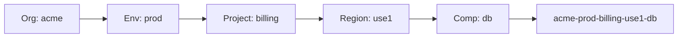

# Naming Conventions

There are only two hard things in Computer Science: cache invalidation and **naming things**. In Terraform, bad naming leads to resource collisions, "fear of refactoring," and cryptic state files that haunt teams for years.

---

## 🎨 1. The HCL Style Guide

Terraform follows a rigid but effective set of naming standards based on **<font color="#ffc000">Snake Case</font>** (`snake_case`) and lowercase identifiers.

| Component | Standard | ✅ Correct Example | ❌ Bad Example |
| :--- | :--- | :--- | :--- |
| **Resources** | `snake_case` | `aws_vpc` | `awsVpc`, `AWS-VPC` |
| **Variables** | `snake_case` | `instance_type` | `instanceType` |
| **Outputs** | `snake_case` | `vpc_id` | `VPC_ID`, `VpcId` |
| **Files** | `snake_case` | `main.tf` | `Main.tf`, `app-configs.tf` |

### Allowed Syntax Rules
- **Lowercase Only**: Always use `a-z` and `0-9`.
- **No Hyphens in IDs**: Use `_` as the primary separator for **<font color="#92d050">HCL identifiers</font>**.
- **No Leading Numbers**: Identifiers must start with a letter.
- **Hyphens for Tags**: Hyphens (`-`) are reserved for **<font color="#ffc000">public resource names</font>** (e.g., a Load Balancer's DNS name in the AWS console).

---

## 🏗️ 2. Resource Naming Strategy

### A. The "this" vs. "main" Philosophy
When a module creates only **one** instance of a resource type, the internal identifier should be **<font color="#92d050">"this"</font>** or **<font color="#92d050">"main"</font>**.

*   **Why?** It prevents "stuttering" (e.g., `aws_vpc.vpc`) and makes copying/pasting logic between modules significantly easier.
*   **Refactoring Safety**: Renaming an internal identifier (e.g., from `main` to `api_gateway`) is treated by Terraform as a **Destroy and Create** unless you use a `moved` block.

```hcl
# ✅ Best Practice (Generic)
resource "aws_security_group" "this" { ... }

# ❌ Anti-Pattern (Redundant)
resource "aws_security_group" "my_security_group" { ... }
```

### B. The External Labeling Pattern
For names that appear in your Cloud Console, follow a strict **<font color="#ffc000">Prefix-to-Role</font>** pattern:
`[Org]-[Env]-[Project]-[Region]-[Component]`

*   **Example**: `acme-prod-billing-us-east-1-db`



---

## 🔗 3. Predictable Outputs & Variables

### Variables: Specificity without Stuttering
Variables inside a module should be named after the **attribute** they modify, not the resource name.

*   **Good**: `cidr_block` inside a VPC module.
*   **Bad**: `vpc_cidr_block` (it's redundant since it's already in the VPC module).

### Outputs: The Consumer's Perspective
Always output the **<font color="#92d050">ID</font>** and **<font color="#92d050">ARN</font>** of created resources. Follow the pattern: `[Resource]_[Attribute]`.

*   **Examples**: `vpc_id`, `db_instance_endpoint`, `alb_dns_name`.
*   **Avoid**: `id`, `arn`, `name` (too ambiguous for consumers of your module).

---

## 🏗️ 4. Real-Life Scenarios

### Scenario 1: The "Version Stutter" Outage
*   **The Problem**: A team named their resource `resource "aws_instance" "nginx_v1_18"`.
*   **The Incident**: They needed to upgrade to Nginx 1.20. When they changed the code, they also changed the Terraform identifier to `nginx_v1_20`.
*   **Outcome**: Terraform triggered a **Destroy** for the old name and a **Create** for the new name, causing 10 minutes of downtime for a simple package update.
*   **The Fix**: Use **Role-based names** like `nginx_proxy`. Upgrades never require a resource rename in code.

### Scenario 2: The Global Bucket Collision
*   **The Problem**: A developer named their S3 bucket `logs-bucket`.
*   **Outcome**: The deployment failed because S3 bucket names are **globally unique**. Someone else in the world owned that name.
*   **The Fix**: Use a dynamic naming convention: `${var.org}-${var.env}-${var.project}-logs-${random_id.this.hex}`.

### Scenario 3: The "Moved" Block Salvation (Safety Refactoring)
*   **The Problem**: You have 100 resources named `web_server_01` and want to rename them to `this` to fit current standards.
*   **The Solution**: Instead of manually running `terraform state mv` (dangerous), use the **<font color="#92d050">`moved` block</font>**. It records the rename in code and ensures no infrastructure is destroyed.

---

## ❓ 5. Interview Questions (Expert Deep Dive)

1.  **Why do we use `_` for HCL identifiers but `-` for console resource names?**
    <details>
    <summary>Show Answer</summary>
    HCL syntax is strictly based on underscores (to match typical programming language conventions). However, cloud services (like AWS S3 or DNS) follow web standards where hyphens are the only allowed separators for URLs and hostnames.
    </details>

2.  **What is the "Context" approach to naming variables in modules?**
    <details>
    <summary>Show Answer</summary>
    Variables should be named as if you were looking at the resource itself. Inside a `security_group` module, a variable should be `name`, not `sg_name`. The context is provided by the module name itself.
    </details>

3.  **How do you handle S3 bucket naming in a multi-regional deployment?**
    <details>
    <summary>Show Answer</summary>
    Include the region in the naming convention (e.g., `us-east-1` vs `eu-west-1`) since S3 bucket names are global but the buckets themselves are regional.
    </details>

4.  **Why is `this` considered a "Copy-Paste Safe" identifier?**
    <details>
    <summary>Show Answer</summary>
    If all modules use `aws_instance.this`, you can easily copy logic from a "Database" module to a "Gateway" module without having to search-and-replace specific names throughout the file.
    </details>

5.  **What is the impact of naming on "State Locks"?**
    <details>
    <summary>Show Answer</summary>
    Naming itself doesn't lock the state, but inconsistent naming leads to developers running concurrent plans on the same resources under different assumptions, increasing the risk of "dirty" state files.
    </details>

---

## 🧠 6. Knowledge Check (Final Quiz)

### Syntax & Consistency
1.  **Which is the standard for a Terraform variable name?**
    - [ ] `InstanceType`
    - [ ] `instance-type`
    - [x] `instance_type`

2.  **Identifiers in HCL must start with:**
    - [ ] A number.
    - [x] A letter.
    - [ ] An underscore.

3.  **Which output name is most professional?**
    - [ ] `id`
    - [ ] `the_database_id`
    - [x] `db_instance_id`

### Operation & Strategy
4.  **Renaming `resource "aws_instance" "a"` to `resource "aws_instance" "b"` without a `moved` block results in:**
    - [ ] A simple rename in state.
    - [x] A **Destroy** of 'a' and **Create** of 'b'.
5.  **`name_prefix` is helpful because it:**
    - [x] Appends a random suffix to ensure global uniqueness and overlap during updates.
    - [ ] Makes the code shorter.

---

## 📖 7. Summary Checklist

✅ **Snake Case** for all internal code.
✅ **Role-based names** (e.g., `this`, `api`, `bastion`) instead of software versions.
✅ **Global Uniqueness** strategy for S3, IAM, and LB names.
✅ **Predictable Outputs** (`id`, `arn`, `endpoint`).
✅ **Descriptions** for every single variable.

---
**Module Status**: ✅ Comprehensive Verified
**Last Updated**: 2026-01-08
