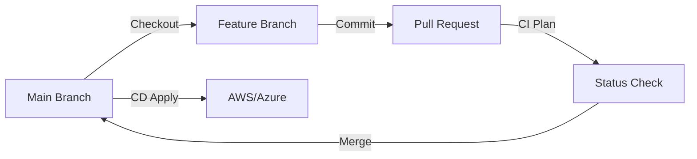

# Version Control Strategies

Treat your infrastructure like software. If it's not in Git, it doesn't exist.

## 1. Branching Models for IaC

Unlike app code, infrastructure has "State." This makes branching tricky.

### Trunk-Based Development (Recommended)
*   **Philosophy**: Short-lived feature branches, fast merge to `main`.
*   **Workflow**:
    1.  Create `feature/add-rds`.
    2.  Open PR.
    3.  CI runs `terraform plan`.
    4.  Review & Merge to `main`.
    5.  CD runs `terraform apply` on `main`.

### GitFlow (Legacy/Complex)
*   **Philosophy**: `develop` branch deploys to Dev env, `main` deploys to Prod.
*   **Problem**: Promoting an artifact from Dev to Prod in Terraform means *re-running* the apply. If `main` and `develop` drift, the "tested" code in Dev might behave differently in Prod.

### Visual: Trunk-Based IaC Workflow



---

## 2. The Definitive `.gitignore`

Never commit generated files or secrets.

```gitignore
# Local .terraform directories
**/.terraform/*

# .tfstate files
*.tfstate
*.tfstate.*

# Crash log files
crash.log
crash.*.log

# Exclude all .tfvars files, which are likely to contain sentitive data, such as
# password, private keys, and other secrets. These should not be part of version 
# control as they are data points which are potentially sensitive.
*.tfvars
*.tfvars.json

# Ignore override files as they are usually used to override resources locally and so
# are not checked in
override.tf
override.tf.json
*_override.tf
*_override.tf.json

# Ignore CLI configuration files
.terraformrc
terraform.rc
```

---

## 3. Code Review Checklist

Reviewing Terraform is harder than reviewing Python. focusing on the **Plan**, not just the code.

1.  **The Plan**: Does the PR include the output of `terraform plan`? (Use a bot like Atlantis or GitHub Actions to post it).
2.  **Destructive Changes**: Search for `destroy` or `replace`. Is data loss acceptable?
3.  **Naming**: Do resources follow the Naming Standards?
4.  **Hardcoded Values**: Are there magic IP addresses or IDs?
5.  **Docs**: Did the `README.md` update (via `terraform-docs`)?

---

## 4. Semantic Commits

Write commit messages that explain *why*, not just *what*.

*   **Format**: `type(scope): subject`
*   **Types**:
    *   `feat`: New resource.
    *   `fix`: Bug fix.
    *   `docs`: Documentation only.
    *   `chore`: Maintenance (upgrading provider versions).
    *   `style`: Formatting (terraform fmt).

**Example**:
> `feat(vpc): add private subnets for rds`

---

## 5. Real-Life Scenarios

### Scenario 1: "The Committed Binary"
**Problem**: A user committed the `.terraform/` directory (300MB of provider binaries) to the repo.
**Consequence**: Cloning the repo took forever. Team members on different OS versions (Mac vs Linux) found the binaries incompatible and `init` failed.
**Fix**: Added `.terraform` to `.gitignore` and removed the folder from Git history.

### Scenario 2: "The Merge Conflict"
**Problem**: Two engineers managed state locally and committed `terraform.tfstate` to Git.
**Event**: Engineer A added an EC2. Engineer B added an S3 bucket. They merged. The state file had conflict markers `<<<< HEAD`.
**Consequence**: Terraform could not read the corrupted state file.
**Lesson**: **NEVER** commit state to Git. Use a Remote Backend (S3/DynamoDB).

### Scenario 3: "Ghost Resources"
**Problem**: A developer renamed a resource in a PR but forgot to add a `moved` block.
**Event**: The reviewer didn't check the Plan output carefully.
**Outcome**: Terraform destroyed the database (Data Loss) and created a new one with the new name.
**Fix**: Always enforce "Plan Review" in CI. Look for "red" text (Destroy).

---

## 6. ❓ Interview Questions

1.  **Why should you ignore `*.tfvars`?**
    *   **Answer**: They often contain secrets (passwords, keys) or environment-specific configuration that shouldn't be shared globally.

2.  **What is the "Atlantis" workflow?**
    *   **Answer**: A GitOps tool where you ensure Terraform runs via Pull Request comments (e.g., commenting `atlantis plan` runs the plan and posts the output back to the PR).

3.  **Explain "Drift" in the context of Git vs Cloud.**
    *   **Answer**: Drift is when the live infrastructure (Cloud) differs from the Code (Git), usually due to manual "ClickOps" changes.

4.  **How do you rollback a Terraform change using Git?**
    *   **Answer**: `git revert` the merge commit, allowing the CD pipeline to run `apply` on the old code (which typically destroys the new resources).

5.  **Is "Trunk-Based Development" suitable for Terraform?**
    *   **Answer**: Yes, and it's preferred. Long-lived feature branches usually result in massive merge conflicts because infrastructure state evolves quickly.

6.  **What is a "Monorepo" for Terraform?**
    *   **Answer**: Storing all modules and environment configurations in a single Git repository. It simplifies code sharing but requires smart CI tooling to only build changed directories.

7.  **Why use Semantic Commits?**
    *   **Answer**: It allows automated release notes generation and semantic versioning (e.g., `fix` triggers a patch release, `feat` triggers a minor release).

8.  **Can you diff a binary Plan file?**
    *   **Answer**: No. You must use `terraform show -json tfplan` to convert it to readable text/JSON for diffing.

9.  **What happens if you delete the `.terraform.lock.hcl` file?**
    *   **Answer**: Terraform might upgrade your providers to newer versions during `init`, potentially introducing breaking changes that weren't tested.

10. **How do you handle a large Pull Request in Terraform?**
    *   **Answer**: Break it down. A PR touching 50 resources is risky. Split it into "Networking PR", "Database PR", "App PR" to reduce the blast radius of a bad merge.

---

## 7. 🧠 Knowledge Check (Quiz)

### Git Basics
1.  **Which file MUST be in `.gitignore`?**
    *   [ ] `main.tf`
    *   [x] `.terraform/`

2.  **Committing the state file (`.tfstate`) is:**
    *   [ ] Recommended.
    *   [x] Dangerous and bad practice.

3.  **Semantic Commit format is:**
    *   [ ] `Code changed.`
    *   [x] `type(scope): description`

4.  **The `.terraform.lock.hcl` file should be:**
    *   [x] Committed to Git.
    *   [ ] Ignored.

5.  **GitFlow typically uses:**
    *   [ ] Only `main`.
    *   [x] `develop` and `main` (and release branches).

### Workflow & Review
6.  **"ClickOps" refers to:**
    *   [x] Manual changes in the Cloud Console.
    *   [ ] Clicking the mouse fast.

7.  **A Terraform Plan in a PR helps detect:**
    *   [x] Destructive changes (Destroy/Replace).
    *   [ ] Syntax errors (Validation does this).

8.  **Atlantis is a tool for:**
    *   [ ] Database management.
    *   [x] Pull Request Automation for Terraform.

9.  **If a Plan shows "4 to add, 1 to destroy", you should:**
    *   [ ] Merge immediately.
    *   [x] Investigate why 1 is being destroyed (Is it safe?).

10. **The `master` or `main` branch usually represents:**
    *   [x] The Source of Truth (Prod).
    *   [ ] Experimental code.

### Scenarios
11. **If you rename a file from `vc.tf` to `vpc.tf`:**
    *   [x] Terraform doesn't care (it reads all `.tf` files). Git tracks the move.
    *   [ ] Terraform destroys resources.

12. **Using a Pre-Commit hook can:**
    *   [x] Automatically run `terraform fmt` and `docs`.
    *   [ ] Deploy code.

13. **Why avoid binary files in Git?**
    *   [x] They bloat the repo size and can't be diffed.
    *   [ ] Git doesn't support them.

14. **"GitOps" means:**
    *   [x] Operations by Pull Request; Git is the single source of truth.
    *   [ ] Using GitHub.

15. **If CI fails on `terraform fmt` check:**
    *   [ ] Ignore it.
    *   [x] Run `terraform fmt` locally and push again.

### General
16. **Provider plugins are:**
    *   [x] large binaries downloaded during init.
    *   [ ] text files.

17. **A "Feature Branch" should live:**
    *   [ ] Forever.
    *   [x] Only as long as the feature takes to implement (days).

18. **Can you put multiple modules in one Repo?**
    *   [x] Yes (Monorepo pattern).
    *   [ ] No.

19. **`terraform.tfvars` should usually be:**
    *   [x] Ignored (if it has secrets) or used for default non-sensitive local testing.
    *   [ ] Public.

20. **Tags in Git (e.g., `v1.0.0`) are used for:**
    *   [x] Module versioning.
    *   [ ] Branching.