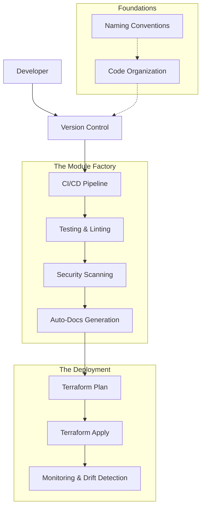

# Terraform Best Practices

**Mastering Terraform** is about more than just writing HCL; it's about building a **robust**, **secure**, and **maintainable** ecosystem for your infrastructure. In an enterprise environment, "working code" is just the baseline—professional SREs focus on **Predictability**, **Resiliency**, and **Scalability**.

---

## 🧭 The Best Practices Ecosystem

Professional IaC management requires a multi-layered approach. It starts with a solid foundation and moves through automated pipelines to constant observability.

---

## 🚀 Why Best Practices Matter

In the world of Infrastructure as Code, technical debt translates directly into **operational risk**. Adhering to these standards ensures:
- **📉 Reduced Blast Radius**: Isolation prevents a bug in a dashboard from taking down the database.
- **🛡️ Enhanced Security**: Secrets are never leaked, and permissions are restricted by design.
- **⚡ Team Velocity**: New engineers can understand the codebase in minutes, not days.
- **💰 Cost Control**: Automated tools prevent over-provisioning and orphaned resources.

---

## 📚 Learning Path

1.  **[01. Code Organization](Code%20Organization%20Best%20Practices.md)**: Structuring for scale and **blast radius reduction**.
2.  **[02. Naming Conventions](./02-Naming-Conventions/README.md)**: Industry standards for **self-documenting code**.
3.  **[03. Security Best Practices](./03-Security-Best-Practices/README.md)**: Secret management and the **principle of least privilege**.
4.  **[04. Performance Optimization](./04-Performance-Optimization/README.md)**: Faster plans and effective **parallelism**.
5.  **[05. Testing Strategies](./05-Testing-Strategies/README.md)**: From static analysis to **Terratest**.
6.  **[06. Documentation Standards](./06-Documentation-Standards/README.md)**: Automated READMEs and **architecture diagrams**.
7.  **[07. Version Control](./07-Version-Control/README.md)**: Git branching models for infrastructure.
8.  **[08. CI/CD Integration](./08-CI-CD-Integration/README.md)**: Orchestrating safe, **automated deployments**.
9.  **[09. Monitoring and Observability](./09-Monitoring-and-Observability/README.md)**: Tracking health, cost, and **drift detection**.
10. **[10. Troubleshooting Guidelines](./10-Troubleshooting-Guidelines/README.md)**: Debugging logs and **state recovery**.

---

## 🏗️ Module Features

- **✅ 200+ Quiz Questions**: Validating best practices across 13 detailed sub-modules.
- **👔 Enterprise Interview Prep**: Sophisticated Q&A tailored for Senior SRE and DevOps Architect roles.
- **🏗️ Real-Life Scenarios**: "Stories from the Trenches" covering outages, migrations, and architecture recoveries.
- **📊 Visual Standards**: Mermaid diagrams and architecture blueprints for every major concept.

---

## 📺 YouTube Lessons

For video walk-throughs on specific best practices, check out the **[📺 YouTube Lessons](../Youtube_Lessons.md)** in the parent directory.

---
**Module Status**: ✅ Comprehensive Verified
**Last Updated**: 2026-01-08
