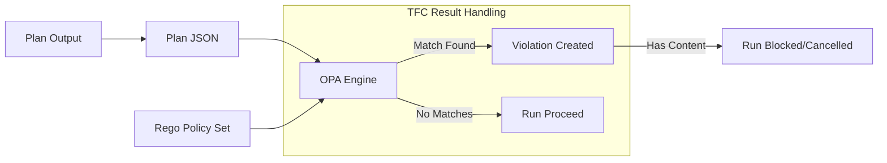

# Policy as Code (OPA)

While Sentinel is the native HashiCorp solution, **Open Policy Agent (OPA)** is the industry-standard, CNCF-graduated project for general-purpose policy enforcement. HCP Terraform's native support for OPA (using the **Rego** language) allow organizations to unify their governance across Kubernetes, Cloud, and CI/CD pipelines.

---

## 🏗️ 1. OPA vs. Sentinel: The Strategic Choice

| Feature | Sentinel | Open Policy Agent (OPA) |
| :--- | :--- | :--- |
| **Origin** | HashiCorp Proprietary. | Cloud Native Computing Foundation (CNCF). |
| **Language** | Sentinel (Imperative/Functional). | Rego (Declarative/Logic-based). |
| **Versatility** | Optimized for HashiCorp tools. | Ubiquitous (K8s, CI/CD, Envoy, Kafka). |
| **Ecosystem** | Strong tied to TFC features. | Massive open-source library of policies. |

**Platform Strategy**: If your company already uses OPA to secure **Kubernetes (Gatekeeper)** or Service Meshes, using OPA for Terraform is the logical choice to reuse Rego skills and policy libraries across the entire stack.

---

## 🔄 2. The OPA Integration Flow

HCP Terraform executes OPA by converting the **<font color="#92d050">Terraform Plan</font>** into a JSON payload and feeding it into the OPA engine alongside your `.rego` policy files.



### The Declarative Logic Model
Unlike traditional languages, Rego doesn't use "if-then" statements. Instead, you define **sets of violations**.
- If the `deny` set is **empty**, the policy passes.
- If the `deny` set contains **any messages**, the policy fails.

---

## 💻 3. Rego Logic Example: Restricting S3 Public Access

```rego
package terraform

import input.tfplan as tfplan

# Rule: Deny if S3 bucket has public ACL
deny[msg] {
    # 1. Search through every resource change in the plan
    r := tfplan.resource_changes[_]
    r.type == "aws_s3_bucket"
    
    # 2. Check for public ACLs in the 'after' state
    public_acls := ["public-read", "public-read-write"]
    r.change.after.acl in public_acls
    
    # 3. Define failure message
    msg := sprintf("S3 Bucket %v violates security policy: Public ACLs are banned.", [r.address])
}
```

---

## 🚀 4. Real-Life Scenarios

### Scenario 1: The "Polyglot" Policy
*   **The Incident**: A security team had to maintain two different policy languages: Rego for Kubernetes Admission Control and Sentinel for Terraform Cloud.
*   **The OPA Solution**: They migrated Terraform policies to OPA. They created a shared "Compliance Helper" library in Rego that validates VPC CIDRs, Tag formats, and Cost Centers.
*   **Outcome**: Policy authoring time was cut by 50%, and consistency across K8s and Cloud improved significantly.

### Scenario 2: The "Untrusted" Public Module
*   **The Incident**: A developer used a community module that sneakily added an administrative IAM role for cross-account access.
*   **The OPA Solution**: A Rego policy was written to scan `resource_changes` of type `aws_iam_role`. If the policy in the role contained a `*` (Star) action for an external principal, the run was blocked.
*   **Outcome**: A potential supply-chain attack was blocked by automated inspection of the plan JSON.

---

## ❓ 5. Interview Questions (Expert Deep Dive)

1.  **Why is Rego described as a "Declarative" language?**
    <details>
    <summary>Show Answer</summary>
    Unlike imperative languages where you write `for` loops and `if` statements, in Rego, you describe the **state of violation**. OPA then searches the JSON input to see if any data matches that state. If it finds a match, the rule is true.
    </details>

2.  **Does HCP Terraform support "Soft Mandatory" overrides for OPA?**
    <details>
    <summary>Show Answer</summary>
    **Yes**. HCP Terraform treats OPA as a first-class citizen. You can map specific OPA rules to **Advisory**, **Soft Mandatory**, or **Hard Mandatory** levels, just like Sentinel.
    </details>

3.  **What is the role of the `terraform plan -json` output in OPA?**
    <details>
    <summary>Show Answer</summary>
    OPA cannot read `.tf` files or binary state. It requires a structured JSON representation of the plan. This JSON contains the `resource_changes`, `prior_state`, and `configuration` blocks that OPA parses as its primary `input`.
    </details>

4.  **How do you unit test an OPA policy?**
    <details>
    <summary>Show Answer</summary>
    Using the `opa test` command. You create a separate file (e.g., `policy_test.rego`) that defines "fake" inputs and asserts whether the `deny` rule should be empty or contain a specific message. This enables a full CI/CD pipeline for your security policies.
    </details>

5.  **What is the "Rego Playground"?**
    <details>
    <summary>Show Answer</summary>
    An interactive web-based IDE (`play.openpolicyagent.org`) where you can paste your Terraform Plan JSON and your Rego code to see the results of policy evaluations in real-time. It is essential for rapid prototyping.
    </details>

---

## 🧠 6. Knowledge Check (Quiz)

### Architecture & Engines
1.  **OPA stands for:**
    - [x] Open Policy Agent.
    - [ ] Organized Policy Architecture.
2.  **Rego policies are grouped into:**
    - [ ] Folders.
    - [x] **Packages**.
3.  **The primary input for OPA in HCP Terraform is:**
    - [ ] The `.tf` source code.
    - [x] The **Plan JSON** output.

### Logic & Scenarios
4.  **To block a run, the `deny` rule must:**
    - [ ] Return `false`.
    - [x] **Produce a non-empty set of messages**.
5.  **The `[_]` operator in Rego is used for:**
    - [x] **Iteration** (searching through every element in an array).
    - [ ] Multiplication.
6.  **Can OPA check the configuration of provider versions?**
    - [x] **Yes** (by inspecting the `configuration` block in the plan JSON).
    - [ ] No.

---

## 📖 7. Final Summary Checklist

✅ **CNCF Alignment**: Use OPA if your organization prioritizes open-source standards and Kubernetes.
✅ **Modular Packages**: Organize your Rego code into packages (e.g., `package terraform.security`).
✅ **Detailed Deny Messages**: Always include the resource address (`r.address`) so developers can fix the error.
✅ **Mock Testing**: Never deploy a policy without a corresponding `rego_test` file.
✅ **Plan JSON Mastery**: Learn the structure of the `tfplan` JSON to write more efficient queries.

---
**Module Status**: ✅ Comprehensive Verified
**Last Updated**: 2026-01-08
