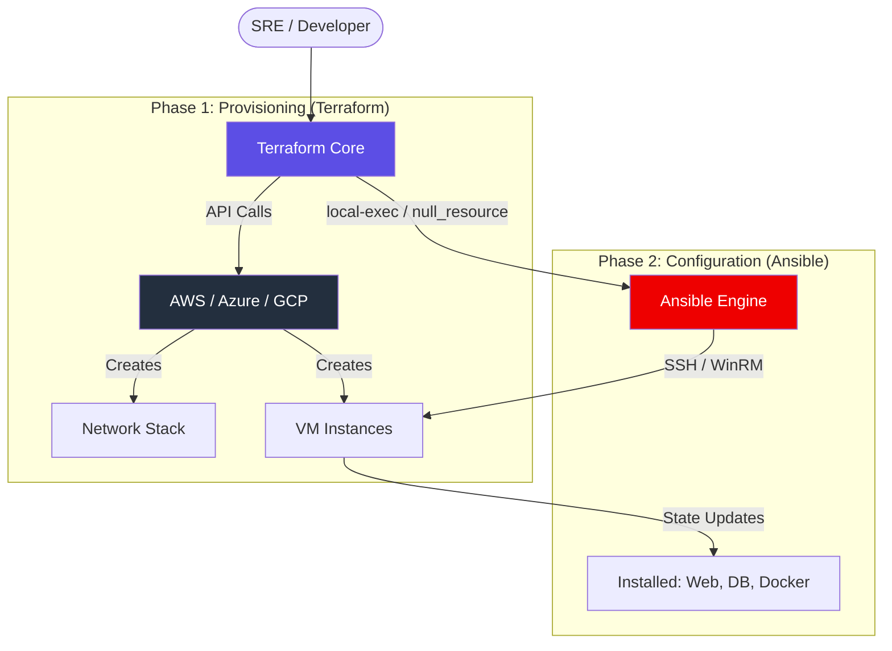
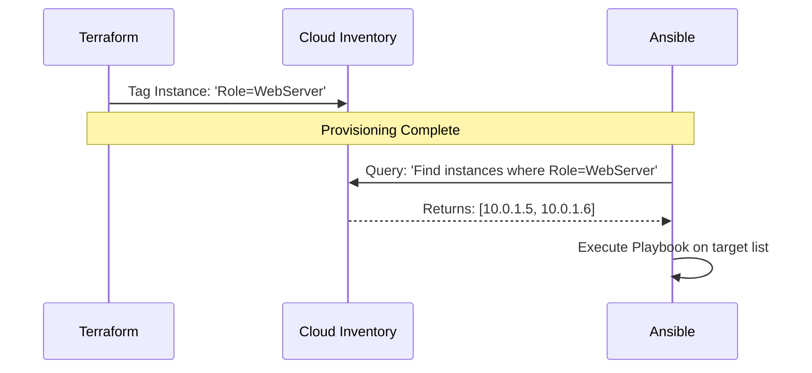

Combining Terraform and Ansible creates a powerful **<font color="#92d050">Full-Stack Automation Pipeline</font>**. Terraform handles the "Cradle" (Provisioning Infrastructure), and Ansible handles the "Life" (Configuring Software & Maintenance).

---
## 🏗️ 1. The Integrated Architecture
The most common workflow involves Terraform deploying the virtual hardware and then triggering Ansible to configure it. This is often referred to as the **Infrastructure-as-Code (IaC) Handover**.



### Why Integration Matters:
- **Separation of Concerns**: Terraform focuses on identity and availability; Ansible focuses on state and service health.
- **Speed to Value**: You can deploy a fully functional environment from zero to "Hello World" in a single command.
- **Hybrid Strategy**: Use Terraform for immutable infrastructure (ASGs) and Ansible for mutable infrastructure (Legacy servers).
---
## 🛠️ 2. Advanced Integration Patterns

### Pattern A: The `null_resource` Orchestrator
To avoid coupling configuration logic directly to a VM resource (which might trigger unnecessary recreations), use a `null_resource` or `terraform_data` (TF 1.5+) block.
```hcl
resource "aws_instance" "web" {
  ami           = "ami-12345"
  instance_type = "t3.micro"
}

resource "null_resource" "ansible_trigger" {
  # Re-run if instance ID or playbook changes
  triggers = {
    instance_id   = aws_instance.web.id
    playbook_hash = filemd5("playbook.yml")
  }

  provisioner "local-exec" {
    command = "ansible-playbook -i ${aws_instance.web.public_ip}, playbook.yml"
  }

  depends_on = [aws_instance.web]
}
```
### Pattern B: The Dynamic Inventory Handshake
Instead of passing IPs manually, Ansible can query the cloud provider (using `aws_ec2` plugin) to find targets based on Terraform-applied tags.



---

## � 3. Real-Life Scenarios

### Scenario 1: The "SSH Race Condition"
*   **The Problem**: Ansible fails because it tries to connect before the VM's SSH daemon has fully started, even though the VM is "Running."
*   **The Fix**: Use a `remote-exec` block inside the VM resource to act as a "Wait for Ready" signal before the `local-exec` Ansible call.
*   **Outcome**: 100% success rate on first-time deployments.
### Scenario 2: Immutable vs. Mutable Drift
*   **The Problem**: A security patch needs to be applied to 50 existing instances.
*   **The Strategy**: 
    - **Terraform Approach**: Update the AMI ID and recreate all 50 instances (Infrastructure replacement).
    - **Ansible Approach**: Run a playbook to update packages across the existing fleet (Configuration update).
*   **Outcome**: The team chooses Ansible for zero-downtime patching of stateful databases, and Terraform for stateless web nodes.
---

## ❓ 4. Interview Questions (Expert Deep Dive)
1.  **If an Ansible playbook fails during a Terraform run, what happens to the Terraform state?**
    <details>
    <summary>Show Answer</summary>
    The resource associated with the failed provisioner is marked as **"tainted"**. In the next run, Terraform will destroy and recreate that resource to ensure it reaches the desired state.
    </details>

2.  **How do you handle secrets during the Terraform-to-Ansible handover?**
    <details>
    <summary>Show Answer</summary>
    Never pass secrets as command-line arguments in `local-exec`. Instead, use **Environment Variables** (`environment = { SEC_KEY = var.key }`) or integration with **HashiCorp Vault**.
    </details>

3.  **Explain the "cloud-init" alternative to Ansible provisioners.**
    <details>
    <summary>Show Answer</summary>
    Cloud-init (via `user_data`) is a "pull" model. The VM configures itself on boot. While it removes the need for SSH access from the runner, it is harder to debug and orchidstrate compared to the Ansible "push" model.
    </details>

---

## 🧠 5. Knowledge Check (Quiz)

### Lifecycle & Mechanics
1.  **A failed `local-exec` provisioner results in a resource being:**
    - [ ] Deleted immediately.
    - [x] **Tainted**.
2.  **Which HCL block is best for decoupling Ansible from VM lifecycle?**
    - [ ] `data`
    - [x] **`null_resource`**
3.  **To run Ansible on private IPs, the Terraform runner must have:**
    - [x] **VPN or Bastion/ProxyJump access.**
    - [ ] Public IP access.

---

## 📖 6. Final Summary Checklist

✅ **Provisioners as Last Resort**: Use Cloud-init for simple tasks; Ansible for complex ones.
✅ **Wait for Connectivity**: Always use a `remote-exec` port check before calling Ansible.
✅ **Use Dynamic Inventory**: For production, rely on Cloud Tags rather than hardcoded IP strings.
✅ **Taint Awareness**: Remember that recreating a database because of a config typo can lead to data loss.
✅ **Secure the Handover**: Use Variable Sets and Env Vars to pass sensitive data to the configuration phase.

---
**Module Status**: ✅ Comprehensive Verified
**Last Updated**: 2026-01-08
