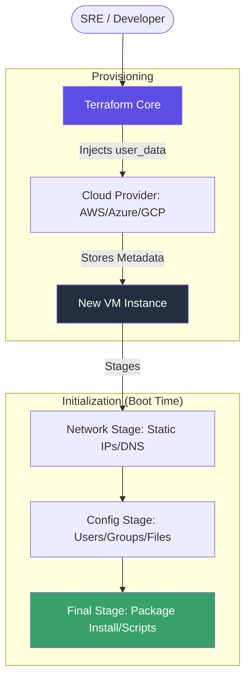

Cloud-Init is the industry-standard method for **<font color="#92d050">Cross-Platform Cloud Instance Initialization</font>**. In Terraform, this is primarily implemented using the `user_data` or `user_data_base64` attributes to bootstrap virtual machines automatically upon their first boot.

---
## 🏗️ 1. The Cloud-Init Lifecycle
Unlike provisioners (which push configuration after the VM is up), Cloud-Init is a **"Pull" model**. The cloud provider's metadata service (IMDS) provides the script, and the internal Cloud-Init agent executes it as the system boots.



### Why Use Cloud-Init?
- **No SSH Required**: Configuration happens before the SSH service is even started.
- **Fail-Safe**: If a script fails, the instance is still "clean" and managed by Terraform.
- **Speed**: Packages are installed during the OS startup sequence, reducing total "Time to Ready."
- **Immutable Ready**: Perfect for Auto Scaling Groups (ASGs).
---
## 🛠️ 2. Implementation Patterns

### Pattern A: Standard Shell Script (The Quick Way)
The simplest form is a standard bash script passed as a heredoc.
```hcl
resource "aws_instance" "web" {
  ami           = "ami-12345"
  instance_type = "t3.micro"

  user_data = <<-EOF
    #!/bin/bash
    apt update && apt install -y nginx
    systemctl enable --now nginx
  EOF
}
```
### Pattern B: Cloud-Config YAML (The Professional Way)
Using the `#cloud-config` format allows for declarative management of users, files, and packages. This is best handled via Terraform's `templatefile` function.
```hcl
# main.tf
resource "aws_instance" "app" {
  ami           = var.ami_id
  instance_type = "t3.small"

  user_data = templatefile("${path.module}/cloud-init.yaml", {
    admin_user = "sre_admin"
    app_port   = 8080
  })
}
```
---
## 🚀 3. Real-Life Scenarios

### Scenario 1: The Zero-Trust Hardening
*   **The Goal**: Deploy a server that is unreachable via SSH but fully functional.
*   **The Solution**: Use Cloud-Init to install the application and configure the firewall. Since Cloud-Init runs locally on the guest via the metadata service, it doesn't need an open port 22 to work.
*   **Outcome**: A hardened, production-ready node with a reduced attack surface.
### Scenario 2: Dynamic Volume Mounting
*   **The Goal**: Automatically format and mount an attached EBS volume upon instance boot.
*   **The Solution**: Use the `fs_setup` and `mounts` blocks in the `#cloud-config` YAML.
*   **Outcome**: Storage is ready for the application immediately without manual `mkfs` commands.
---
## ❓ 4. Interview Questions (Expert Deep Dive)

1.  **What is the difference between `user_data` and `user_data_base64`?**
    <details>
    <summary>Show Answer</summary>
    `user_data` accepts plain text (which the provider usually base64 encodes for you). `user_data_base64` allows you to provide pre-encoded data, which is useful for avoiding escaping issues or passing binary data.
    </details>

2.  **Does Terraform wait for Cloud-Init to finish before marking a resource as "created"?**
    <details>
    <summary>Show Answer</summary>
    **No**. Terraform considers the resource "created" once the Cloud Provider API confirms the VM is starting. The internal Cloud-Init execution happens asynchronously. To wait for it, you must use a separate "health check" mechanism.
    </details>

3.  **How do you debug a failed Cloud-Init script?**
    <details>
    <summary>Show Answer</summary>
    By inspecting the logs on the guest VM: `/var/log/cloud-init.log` (agent activity) and `/var/log/cloud-init-output.log` (stdout/stderr of your custom scripts).
    </details>

---

## 🧠 5. Knowledge Check (Quiz)

1.  **Cloud-Init logs are primarily found in:**
    - [ ] `/var/log/syslog`
    - [x] **`/var/log/cloud-init-output.log`**
2.  **Which HCL function is best for passing variables into a cloud-config file?**
    - [ ] `file()`
    - [x] **`templatefile()`**
3.  **Cloud-Init scripts run with which privileges?**
    - [x] **Root / Sudo**
    - [ ] The default user.

---

## 📖 6. Final Summary Checklist

✅ **Prefer Metadata**: Use Cloud-Init instead of SSH provisioners whenever possible.
✅ **Declarative YAML**: Favor `#cloud-config` over raw bash for better readability and structure.
✅ **Log Aggregation**: In production, forward cloud-init logs to a central system (CloudWatch/Loki) for debugging.
✅ **Idempotency**: Ensure your scripts can handle a reboot (although Cloud-Init usually runs only once per instance ID).
✅ **Template Everything**: Use Terraform variables to drive your Cloud-Init configuration rather than hardcoding.

---
**Module Status**: ✅ Comprehensive Verified
**Last Updated**: 2026-01-08
