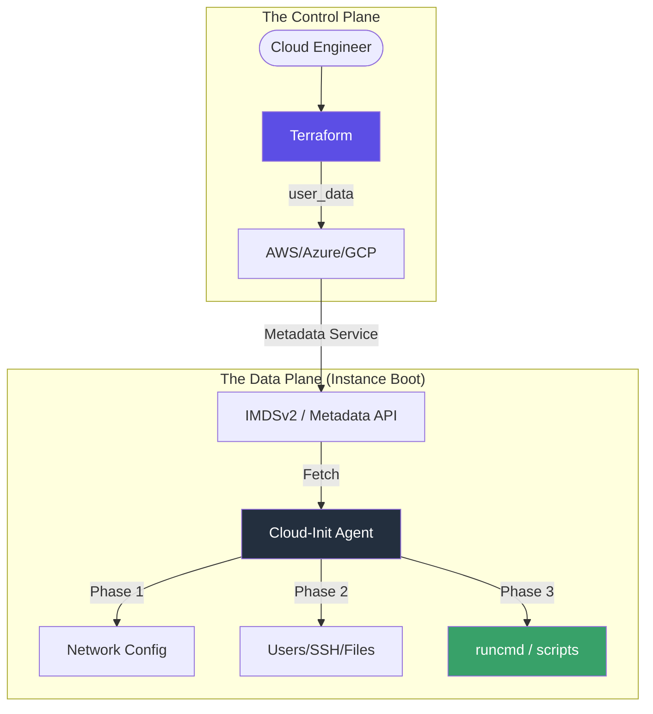

# The Deep Dive
Cloud-Init is the industry-standard method for **<font color="#92d050">Cross-Platform Cloud Instance Initialization</font>**. It allows you to transform a generic OS image into a specialized node (Web Server, Database, etc.) without ever needing manual SSH access.

---
## 🏗️ 1. Orchestration Architecture
Cloud-Init operates as a "metadata consumer." Terraform acts as the "metadata producer."



### Key Differences: Cloud-Init vs. Provisioners

| Feature | Cloud-Init (`user_data`) | Terraform Provisioners (`remote-exec`) |
| :--- | :--- | :--- |
| **Model** | **Pull** (Guest fetches config) | **Push** (Runner connects to guest) |
| **Connectivity** | No SSH/Network ingress needed | Requires Port 22/5985 open |
| **Reliability** | Native to cloud-init agent | Subject to network/SSH timeouts |
| **Ordering** | Runs during early boot | Runs after VM is fully up |
| **Security** | Most Secure (Zero-ingress) | Moderate (Requires ingress) |

---
## 🛠️ 2. Advanced Configuration Patterns

### Template-Driven YAML
Modern DevOps avoids hardcoding. We use Terraform's `templatefile` to inject environment-specific data into the cloud-config.
```hcl
# main.tf
resource "aws_instance" "node" {
  user_data = templatefile("cloud-config.tftpl", {
    env  = "production"
    db_endpoint = aws_db_instance.main.address
  })
}
```
### Multipart MIME (Mixed Scripts)
Sometimes you need to combine a YAML config with a Shell script. Cloud-init supports multipart MIME messages. TFC provides a `cloudinit_config` data source for this.
```hcl
data "cloudinit_config" "foo" {
  gzip          = false
  base64_encode = false

  part {
    content_type = "text/cloud-config"
    content      = file("config.yaml")
  }

  part {
    content_type = "text/x-shellscript"
    content      = "echo 'Hello World'"
  }
}
```

---

## 🚀 3. Real-Life Scenarios

### Scenario 1: The "Unreachable" Web Server
*   **Challenge**: Secure a server by closing all inbound ports except 80 and 443. How do you configure it without SSH?
*   **The Cloud-Init Fix**: Embed all `apt install`, `nginx.conf` writes, and `ufw` firewall rules into the `#cloud-config`.
*   **Outcome**: The instance boots up, configures its own firewall, starts Nginx, and becomes functional—all without a single SSH connection ever being established.

### Scenario 2: Auto-Scaling with Warm Pools
*   **Challenge**: Instances in an Auto-Scaling Group (ASG) take too long to start because they have to download large Docker images.
*   **The Cloud-Init Fix**: Use Cloud-init to trigger a `docker pull` immediately upon the first networking stage.
*   **Outcome**: By the time the ASG health check hits the node, the images are already cached locally.

---

## ❓ 4. Interview Questions (Expert Deep Dive)

1.  **Where can you find Cloud-Init logs on a Linux system?**
    <details>
    <summary>Show Answer</summary>
    There are two main logs:
    1. `/var/log/cloud-init.log`: Agent-specific logs (network, stages).
    2. `/var/log/cloud-init-output.log`: Captures the `stdout` and `stderr` of all scripts ($runcmd, shell parts).
    </details>

2.  **How do you re-run Cloud-Init without destroying the instance?**
    <details>
    <summary>Show Answer</summary>
    By default, cloud-init runs once per Instance ID. To force a re-run, you can delete the marker file `sudo rm -rf /var/lib/cloud/*` and run `sudo cloud-init init` or `sudo cloud-init clean --reboot`.
    </details>

3.  **What is the maximum size of `user_data`?**
    <details>
    <summary>Show Answer</summary>
    For AWS, the limit is **16 KB**. If your config exceeds this, you should use the `user_data` to download a larger script from S3 or use a pre-baked AMI (Packer).
    </details>

---

## 🧠 5. Knowledge Check (Quiz)

1.  **Which Cloud-Init stage handles package installation?**
    - [ ] Network Stage.
    - [x] **Final / Modules Stage.**
2.  **Does `#cloud-config` require a specific header?**
    - [x] **Yes, the first line must be `#cloud-config`.**
    - [ ] No, it's optional.
3.  **Can Cloud-Init create users and SSH keys?**
    - [x] **Yes.**
    - [ ] No, only scripts.

---

## 📖 6. Final Summary Checklist

✅ **Prefer User-Data**: Use Cloud-Init for any setup that doesn't require complex, persistent orchestration.
✅ **Use Templates**: Leverage HCL `templatefile` to keep logic in TF and config in YAML.
✅ **Check the Output**: Always verify `/var/log/cloud-init-output.log` during your troubleshooting phase.
✅ **Security first**: Use Cloud-Init to bake in security patches and rotate default passwords immediately on boot.

---
**Module Status**: ✅ Comprehensive Verified
**Last Updated**: 2026-01-08
