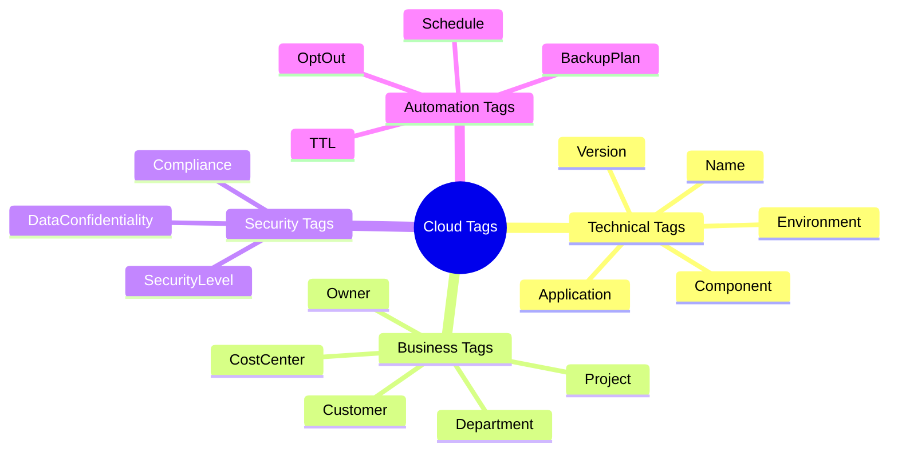

# 🏷️ Tagging Strategies for Cost Allocation
Resource tagging is the foundation of cloud cost management. Without consistent tags, it is impossible to determine which project, team, or department is responsible for specific cloud costs.

## 🚀 Why Tagging Matters
- **Cost Allocation:** Break down your cloud bill by Cost Center, Project, or Owner using Cost Explorer or Billing reports.
- **Automation:** <font color="#ffc000">Trigger cleanup scripts or auto-shutdown schedules</font> based on tags (e.g., `environment: development`, `schedule: business-hours`).
- **Governance:** identify untagged resources using Terraform policies (Sentinel/Checkov) or Cloud Native tools like AWS Config.
- **Security:** Use Attribute-Based Access Control (ABAC) to restrict access based on resource tags.
---
## 🛠️ Implementing Default Tags in AWS
One of the most powerful features in the AWS Provider is the ability to apply `default_tags` at the provider level. This ensures that every resource created by that provider instance inherits the specified tags automatically.
```hcl
provider "aws" {
  region = "us-east-1"

  default_tags {
    tags = {
      Environment = "Production"
      Project     = "Skyline-Apollo"
      Owner       = "DevOps-Team"
      ManagedBy   = "Terraform"
      CostCenter  = "CC-12345"
      Department  = "Engineering"
    }
  }
}

resource "aws_instance" "web" {
  ami           = "ami-0c55b159cbfafe1f0"
  instance_type = "t3.micro"
  
  # These tags will be MERGED with the provider's default tags
  tags = {
    Name = "Web-Server-01"
    Role = "Frontend"
  }
}
```
### 💡 Multi-Provider Best Practice
If you are managing multiple AWS accounts (e.g., Dev, Staging, Prod), define the provider in a base module with environment-specific default tags to ensure consistency across the entire organization.

---
## 📊 Tagging Hierarchy & Taxonomy
Standardizing your tagging schema across the organization is critical. Use the following hierarchy as a guide to ensure all metadata is captured.



---
## 🛡️ Enforcing Tags with Terraform
### 1. Variable Validation
You can use Terraform's `variable` validation to ensure mandatory tags are passed before the plan is even generated.
```hcl
variable "mandatory_tags" {
  type = map(string)
  description = "A map of tags to apply to all resources"
  
  validation {
    condition     = contains(keys(var.mandatory_tags), "CostCenter") && contains(keys(var.mandatory_tags), "Owner")
    error_message = "Mandatory tags missing: 'CostCenter' and 'Owner' must be provided."
  }
}
```
### 2. Policy as Code (Checkov Example)
Use tools like **<font color="#ff0000">Checkov</font>** to prevent the deployment of resources that don't have the required tags in the CI/CD pipeline.
```yaml
# checkov-policy.yaml snippet
check:
  id: "CKV_AWS_1"
  name: "Ensure all resources have mandatory tags"
  resource: "aws_*"
  attribute: "tags.CostCenter"
  operator: "exists"
```
---
## 📈 Real-Life Scenario: The "<font color="#ff0000">Zombie</font>" Resource Cleanup
A large enterprise discovered they were spending **$5,200/month** on unattached EBS volumes and idle RDS snapshots that were forgotten during testing.
**The Solution:**
1. **Standardization:** Updated all Terraform templates to include a `TTL` (Time To Live) and `OptOut` tag.
2. **Implementation:**
   - Resources with `TTL: 48h` are automatically deleted after 2 days.
   - Resources with `OptOut: True` are skipped by cleanup scripts.
3. **Execution:** Every Sunday, a Lambda script (managed via Terraform) scans for resources and terminates "Zombie" instances.
4. **Result:** Reduced waste by **34%** in the first month, saving over **$20,000 annually**.
---
## 📝 Common Tagging Pitfalls to Avoid
- **Case Sensitivity:** `Environment` vs `environment`. Standardize on one (usually CamelCase or kebab-case).
- **Over-Tagging:** Don't add tags that change frequently (like `LastModifiedBy`) unless automated, as Terraform will see this as a drift.
- **Spaces in Values:** Use hyphens or underscores instead of spaces to avoid CLI parsing issues.
---

[Next: Right-Sizing ➡️](02-Right-Sizing.md)