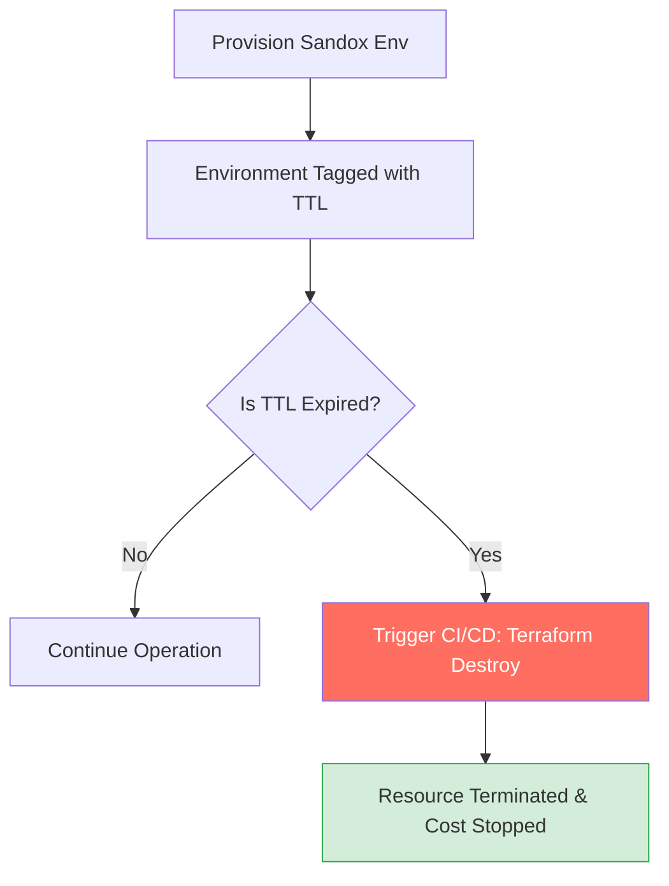
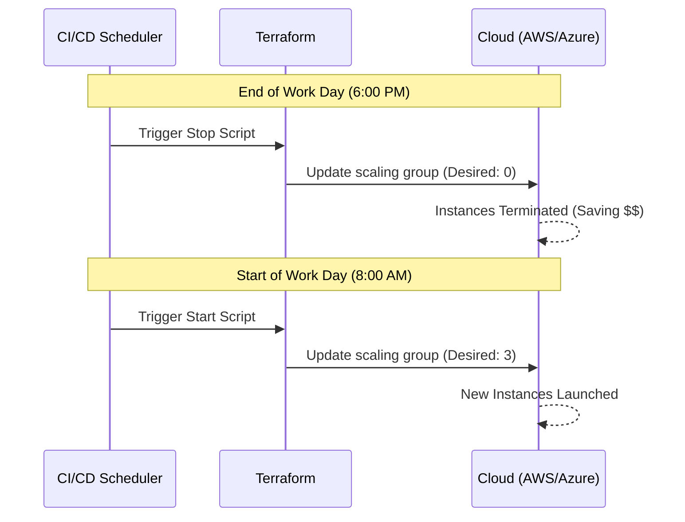
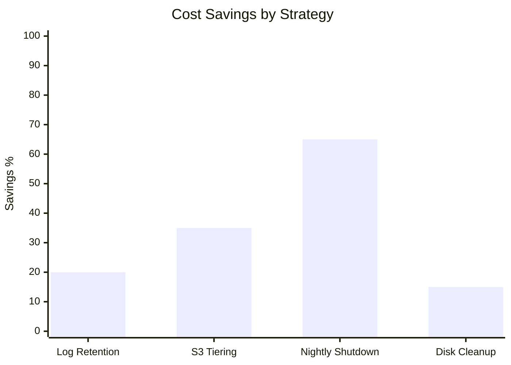

# ♻️ Lifecycle Management & Waste Reduction

Cloud waste is often caused by resources that are forgotten or left running long after they've served their purpose. Terraform helps automate the cleanup and lifecycle of these resources through policy-driven infrastructure.


## 🗑️ Common Sources of Cloud Waste

1.  **Orphaned <font color="#ff0000">Snapshots</font>:** Backups of volumes that no longer exist.
2.  **Idle <font color="#ff0000">Load Balancers</font>:** Provisioned but pointing to zero healthy instances.
3.  **Old <font color="#ff0000">S3 Versions</font>:** Keeping every version of a file forever without a expiration policy.
4.  **Zombie <font color="#ff0000">Disks</font>:** Unattached EBS, Azure Managed Disks, or GCP Persistent Disks.
5.  **Infinite <font color="#ff0000">Logs</font>:** CloudWatch or Stackdriver logs set to "Never Expire".

---

## 🛠️ Automated Lifecycle Policies

### 1. S3 Lifecycle Rules (Storage Tiering)
Instead of manually deleting objects, use Terraform to move old data to cheaper storage (<font color="#00b050">Glacier</font>) or delete it entirely.

```hcl
resource "aws_s3_bucket_lifecycle_configuration" "cleanup" {
  bucket = aws_s3_bucket.logs.id

  rule {
    id     = "archive-and-cleanup"
    status = "Enabled"

    transition {
      days          = 30
      storage_class = "GLACIER" # 60% cheaper than Standard
    }

    expiration {
      days = 90 # Auto-delete logs older than 3 months
    }
  }
}
```

### 2. CloudWatch Log Retention
By default, CloudWatch logs are kept forever. Use Terraform to enforce a retention policy.

```hcl
resource "aws_cloudwatch_log_group" "app_logs" {
  name              = "/aws/lambda/my-function"
  retention_in_days = 14 # Drastically reduces CloudWatch storage costs
}
```

### 3. Auto-Deletion for Temporary Environments
Use **TTL** (<font color="#00b050">Time To Live</font>) patterns. 



---

## 🕒 Scheduling Resource Activity
For Dev/Test environments, running resources 24/7 is a primary driver of waste. Using <font color="#00b050">Scheduled Autoscaling</font> is the most effective remedy.



---

## 🛡️ The `lifecycle` Meta-Argument
Terraform provides built-in safeguards to manage how resources are handled during updates and destruction.

```hcl
resource "aws_instance" "app" {
  # ...
  lifecycle {
    # 1. Prevents accidental 'terraform destroy'
    prevent_destroy = true 

    # 2. Ensures new resource is up BEFORE old one is killed (zero downtime)
    create_before_destroy = true 

    # 3. Ignore manual changes made in the UI to prevent constant 'drifts'
    ignore_changes = [tags, instance_type]
  }
}
```

---

## 📊 Waste Reduction Potential (Impact Analysis)
Implementing these four strategies can reduce your monthly bill significantly.



---

## 📈 Real-Life Scenario: The "S3 Glacier" Shift
A media company was storing <font color="#00b050">500TB</font> of raw footage in S3 Standard, costing them thousands per month. Only 5% of that footage was accessed after the first 30 days.

**The Solution:**
Implemented the S3 Lifecycle policy shown above via Terraform.
1.  **Day 1-30:** S3 Standard (Immediate access).
2.  **Day 31-90:** S3 Intelligent-Tiering.
3.  **Day 91+:** <font color="#00b050">Glacier Deep Archive</font>.

**Result:** Their monthly S3 bill dropped from <font color="#ff0000">$12,000</font> to <font color="#00b050">$3,500</font>.

---

[Next: Infracost Integration ➡️](./04-Infracost-Integration.md)
