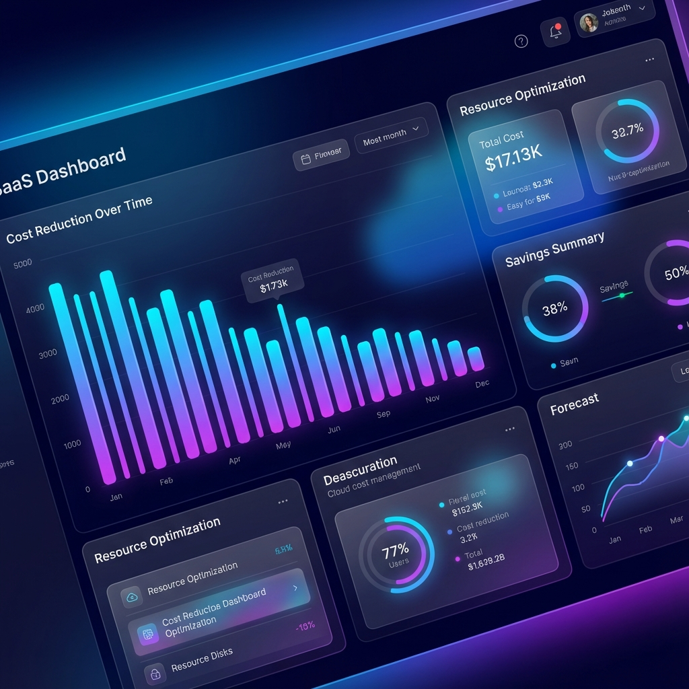
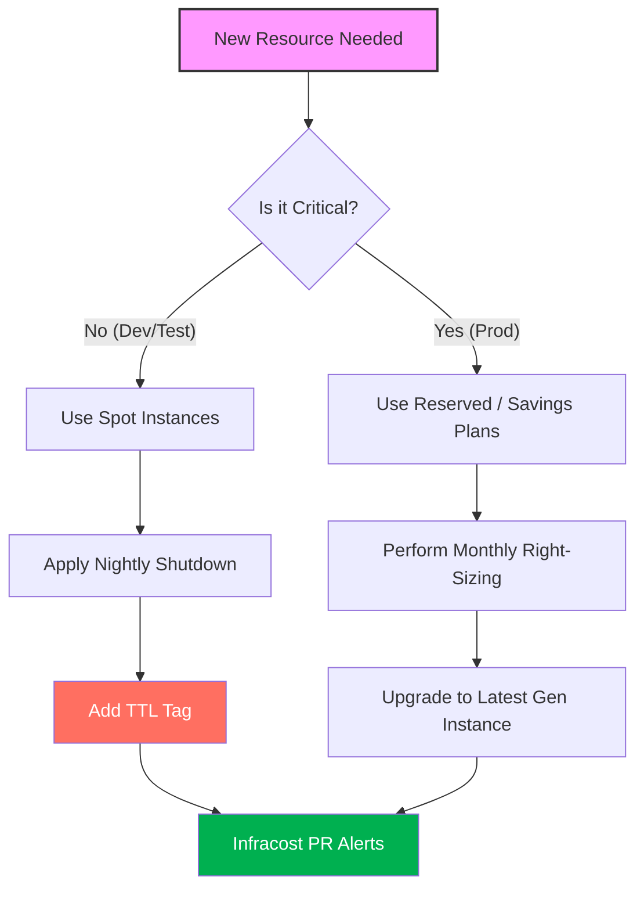
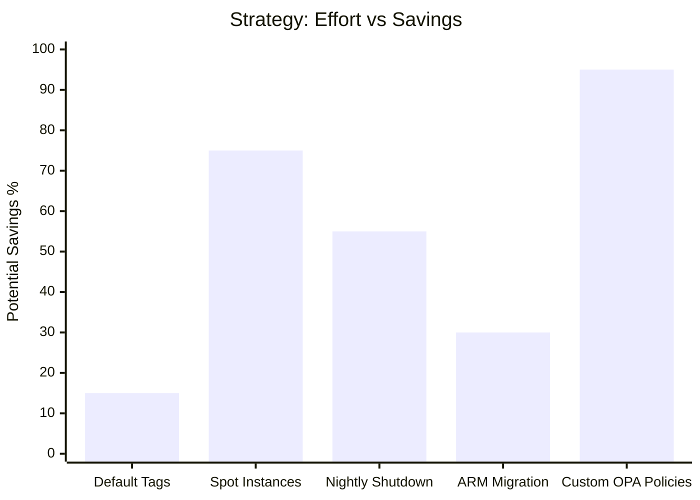

# 🚀 Pro Tips & Hacks for Terraform Cost Management
Mastering cloud costs with Terraform requires more than just knowing the resources; it requires clever implementation patterns that automate savings and enforce efficiency. This section contains engineering "hacks" used by senior SREs to keep cloud bills lean.

## 🧠 The Cost Optimization Decision Tree
Not every saving strategy is right for every project. Use this decision tree to determine your next move.



---
## 🛠️ The "Hacks" Collection
### 💡 Hack #1: Forcing Case Consistency in Tags
Inconsistent tagging (e.g., `Env: Prod` vs `env: prod`) breaks billing reports. Use HCL functions to enforce standards.
```hcl
variable "environment" {
  type    = string
  default = "Development"
}

locals {
  # Forces all environment tags to be lowercase and trimmed
  standardized_env = lower(trimspace(var.environment))
}

resource "aws_instance" "app" {
  # ...
  tags = {
    Environment = local.standardized_env
  }
}
```
### 💡 Hack #2: The "Dev-Zero" Pattern
Automatically scale environments to zero during off-hours or weekends using a single variable toggle.
```hcl
variable "is_working_hour" {
  type    = bool
  default = true
}

resource "aws_autoscaling_group" "dev_asg" {
  # If it's not working hours, scale to 0. Otherwise, use 2.
  desired_capacity = var.is_working_hour ? 2 : 0
  max_size         = var.is_working_hour ? 5 : 0
  min_size         = 0
  # ...
}
```
### 💡 Hack #3: Ignore External Auto-Tags
Cloud providers or 3rd party tools often add tags (like `last-scanned`) that cause Terraform to detect "drift". Use the `ignore_tags` provider block to stop unnecessary updates.
```hcl
provider "aws" {
  ignore_tags {
    key_prefixes = ["kubernetes.io/", "aws:"]
    keys         = ["LastScannedByVault", "BackupPlanID"]
  }
}
```
### 💡 Hack #4: Use `terraform state list` for Waste Audits
You can quickly find expensive resources currently in your state without logging into the console.
```bash
# Find all unattached volumes or specific instance types
terraform state list | grep "aws_instance"
```
---
## 📊 Effort vs. Saving Potential
Some hacks are easier to implement than others. Aim for the "High Impact, Low Effort" quadrant first.

---
## 🛡️ Pro Tips for Clean Code
1.  **Tag Everything:** Even your S3 buckets and IAM roles. This makes "Untagged Resource" audits much easier.
2.  **Use `t3a` instead of `t3`:** AMD instances are typically 10% cheaper than Intel equivalents in AWS with identical performance.
3.  **Clean up State Buckets:** Ensure your Terraform state S3 bucket has a lifecycle policy to delete old versions of state files.
4.  **Pin Provider Versions:** Price calculation logic in tools like Infracost depends on stable provider versions.
---
## 📈 Real-Life Scenario: The "AMD Switch"
A company running 200 `t3.medium` instances switched their Terraform variable to use `t3a.medium`. 
**The Hack:**
```hcl
# Before
instance_type = "t3.medium"
# After
instance_type = "t3a.medium"
```
**Result:**
- **Performance Change:** 0% (Identical specs).
- **Cost Change:** -10% immediate saving.
- **Total Saving:** **$1,200/month** by changing one character in a variable file.
---

[⬅️ Back to Module Overview](./README.md)
