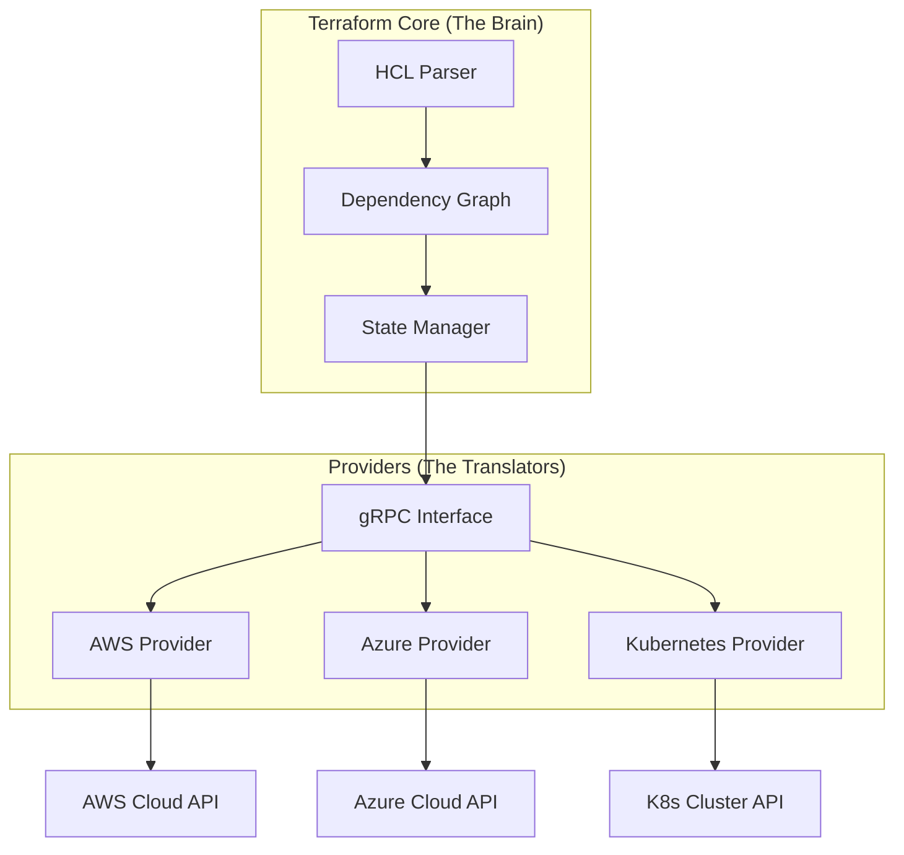

# Terraform & Multi-Cloud CLI Mastery
Welcome to Day 1 of your Infrastructure as Code (IaC) journey. Today, we go beyond the surface of Terraform to understand why it has become the industry standard for cloud orchestration and how you can master its architecture, environment setup, and advanced command workflows.

---
## 🏗️ 1. Orchestration vs. Configuration Management
One of the most common points of confusion in DevOps is the difference between tools like **Terraform** and **Ansible**.

| Feature | Terraform (Orchestration) | Ansible (Config Management) |
| :--- | :--- | :--- |
| **Primary Goal** | Provisioning Infrastructure (VPC, VMs, DBs) | Configuring OS/Apps (Installing Nginx, Users) |
| **Architecture** | Agentless (API-based) | Agentless (SSH/WinRM-based) |
| **Approach** | **Declarative** (Desired State) | **Procedural/Imperative** (Step-by-Step) |
| **State** | State-aware (Tracks what it created) | Stateless (Checks system state via SSH) |

### The Power of Declarative Code
In a **Declarative** model, you define *what* you want (e.g., "I want 3 servers"). If you run the code again, Terraform sees you already have 3 servers and does nothing. This is called **Idempotency**.

---
## 🧩 2. Architectural Deep Dive
Terraform’s strength lies in its modular, plugin-based architecture.
### A. Terraform Core
Written in Go, the Core is the brain of the operation. It is responsible for:
- **Reading Configuration**: Parsing HCL files.
- **State Management**: Comparing the current state to the desired state.
- **Dependency Graph (<font color="#ffc000">DAG</font>)**: Building a mathematical map to determine which resources can be created in parallel.
### B. Providers (The Translators)
Terraform Core does not know how AWS or GCP works. It uses **Providers** as translators.
- Providers are external binaries that communicate with Core via **gRPC**.
- Each provider translates HCL commands into specific API calls (e.g., `aws_instance` becomes an `ec2:RunInstances` call).



### C. The State File (<font color="#ff0000"> terraform.tfstate</font> )
The State file is the "<font color="#ffc000">Source of Truth</font>." It bridges the gap between your code and reality.
- **Metadata**: It stores IDs of real-world resources.
- **Performance**: It allows Terraform to know the state of thousands of resources without querying the Cloud APIs every time.
- **Locking**: When used with a remote backend (<font color="#ffc000">S3</font>/<font color="#ffc000">GCS</font>), it prevents two engineers from running <font color="#ffc000">apply</font> at the same time and corrupting the environment.
---
## 🛠️ 3. Environment Setup & Installation
Before writing code, you need a robust local environment. This includes Terraform itself and the CLIs for the major cloud providers.
### A. Terraform Installation
Professional DevOps engineers use version managers to handle different projects.
#### Windows (Chocolatey/Winget)
```powershell
# Using Chocolatey
choco install terraform

# Using Winget
winget install HashiCorp.Terraform
```
#### **Linux (tfenv - Recommended)**
`tfenv` allows you to switch between versions seamlessly.
```bash
git clone --depth=1 https://github.com/tfutils/tfenv.git ~/.tfenv
echo 'export PATH="$HOME/.tfenv/bin:$PATH"' >> ~/.bashrc
source ~/.bashrc

tfenv install 1.7.0
tfenv use 1.7.0
```
---
### B. AWS CLI Installation
The AWS Command Line Interface (CLI) is used to manage AWS services and authenticate Terraform.
#### **Windows**
1. Download the [AWS CLI MSI Installer](https://awscli.amazonaws.com/AWSCLIV2.msi).
2. Run the installer and verify: `aws --version`
#### **Linux (x86_64)**
```bash
curl "https://awscli.amazonaws.com/awscli-exe-linux-x86_64.zip" -o "awscliv2.zip"
unzip awscliv2.zip
sudo ./aws/install
```
### **macOS**
```bash
curl "https://awscli.amazonaws.com/AWSCLIV2.pkg" -o "AWSCLIV2.pkg"
sudo installer -pkg AWSCLIV2.pkg -target /
```
---
### C. Azure CLI Installation (az)
The Azure CLI is essential for managing Azure resources and service principals.
#### **Windows**
```powershell
$ProgressPreference = 'SilentlyContinue'; Invoke-WebRequest -Uri https://aka.ms/installazurecliwindows -OutFile .\AzureCLI.msi; Start-Process msiexec.exe -Wait -ArgumentList '/I AzureCLI.msi /quiet'; rm .\AzureCLI.msi
```
#### **Linux (Ubuntu/Debian)**
```bash
curl -sL https://aka.ms/InstallAzureCLIDeb | sudo bash
```
#### **macOS (Homebrew)**
```bash
brew update && brew install azure-cli
```
---
### D. Google Cloud CLI (gcloud)
Used for GCP authentication and resource management.
#### **Windows**
1. Download the [Google Cloud CLI Installer](https://dl.google.com/dl/cloudsdk/channels/rapid/GoogleCloudSDKInstaller.exe).
2. Follow the setup wizard and run `gcloud init`.
#### **Linux (Debian/Ubuntu)**
```bash
sudo apt-get update
sudo apt-get install apt-transport-https ca-certificates gnupg curl
curl https://packages.cloud.google.com/apt/doc/apt-key.gpg | sudo gpg --dearmor -o /usr/share/keyrings/cloud.google.gpg
echo "deb [signed-by=/usr/share/keyrings/cloud.google.gpg] https://packages.cloud.google.com/apt cloud-sdk main" | sudo tee -a /etc/apt/sources.list.d/google-cloud-sdk.list
sudo apt-get update && sudo apt-get install google-cloud-cli
```
#### **macOS (Homebrew)**
```bash
brew install --cclass google-cloud-sdk
```
---
## 🚀 4. The Terraform Lifecycle (The Inner Loop)
A DevOps engineer performs these steps hundreds of times a day in this order:
### Core Development Workflow
1.  **`terraform fmt`**:
    - Formats your code to HashiCorp's standard style.
    - Automatically fixes indentation, spacing, and alignment.
    - **Best Practice**: Run before every commit or enable "Format on Save" in your IDE.

2.  **`terraform validate`**:
    - Validates the syntax and internal consistency of your configuration.
    - Checks for typos, missing required arguments, and invalid references.
    - **Runs offline** - doesn't require provider credentials or network access.

3.  **`terraform init`**:
    - Initializes the working directory (run once per project or when providers change).
    - Downloads required Provider plugins into the `.terraform/` folder.
    - Sets up the backend for state storage.
    - **Re-run when**: Adding new providers or changing backend configuration.

4.  **`terraform plan`**:
    - Performs a "Dry Run" against real infrastructure.
    - Compares code vs. state vs. reality.
    - Generates an execution plan (What will be Created, Changed, or Destroyed).
    - **Always review** the plan output before applying.

5.  **`terraform apply`**:
    - Executes the plan after confirmation.
    - Makes actual API calls to the cloud.
    - Updates the `terraform.tfstate` file with new resource information.
---
### Additional Essential Commands
#### **`terraform show`**
- **Purpose**: Display current state or saved plan in human-readable format.
- **When to use**: Debugging resource configurations or reviewing what's currently deployed.
#### **`terraform output`**
- **Purpose**: Display output values (IPs, URLs) for use in other systems or CI/CD pipelines.
#### **`terraform destroy`**
- **Purpose**: Gracefully removes all resources managed by the current configuration.
- **Best Practice**: Always run `terraform plan -destroy` first.
---
### Advanced Troubleshooting Commands

##### **`terraform state` - State File Surgery**
```bash
terraform state list            # List all tracked resources
terraform state show <res>     # Show details of a specific resource
terraform state rm <res>       # Stop tracking a resource (Manual delete)
terraform state mv <old> <new> # Rename a resource in state without destroying it
```
##### **`terraform import` - Adopt Existing Infrastructure**
Brings existing cloud resources (created manually) under Terraform management.
```bash
terraform import aws_instance.web i-1234567890abcdef0
```
##### **`terraform taint` - Force Resource Recreation**
Marks a resource as "unhealthy," forcing it to be destroyed and recreated on next apply.
```bash
terraform taint aws_instance.web_server
```
##### **`terraform workspace` - Multi-Environment Management**
Manage multiple environments (dev, staging, prod) using the same code but separate state files.
```bash
terraform workspace list
terraform workspace new production
terraform workspace select dev
```
---
## 📄 5. HCL Syntax: The Building Blocks
### A. The Resource Block
Defines a piece of infrastructure to be created.
```hcl
resource "aws_instance" "web_server" {
  ami           = "ami-12345678" 
  instance_type = "t3.micro"     
  tags = { Name = "WebSrv" }
}
```
### B. Variables & Outputs
- **Variables**: Input parameters to make your code reusable.
- **Outputs**: Information displayed after deployment (e.g., Load Balancer URL).
---
## 🛡️ 6. SRE Best Practices: Day 1 Standards
1.  **Never Hardcode**: Use variables for regions, environment names, and secrets.
2.  **Remote State**: <font color="#ffc000">Never keep your state file on your laptop</font>. Use S3/GCS with DynamoDB/Firestore locking.
3.  **Version Pinning**: Always pin your Terraform and Provider versions to prevent "<font color="#ffc000">breaking changes</font>" from automatic updates.
4.  **Formatting**: Always run <font color="#ff0000">terraform fmt</font> before committing.
---
## 🌟 7. Real-Life Scenarios: Lessons from the Field
### Scenario 1: The Parallelization Miracle (<font color="#ff0000">Efficiency</font>)
**Situation**: You need to deploy a complex network consisting of a VPC, 50 Subnets, and 100 Security Group rules.
**The Terraform Way**: Because Terraform builds a **DAG** (<font color="#ff0000">Directed Acyclic Graph</font>), it spawns parallel API calls, deploying the entire network in seconds. This highlights the power of <font color="#ffc000">automated dependency management</font>.
### Scenario 2: The "<font color="#ff0000">Plan</font>" That Saved the Database (Safety)
**Situation**: An engineer updates an RDS instance identifier in the code.
**The Save**: **<font color="#00b050">terraform plan</font>** shows a <font color="#ff0000">-</font> / <font color="#00b050">+</font> destroy and then create replacement. The engineer realizes this would cause **permanent data loss** and cancels the change.
### Scenario 3: The "<font color="#ff0000">Configuration Drift</font>" Catch (Security)
**Situation**: A developer manually adds a "0.0.0.0/0" rule to a Security Group.
**The Detection**: The next morning, the CI job's **<font color="#00b050">terraform plan</font>** detects the drift. Running **<font color="#00b050">apply</font>** restores the security group to its secure, documented state.
### Scenario 4: The "<font color="#ff0000">State Lock</font>" Deadlock (Collaboration)
**Situation**: Bob and Alice try to run <font color="#00b050">apply</font> at the same time.
**The Protection**: DynamoDB Locking prevents Alice's process from overlapping with Bob's, avoiding **state corruption**.

---
## ❓ 8. Knowledge Check & Interview Prep
1.  **Why is `terraform init` required for every new project?**
    <details><summary>Answer</summary>To download the specific provider binaries and initialize the backend storage.</details>
2.  **What happens if you change a resource manually in the Cloud Console?**
    <details><summary>Answer</summary>It creates **Configuration Drift**. Terraform will detect it on the next plan and offer to revert the changes.</details>
3.  **What is the difference between `terraform state rm` and `terraform destroy`?**
    <details><summary>Answer</summary>`destroy` deletes the cloud resource; `state rm` only stops tracking it in Terraform (the resource stays running).</details>
4.  **Explain Implicit vs. Explicit dependencies.**
    <details><summary>Answer</summary>Implicit is detected automatically via resource references; Explicit is defined manually using `depends_on`.</details>
5.  **What is the purpose of `terraform.lock.hcl`?**
    <details><summary>Answer</summary>It locks provider versions to ensure consistency across all team members and CI/CD pipelines.</details>
6.  **How does Terraform handle secrets?**
    <details><summary>Answer</summary>Via environment variables (`TF_VAR_`), secret managers (Vault), or encrypted `.tfvars` files kept out of Git.</details>
7.  **Is HCL case-sensitive?**
    <details><summary>Answer</summary>Yes, names and attributes are case-sensitive.</details>
8.  **What is "Idempotency"?**
    <details><summary>Answer</summary>The property where running a command multiple times results in the same state without unintended side effects.</details>
9.  **Resource vs. Data block?**
    <details><summary>Answer</summary>`resource` creates/manages an object; `data` reads information about an existing object.</details>
10. **Validate vs. Fmt?**
    <details><summary>Answer</summary>`fmt` handles aesthetics (spacing); `validate` handles logic and syntax accuracy.</details>
