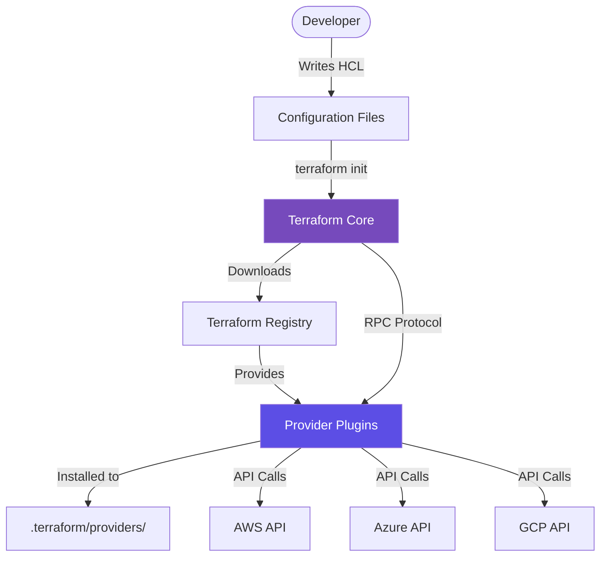
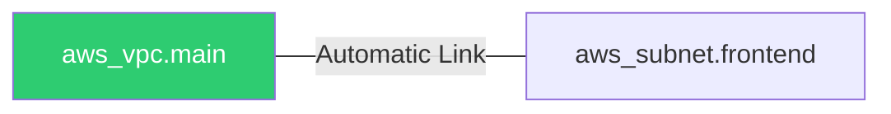
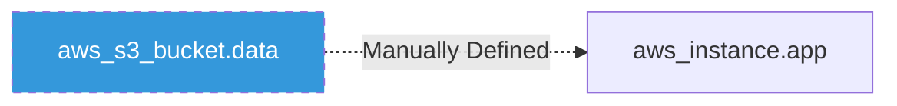

# Building the Cloud
Welcome to Day 2 After setting up your environment on Day 1, today we dive into the two most critical components of any Terraform project: **Providers** (the messengers) and **Resources** (the message).

---
## 🏗️ 1. Providers: The Heart of Extensibility
Providers are the plugins that Terraform uses to communicate with cloud providers, SaaS platforms, and other APIs. Terraform itself doesn't know how to create an AWS instance or a GitHub repo; it delegates that task to the provider.
### How Providers Work
When you run `terraform init`, Terraform scans your code for provider requirements and downloads the necessary binary plugins into the hidden `.terraform/providers` directory.
### Provider Configuration
Providers are configured using two blocks:
1.  **`required_providers`**: Inside the `terraform {}` block. It defines the source and version constraint.
2.  **`provider`**: Configures the specific settings (like `region`, `credentials`, or `endpoints`).
```hcl
terraform {
  required_providers {
    aws = {
      source  = "hashicorp/aws"
      version = "~> 5.0" # Pinning to version 5.x
    }
  }
}

provider "aws" {
  region = "us-east-1"
}
```
### Provider Architecture
Providers act as an abstraction layer between Terraform Core and the underlying Cloud APIs.



---
## 🧩 2. Resources: Describing Infrastructure
Resources are the most important element in HCL. Each resource block describes one or more infrastructure objects, such as virtual networks, compute instances, or higher-level components such as DNS records.
### Resource Syntax
```hcl
# resource "TYPE" "LOCALNAME"
resource "aws_instance" "web_server" {
  ami           = "ami-0c55b159cbfafe1d0"
  instance_type = "t3.micro"
  
  tags = { Name = "Terraform-Lab-Srv" }
}
```
### Resource Meta-Arguments
Meta-arguments are special parameters that change how Terraform treats a resource:
- **`count`**: Creates a fixed number of identical resources.
- **`for_each`**: Creates multiple instances based on a map or list (better for unique settings).
- **`depends_on`**: Manually forces the order of creation.
- **`lifecycle`**: Controls specialized behaviors like `prevent_destroy` or `create_before_destroy`.
---
## 🔗 3. Implicit vs. Explicit Dependencies
### Implicit Dependencies (Automatic)
Terraform is smart. If Resource B references an attribute from Resource A (e.g., `vpc_id = aws_vpc.main.id`), Terraform automatically knows it must create the VPC first.


### Explicit Dependencies (Manual)
Sometimes there is no direct link in the code, but an order is still required (e.g., a script on a VM needs an S3 bucket to exist first). In this case, we use `depends_on`.


---
## 🌟 Real-Life Scenarios

### Scenario 1: The Multi-Region/Account Strategy
**Problem**: An SRE needs to deploy a global application spanning `us-east-1` and `eu-west-1` for disaster recovery.
**Solution**: **Provider Aliases**. You can initialize the same provider twice with different aliases and regions.
```hcl
provider "aws" {
  region = "us-east-1"
}

provider "aws" {
  alias  = "ireland"
  region = "eu-west-1"
}

resource "aws_instance" "euro_server" {
  provider = aws.ireland # Directed to the specific alias
  ami      = "ami-xyz"
}
```
### Scenario 2: Blue/Green Deployment with Zero Downtime
**Problem**: Updating an EC2 instance's AMI usually destroys it first, causing several minutes of downtime.
**Solution**: Use `lifecycle { create_before_destroy = true }`. Terraform will spin up the "<font color="#00b050">Green</font>" instance first, ensure it's healthy, and only then terminate the "<font color="#0070c0">Blue</font>" instance.

---
## 🎤 Interview Questions (Junior to Senior)
### Beginner
1.  **What does `terraform init` do to providers?**
    - It downloads the provider binaries from the registry into the `.terraform` folder based on your configuration.
2.  **What is a resource "local name"?**
    - It is the identifier used within Terraform code (e.g., `web_server` in `aws_instance.web_server`). It does not appear in your cloud provider's console.

### Intermediate
3.  **Explain the difference between `count` and `for_each`.**
    - `count` uses an index (0, 1, 2) and is best for identical resources. `for_each` uses keys and is best for resources that need unique values (like different subnet names).
4.  **How do you handle a resource that cannot be deleted?**
    - Add `lifecycle { prevent_destroy = true }` to the block. Terraform will error out instead of deleting it.

### Advanced (SRE)
5.  **What is the Provider Lock File (`.terraform.lock.hcl`)?**
    - This file records exact provider versions and checksums. It ensures that every developer and the CI/CD pipeline are using the same binary, preventing "it works on my machine" issues.
6.  **Explain a circular dependency and how to resolve it.**
    - If Resource A depends on B, and B depends on A, Terraform will fail. This usually requires breaking the link into a third resource or using a logic change to decouple them.

---
## 🧠 Comprehensive Quiz (25 Questions)

1. **Where does Terraform download providers from by default?**
   - A) GitHub
   - B) Terraform Registry
   - C) Local Disk
   - D) Cloud Provider Console
   <details>
   <summary>Answer</summary>
   - **Answer: B**
   </details>

2. **Which block specifies which versions of a provider are allowed?**
   - A) `provider`
   - B) `variable`
   - C) `required_providers`
   - D) `locals`
   <details>
   <summary>Answer</summary>
   - **Answer: C**
   </details>

3. **What is the purpose of the `alias` argument in a provider block?**
   - A) To rename the provider
   - B) To use the same provider with different configurations (e.g., different regions)
   - C) To hide the provider name
   - D) To speed up initialization
   <details>
   <summary>Answer</summary>
   - **Answer: B**
   </details>

4. **In the resource block `resource "aws_instance" "app"`, what is "app"?**
   - A) Resource Type
   - B) Resource Local Name
   - C) Resource ID
   - D) Resource Tag
   <details>
   <summary>Answer</summary>
   - **Answer: B**
   </details>

5. **Which command lists all resources currently tracked in the state file?**
   - A) `terraform plan`
   - B) `terraform state list`
   - C) `terraform show`
   - D) `terraform output`
   <details>
   <summary>Answer</summary>
   - **Answer: B**
   </details>

6. **How does Terraform determine the order in which to create resources?**
   - A) Alphabetical order in the file
   - B) Order of appearance in the file
   - C) By building a Dependency Graph (DAG)
   - D) It creates them all at once randomly
   <details>
   <summary>Answer</summary>
   - **Answer: C**
   </details>

7. **What is an "Implicit Dependency"?**
   - A) A dependency you write manually
   - B) A link created when one resource references another's attribute
   - C) A dependency that Terraform ignores
   - D) A dependency on a local file
   <details>
   <summary>Answer</summary>
   - **Answer: B**
   </details>

8. **Which meta-argument would you use to ensure a database exists before an app server starts?**
   - A) `lifecycle`
   - B) `for_each`
   - C) `depends_on`
   - D) `provider`
   <details>
   <summary>Answer</summary>
   - **Answer: C**
   </details>

9. **What happens if you set `prevent_destroy = true` in a lifecycle block?**
   - A) The resource will never fail
   - B) Terraform will error if a plan tries to destroy that resource
   - C) The resource is automatically backed up
   - D) You cannot update the resource
   <details>
   <summary>Answer</summary>
   - **Answer: B**
   </details>

10. **When using `count`, how do you access the current index?**
    - A) `${this.index}`
    - B) `count.index`
    - C) `var.index`
    - D) `resource.index`
    <details>
    <summary>Answer</summary>
    - **Answer: B**
    </details>

11. **Which version constraint allows only patch-level updates (e.g., 5.1.x)?**
    - A) `> 5.1`
    - B) `~> 5.1.0`
    - C) `= 5.1`
    - D) `!= 5.0`
    <details>
    <summary>Answer</summary>
    - **Answer: B**
    </details>

12. **Where are provider binaries stored for a project?**
    - A) `/tmp`
    - B) `.terraform/providers`
    - C) `C:\Windows\System32`
    - D) In the state file
    <details>
    <summary>Answer</summary>
    - **Answer: B**
    </details>

13. **What happens if you remove a resource block and run `terraform apply`?**
    - A) Terraform ignores it
    - B) Terraform destroys the matching resource in the cloud
    - C) Terraform creates a backup
    - D) The configuration fails
    <details>
    <summary>Answer</summary>
    - **Answer: B**
    </details>

14. **True or False: A single resource block with `count = 5` creates 5 separate resources.**
    - A) True
    - B) False
    <details>
    <summary>Answer</summary>
    - **Answer: A**
    </details>

15. **What is the benefit of `for_each` over `count`?**
    - A) It is faster
    - B) It allows you to use descriptive keys instead of numerical indexes
    - C) It uses less memory
    - D) It doesn't require a provider
    <details>
    <summary>Answer</summary>
    - **Answer: B**
    </details>

16. **How do you reference the ID of an AWS VPC named 'main'?**
    - A) `aws.vpc.main`
    - B) `aws_vpc.main.id`
    - C) `vpc_id.main`
    - D) `id.aws_vpc.main`
    <details>
    <summary>Answer</summary>
    - **Answer: B**
    </details>

17. **Which lifecycle rule is used for zero-downtime updates?**
    - A) `ignore_changes`
    - B) `create_before_destroy`
    - C) `prevent_destroy`
    - D) `post_deploy_update`
    <details>
    <summary>Answer</summary>
    - **Answer: B**
    </details>

18. **What does the `.terraform.lock.hcl` file ensure?**
    - A) That the cloud provider is locked
    - B) That the same provider version is used consistently across environments
    - C) That no one else can run Terraform
    - D) That secrets are encrypted
    <details>
    <summary>Answer</summary>
    - **Answer: B**
    </details>

19. **Can a resource depend on another resource in a different file (same directory)?**
    - A) Yes
    - B) No
    <details>
    <summary>Answer</summary>
    - **Answer: A**
    </details>

20. **What protocol do providers use to talk to Terraform Core?**
    - A) HTTP/HTTPS
    - B) gRPC/RPC
    - C) SSH
    - D) SMTP
    <details>
    <summary>Answer</summary>
    - **Answer: B**
    </details>

21. **Which block is used to fetch data about existing infrastructure?**
    - A) `resource`
    - B) `data`
    - C) `output`
    - D) `provider`
    <details>
    <summary>Answer</summary>
    - **Answer: B**
    </details>

22. **What does `ignore_changes` do?**
    - A) Deletes the resource
    - B) Instructs Terraform to ignore modifications to specific attributes after creation
    - C) Prevents all updates to the resource
    - D) Ignores errors during apply
    <details>
    <summary>Answer</summary>
    - **Answer: B**
    </details>

23. **How many instances of a provider can you configure with different aliases?**
    - A) 1
    - B) 2
    - C) Unlimited
    - D) None
    <details>
    <summary>Answer</summary>
    - **Answer: C**
    </details>

24. **In HCL, what is the character used for comments?**
    - A) `//` or `#`
    - B) `--`
    - C) `<!-- -->`
    - D) `/* */` only
    <details>
    <summary>Answer</summary>
    - **Answer: A**
    </details>

25. **Is the provider binary platform-specific (e.g., Windows vs Linux)?**
    - A) Yes
    - B) No
    <details>
    <summary>Answer</summary>
    - **Answer: A**
    </details>

---
*End of Day 2 Lab Guide. Mastering Providers and Resources is the bridge from knowing Terraform to actually building the cloud.*
