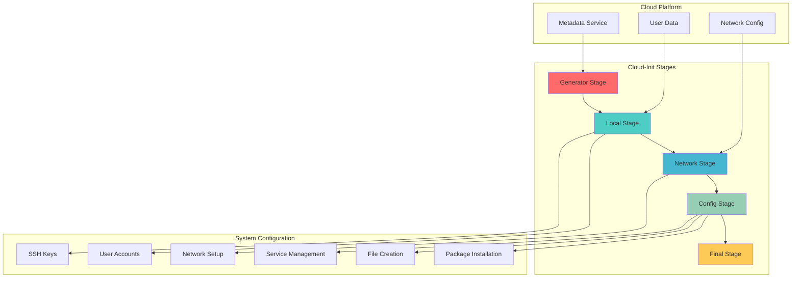

# ☁️ Cloud-Init: Cloud Instance Initialization

Cloud-Init is the industry standard multi-distribution method for cross-platform cloud instance initialization. It is supported across all major public cloud providers, provisioning systems for private cloud infrastructure, and bare-metal installations.

---

## 🎯 **What is Cloud-Init?**

Cloud-Init is a set of Python scripts and utilities to make your cloud instances boot faster and be configured automatically. It handles the early initialization of a cloud instance, including networking, SSH keys, timezone, user data execution, and more.

### **Key Features**
- **Multi-Cloud Support**: AWS, Azure, GCP, OpenStack, VMware, and more
- **Multi-Distribution**: Ubuntu, CentOS, RHEL, SUSE, Debian, and others
- **Declarative Configuration**: YAML-based configuration files
- **Extensible**: Custom modules and plugins
- **Network Configuration**: Static IP, DHCP, bonding, VLANs
- **User Management**: Account creation, SSH keys, sudo privileges

---

## 🏗️ **Architecture Overview**



---

## 🛠️ **Learning Modules**

### **Module 1: Cloud-Init Fundamentals**
- **Installation & Setup**: Cloud-Init installation and basic configuration
- **Boot Stages**: Understanding the five-stage boot process
- **Data Sources**: Metadata services and user data formats
- **Basic Configuration**: Simple user data examples

### **Module 2: Configuration Formats**
- **Cloud-Config**: YAML-based declarative configuration
- **Shell Scripts**: Bash script execution during boot
- **MIME Multi-Part**: Combining multiple configuration types
- **Include Files**: External configuration references

### **Module 3: System Configuration**
- **User Management**: Creating users, groups, and SSH keys
- **Package Management**: Installing and updating software
- **File Management**: Creating files and directories
- **Service Management**: Starting and configuring services

### **Module 4: Advanced Features**
- **Network Configuration**: Static IP, bonding, VLANs
- **Custom Modules**: Writing custom Cloud-Init modules
- **Debugging**: Troubleshooting and logging
- **Enterprise Patterns**: Large-scale deployment strategies

---

## 📚 **Configuration Examples**

### **Basic Cloud-Config (YAML)**
```yaml
#cloud-config

# System update and upgrade
package_update: true
package_upgrade: true

# Install packages
packages:
  - curl
  - wget
  - git
  - vim
  - htop
  - docker.io
  - nginx

# Create users
users:
  - name: devops
    groups: sudo, docker
    shell: /bin/bash
    sudo: ALL=(ALL) NOPASSWD:ALL
    ssh_authorized_keys:
      - ssh-rsa AAAAB3NzaC1yc2EAAAADAQABAAABAQ... user@example.com
  - name: app
    groups: docker
    shell: /bin/bash
    home: /opt/app

# Write files
write_files:
  - path: /etc/nginx/sites-available/default
    content: |
      server {
          listen 80 default_server;
          listen [::]:80 default_server;
          
          root /var/www/html;
          index index.html index.htm index.nginx-debian.html;
          
          server_name _;
          
          location / {
              try_files $uri $uri/ =404;
          }
      }
    permissions: '0644'
    owner: root:root

  - path: /var/www/html/index.html
    content: |
      <!DOCTYPE html>
      <html>
      <head>
          <title>Welcome to Cloud-Init Server</title>
      </head>
      <body>
          <h1>Server configured with Cloud-Init</h1>
          <p>This server was automatically configured during boot.</p>
      </body>
      </html>
    permissions: '0644'
    owner: www-data:www-data

# Run commands
runcmd:
  - systemctl enable nginx
  - systemctl start nginx
  - systemctl enable docker
  - systemctl start docker
  - usermod -aG docker ubuntu
  - echo "Cloud-Init configuration completed" >> /var/log/cloud-init-custom.log

# Set timezone
timezone: UTC

# Configure SSH
ssh_pwauth: false
disable_root: true

# Reboot after configuration
power_state:
  mode: reboot
  message: "Rebooting after Cloud-Init configuration"
  timeout: 30
  condition: true
```

### **Advanced Web Server Configuration**
```yaml
#cloud-config

# System configuration
hostname: web-server-01
fqdn: web-server-01.example.com

# Package management
package_update: true
package_upgrade: true
packages:
  - nginx
  - certbot
  - python3-certbot-nginx
  - ufw
  - fail2ban

# User configuration
users:
  - name: webadmin
    groups: sudo, www-data
    shell: /bin/bash
    sudo: ALL=(ALL) NOPASSWD:ALL
    ssh_authorized_keys:
      - ssh-rsa AAAAB3NzaC1yc2EAAAADAQABAAABAQ... webadmin@company.com

# SSL certificate and Nginx configuration
write_files:
  - path: /etc/nginx/sites-available/myapp
    content: |
      server {
          listen 80;
          server_name example.com www.example.com;
          
          location /.well-known/acme-challenge/ {
              root /var/www/html;
          }
          
          location / {
              return 301 https://$server_name$request_uri;
          }
      }
      
      server {
          listen 443 ssl http2;
          server_name example.com www.example.com;
          
          ssl_certificate /etc/letsencrypt/live/example.com/fullchain.pem;
          ssl_certificate_key /etc/letsencrypt/live/example.com/privkey.pem;
          
          root /var/www/myapp;
          index index.html index.htm;
          
          location / {
              try_files $uri $uri/ =404;
          }
      }
    permissions: '0644'

  - path: /etc/fail2ban/jail.local
    content: |
      [DEFAULT]
      bantime = 3600
      findtime = 600
      maxretry = 3
      
      [sshd]
      enabled = true
      port = ssh
      logpath = /var/log/auth.log
      
      [nginx-http-auth]
      enabled = true
      port = http,https
      logpath = /var/log/nginx/error.log
    permissions: '0644'

# Commands to run
runcmd:
  # Configure firewall
  - ufw default deny incoming
  - ufw default allow outgoing
  - ufw allow ssh
  - ufw allow 'Nginx Full'
  - ufw --force enable
  
  # Configure Nginx
  - ln -s /etc/nginx/sites-available/myapp /etc/nginx/sites-enabled/
  - rm -f /etc/nginx/sites-enabled/default
  - nginx -t && systemctl reload nginx
  
  # Start services
  - systemctl enable nginx
  - systemctl enable fail2ban
  - systemctl start fail2ban
  
  # Create web directory
  - mkdir -p /var/www/myapp
  - chown -R www-data:www-data /var/www/myapp
  
  # Log completion
  - echo "Web server configuration completed at $(date)" >> /var/log/cloud-init-setup.log
```

### **Docker Host Configuration**
```yaml
#cloud-config

# Update system
package_update: true
package_upgrade: true

# Install Docker and dependencies
packages:
  - apt-transport-https
  - ca-certificates
  - curl
  - gnupg
  - lsb-release

# Add Docker repository and install
runcmd:
  # Add Docker GPG key
  - curl -fsSL https://download.docker.com/linux/ubuntu/gpg | gpg --dearmor -o /usr/share/keyrings/docker-archive-keyring.gpg
  
  # Add Docker repository
  - echo "deb [arch=amd64 signed-by=/usr/share/keyrings/docker-archive-keyring.gpg] https://download.docker.com/linux/ubuntu $(lsb_release -cs) stable" | tee /etc/apt/sources.list.d/docker.list > /dev/null
  
  # Update and install Docker
  - apt-get update
  - apt-get install -y docker-ce docker-ce-cli containerd.io docker-compose-plugin
  
  # Configure Docker
  - systemctl enable docker
  - systemctl start docker
  - usermod -aG docker ubuntu
  
  # Install Docker Compose
  - curl -L "https://github.com/docker/compose/releases/latest/download/docker-compose-$(uname -s)-$(uname -m)" -o /usr/local/bin/docker-compose
  - chmod +x /usr/local/bin/docker-compose

# Create Docker daemon configuration
write_files:
  - path: /etc/docker/daemon.json
    content: |
      {
        "log-driver": "json-file",
        "log-opts": {
          "max-size": "10m",
          "max-file": "3"
        },
        "storage-driver": "overlay2"
      }
    permissions: '0644'

  - path: /home/ubuntu/docker-compose.yml
    content: |
      version: '3.8'
      services:
        nginx:
          image: nginx:alpine
          ports:
            - "80:80"
          volumes:
            - ./html:/usr/share/nginx/html:ro
          restart: unless-stopped
        
        app:
          image: node:16-alpine
          working_dir: /app
          volumes:
            - ./app:/app
          ports:
            - "3000:3000"
          restart: unless-stopped
    permissions: '0644'
    owner: ubuntu:ubuntu

# Final commands
final_message: "Docker host setup completed successfully!"
```

---

## 🔧 **Network Configuration**

### **Static IP Configuration**
```yaml
#cloud-config

# Network configuration version 2
network:
  version: 2
  ethernets:
    eth0:
      dhcp4: false
      addresses:
        - 192.168.1.100/24
      gateway4: 192.168.1.1
      nameservers:
        addresses:
          - 8.8.8.8
          - 8.8.4.4
        search:
          - example.com

# Alternative network configuration (version 1)
# network:
#   version: 1
#   config:
#     - type: physical
#       name: eth0
#       subnets:
#         - type: static
#           address: 192.168.1.100/24
#           gateway: 192.168.1.1
#           dns_nameservers:
#             - 8.8.8.8
#             - 8.8.4.4
#           dns_search:
#             - example.com
```

### **Bonded Network Interface**
```yaml
#cloud-config

network:
  version: 2
  ethernets:
    eth0:
      dhcp4: false
    eth1:
      dhcp4: false
  bonds:
    bond0:
      interfaces:
        - eth0
        - eth1
      parameters:
        mode: active-backup
        primary: eth0
        mii-monitor-interval: 100
      dhcp4: false
      addresses:
        - 192.168.1.100/24
      gateway4: 192.168.1.1
      nameservers:
        addresses:
          - 8.8.8.8
          - 8.8.4.4
```

---

## 🔄 **Integration Patterns**

### **With Terraform**
```hcl
# terraform/main.tf
resource "aws_instance" "web_server" {
  ami           = "ami-0c02fb55956c7d316"  # Ubuntu 22.04 LTS
  instance_type = "t3.micro"
  key_name      = var.key_name
  
  vpc_security_group_ids = [aws_security_group.web.id]
  subnet_id              = aws_subnet.public.id
  
  user_data = file("${path.module}/cloud-init.yml")
  
  tags = {
    Name = "Web Server"
    Type = "Production"
  }
}

# cloud-init.yml file referenced above
```

### **With Ansible**
```yaml
# ansible/playbook.yml
- name: Deploy instances with Cloud-Init
  hosts: localhost
  tasks:
    - name: Create cloud-init configuration
      template:
        src: cloud-init.yml.j2
        dest: /tmp/cloud-init-{{ item.name }}.yml
      loop: "{{ instances }}"
    
    - name: Launch EC2 instances
      amazon.aws.ec2_instance:
        name: "{{ item.name }}"
        image_id: "{{ item.ami }}"
        instance_type: "{{ item.type }}"
        key_name: "{{ item.key }}"
        user_data: "{{ lookup('file', '/tmp/cloud-init-' + item.name + '.yml') }}"
        state: present
      loop: "{{ instances }}"
```

### **With Packer**
```json
{
  "builders": [
    {
      "type": "amazon-ebs",
      "ami_name": "custom-ubuntu-{{timestamp}}",
      "instance_type": "t3.micro",
      "region": "us-east-1",
      "source_ami_filter": {
        "filters": {
          "name": "ubuntu/images/*ubuntu-jammy-22.04-amd64-server-*"
        },
        "most_recent": true,
        "owners": ["099720109477"]
      },
      "ssh_username": "ubuntu"
    }
  ],
  "provisioners": [
    {
      "type": "file",
      "source": "cloud-init-template.yml",
      "destination": "/tmp/cloud-init-template.yml"
    },
    {
      "type": "shell",
      "inline": [
        "sudo cp /tmp/cloud-init-template.yml /etc/cloud/cloud.cfg.d/99-custom.cfg"
      ]
    }
  ]
}
```

---

## 🎯 **Best Practices**

### **1. Configuration Management**
- Use version control for all cloud-init configurations
- Implement configuration validation and testing
- Use templates for environment-specific configurations
- Document all custom configurations

### **2. Security**
- Disable password authentication
- Use SSH keys for access
- Configure firewall rules during boot
- Regular security updates and patches

### **3. Performance**
- Minimize boot time with efficient configurations
- Use package caching when possible
- Optimize network configuration
- Monitor cloud-init execution times

### **4. Debugging & Monitoring**
- Enable detailed logging
- Use cloud-init status commands
- Implement health checks
- Monitor configuration drift

---

## 🔍 **Troubleshooting Guide**

### **Common Issues**
1. **Boot Failures**: Configuration syntax errors or missing dependencies
2. **Network Problems**: Incorrect network configuration or DNS issues
3. **Package Installation**: Repository access or package conflicts
4. **Permission Issues**: Incorrect file permissions or ownership

### **Debugging Commands**
```bash
# Check cloud-init status
cloud-init status

# View cloud-init logs
sudo cat /var/log/cloud-init.log
sudo cat /var/log/cloud-init-output.log

# Check configuration
cloud-init query --all

# Validate configuration
cloud-init schema --config-file cloud-config.yml

# Re-run cloud-init (testing only)
sudo cloud-init clean
sudo cloud-init init
sudo cloud-init modules --mode config
sudo cloud-init modules --mode final

# Check network configuration
ip addr show
ip route show
systemd-resolve --status
```

---

## 📊 **Cloud Provider Examples**

### **AWS EC2 User Data**
```bash
#!/bin/bash
# This script runs as root during instance launch

# Update system
yum update -y

# Install packages
yum install -y httpd

# Start services
systemctl start httpd
systemctl enable httpd

# Create simple web page
echo "<h1>Hello from AWS EC2</h1>" > /var/www/html/index.html

# Configure firewall (if needed)
# firewall-cmd --permanent --add-service=http
# firewall-cmd --reload
```

### **Azure Custom Script Extension**
```json
{
  "fileUris": ["https://raw.githubusercontent.com/company/scripts/main/setup.sh"],
  "commandToExecute": "bash setup.sh"
}
```

### **GCP Startup Script**
```bash
#!/bin/bash
# Startup script for GCP Compute Engine

# Install Docker
curl -fsSL https://get.docker.com -o get-docker.sh
sh get-docker.sh

# Add user to docker group
usermod -aG docker $USER

# Start Docker service
systemctl enable docker
systemctl start docker

# Pull and run application
docker run -d -p 80:80 nginx:alpine
```

---

## 🏆 **Interview Questions**

### **Technical Questions**
1. **Explain the five stages of Cloud-Init boot process.**
2. **What are the different data sources Cloud-Init can use?**
3. **How does Cloud-Init handle network configuration across different cloud providers?**
4. **Describe the difference between cloud-config and shell scripts in user data.**

### **Practical Scenarios**
1. **Configuring a web server cluster with load balancing**
2. **Setting up development environments with consistent configurations**
3. **Implementing security hardening during instance boot**
4. **Managing configuration drift in auto-scaling groups**

---

## 🚀 **Advanced Topics**

### **Custom Cloud-Init Modules**
```python
# /usr/lib/python3/dist-packages/cloudinit/config/cc_custom_app.py
from cloudinit import log as logging
from cloudinit.settings import PER_INSTANCE

LOG = logging.getLogger(__name__)

frequency = PER_INSTANCE

def handle(name, cfg, cloud, log, args):
    """
    Custom Cloud-Init module for application deployment
    """
    app_config = cfg.get('custom_app', {})
    
    if not app_config:
        log.debug("No custom_app configuration found")
        return
    
    app_name = app_config.get('name', 'default-app')
    app_version = app_config.get('version', 'latest')
    
    log.info(f"Deploying {app_name} version {app_version}")
    
    # Custom deployment logic here
    # This could include downloading, configuring, and starting applications
    
    log.info(f"Successfully deployed {app_name}")
```

### **MIME Multi-Part Configuration**
```python
#!/usr/bin/env python3
import email.mime.multipart
import email.mime.text

# Create multipart message
msg = email.mime.multipart.MIMEMultipart()

# Add cloud-config part
cloud_config = """#cloud-config
packages:
  - nginx
  - docker.io
"""
msg.attach(email.mime.text.MIMEText(cloud_config, 'cloud-config'))

# Add shell script part
shell_script = """#!/bin/bash
echo "Running custom setup script"
systemctl enable nginx
systemctl start nginx
"""
msg.attach(email.mime.text.MIMEText(shell_script, 'x-shellscript'))

# Output the multipart message
print(msg.as_string())
```

---

## 📖 **Resources & References**

### **Official Documentation**
- [Cloud-Init Documentation](https://cloudinit.readthedocs.io/)
- [Cloud-Init Examples](https://cloudinit.readthedocs.io/en/latest/topics/examples.html)

### **Cloud Provider Guides**
- [AWS User Data](https://docs.aws.amazon.com/AWSEC2/latest/UserGuide/user-data.html)
- [Azure Custom Script Extension](https://docs.microsoft.com/en-us/azure/virtual-machines/extensions/custom-script-linux)
- [GCP Startup Scripts](https://cloud.google.com/compute/docs/startupscript)

### **Community Resources**
- [Cloud-Init GitHub Repository](https://github.com/canonical/cloud-init)
- [Ubuntu Cloud Images](https://cloud-images.ubuntu.com/)

---

**Next Steps**: Master Cloud-Init fundamentals, explore cloud-specific implementations, and integrate with infrastructure automation tools for consistent, automated instance configuration.

*"Consistent, automated cloud instance initialization across all platforms."*