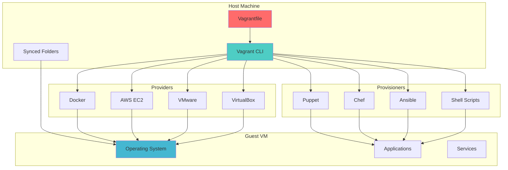

# 🏠 Vagrant: Development Environment Management

Vagrant is a tool for building and managing virtual machine environments in a single workflow, providing consistent development environments across different platforms and team members.

---

## 🎯 **What is Vagrant?**

Vagrant provides easy-to-configure, reproducible, and portable work environments built on top of industry-standard technology and controlled by a single consistent workflow to help maximize productivity and flexibility.

### **Key Features**
- **Reproducible Environments**: Identical development setups across teams
- **Multi-Provider Support**: VirtualBox, VMware, AWS, Docker, and more
- **Provisioning Integration**: Shell, Ansible, Chef, Puppet, Docker
- **Networking**: Port forwarding, private networks, public networks
- **Synced Folders**: Share files between host and guest machines
- **Plugin Ecosystem**: Extensive plugin architecture for customization

---

## 🏗️ **Architecture Overview**



---

## 🛠️ **Learning Modules**

### **Module 1: Vagrant Fundamentals**
- **Installation & Setup**: Installing Vagrant and providers
- **Vagrantfile Basics**: Configuration file structure and syntax
- **Box Management**: Using and creating Vagrant boxes
- **Basic Commands**: Essential CLI operations

### **Module 2: Configuration & Networking**
- **Provider Configuration**: VirtualBox, VMware, cloud providers
- **Network Configuration**: Port forwarding, private/public networks
- **Synced Folders**: File sharing between host and guest
- **Multi-Machine Setups**: Complex development environments

### **Module 3: Provisioning & Automation**
- **Shell Provisioning**: Script-based configuration
- **Configuration Management**: Ansible, Chef, Puppet integration
- **Docker Provisioning**: Container-based development
- **Custom Provisioners**: Building specialized provisioners

### **Module 4: Advanced Patterns**
- **Plugin Development**: Creating custom Vagrant plugins
- **Box Creation**: Building custom Vagrant boxes
- **Enterprise Integration**: Team workflows and best practices
- **Performance Optimization**: Resource management and tuning

---

## 📚 **Vagrantfile Examples**

### **Basic Single Machine**
```ruby
# -*- mode: ruby -*-
# vi: set ft=ruby :

Vagrant.configure("2") do |config|
  # Base box
  config.vm.box = "ubuntu/jammy64"
  config.vm.box_version = "20231215.0.0"
  
  # Hostname
  config.vm.hostname = "dev-server"
  
  # Network configuration
  config.vm.network "private_network", ip: "192.168.56.10"
  config.vm.network "forwarded_port", guest: 80, host: 8080
  config.vm.network "forwarded_port", guest: 3000, host: 3000
  
  # Synced folders
  config.vm.synced_folder ".", "/vagrant"
  config.vm.synced_folder "./app", "/opt/app"
  
  # Provider configuration
  config.vm.provider "virtualbox" do |vb|
    vb.name = "development-server"
    vb.memory = "2048"
    vb.cpus = 2
    vb.gui = false
    
    # Enable symlinks (Windows)
    vb.customize ["setextradata", :id, "VBoxInternal2/SharedFoldersEnableSymlinksCreate/vagrant", "1"]
  end
  
  # Provisioning
  config.vm.provision "shell", inline: <<-SHELL
    apt-get update
    apt-get install -y nginx nodejs npm git
    systemctl enable nginx
    systemctl start nginx
  SHELL
  
  # File provisioning
  config.vm.provision "file", source: "configs/nginx.conf", destination: "/tmp/nginx.conf"
  
  # Shell provisioning with external script
  config.vm.provision "shell", path: "scripts/setup.sh"
end
```

### **Multi-Machine Environment**
```ruby
# -*- mode: ruby -*-
# vi: set ft=ruby :

Vagrant.configure("2") do |config|
  # Global configuration
  config.vm.box = "ubuntu/jammy64"
  
  # Web server
  config.vm.define "web" do |web|
    web.vm.hostname = "web-server"
    web.vm.network "private_network", ip: "192.168.56.10"
    web.vm.network "forwarded_port", guest: 80, host: 8080
    
    web.vm.provider "virtualbox" do |vb|
      vb.name = "web-server"
      vb.memory = "1024"
      vb.cpus = 1
    end
    
    web.vm.provision "shell", inline: <<-SHELL
      apt-get update
      apt-get install -y nginx
      systemctl enable nginx
      systemctl start nginx
    SHELL
  end
  
  # Database server
  config.vm.define "db" do |db|
    db.vm.hostname = "db-server"
    db.vm.network "private_network", ip: "192.168.56.11"
    
    db.vm.provider "virtualbox" do |vb|
      vb.name = "db-server"
      vb.memory = "2048"
      vb.cpus = 2
    end
    
    db.vm.provision "shell", inline: <<-SHELL
      apt-get update
      apt-get install -y mysql-server
      systemctl enable mysql
      systemctl start mysql
      
      # Configure MySQL
      mysql -e "CREATE DATABASE app_db;"
      mysql -e "CREATE USER 'app_user'@'%' IDENTIFIED BY 'password';"
      mysql -e "GRANT ALL PRIVILEGES ON app_db.* TO 'app_user'@'%';"
      mysql -e "FLUSH PRIVILEGES;"
    SHELL
  end
  
  # Load balancer
  config.vm.define "lb" do |lb|
    lb.vm.hostname = "load-balancer"
    lb.vm.network "private_network", ip: "192.168.56.12"
    lb.vm.network "forwarded_port", guest: 80, host: 9080
    
    lb.vm.provider "virtualbox" do |vb|
      vb.name = "load-balancer"
      vb.memory = "512"
      vb.cpus = 1
    end
    
    lb.vm.provision "shell", inline: <<-SHELL
      apt-get update
      apt-get install -y haproxy
      systemctl enable haproxy
    SHELL
    
    lb.vm.provision "file", source: "configs/haproxy.cfg", destination: "/tmp/haproxy.cfg"
    
    lb.vm.provision "shell", inline: <<-SHELL
      cp /tmp/haproxy.cfg /etc/haproxy/haproxy.cfg
      systemctl restart haproxy
    SHELL
  end
end
```

### **Ansible Provisioning**
```ruby
Vagrant.configure("2") do |config|
  config.vm.box = "ubuntu/jammy64"
  
  # Define multiple machines
  (1..3).each do |i|
    config.vm.define "web#{i}" do |node|
      node.vm.hostname = "web#{i}"
      node.vm.network "private_network", ip: "192.168.56.#{10+i}"
      
      node.vm.provider "virtualbox" do |vb|
        vb.memory = "1024"
        vb.cpus = 1
      end
      
      # Only run Ansible on the last machine
      if i == 3
        node.vm.provision "ansible" do |ansible|
          ansible.limit = "all"
          ansible.playbook = "playbooks/site.yml"
          ansible.inventory_path = "inventory/vagrant"
          ansible.extra_vars = {
            ansible_ssh_user: 'vagrant',
            ansible_ssh_private_key_file: '~/.vagrant.d/insecure_private_key'
          }
        end
      end
    end
  end
end
```

---

## 🔧 **Advanced Configuration**

### **Docker Provider**
```ruby
Vagrant.configure("2") do |config|
  config.vm.provider "docker" do |d|
    d.image = "ubuntu:22.04"
    d.has_ssh = true
    d.remains_running = true
    
    # Port mapping
    d.ports = ["8080:80", "3000:3000"]
    
    # Volume mounting
    d.volumes = ["/host/path:/container/path"]
    
    # Environment variables
    d.env = {
      "NODE_ENV" => "development",
      "DEBUG" => "true"
    }
    
    # Custom Dockerfile
    d.build_dir = "."
    d.dockerfile = "Dockerfile.dev"
  end
  
  config.vm.provision "shell", inline: <<-SHELL
    apt-get update
    apt-get install -y openssh-server
    systemctl enable ssh
    systemctl start ssh
  SHELL
end
```

### **AWS Provider**
```ruby
Vagrant.configure("2") do |config|
  config.vm.box = "dummy"
  
  config.vm.provider :aws do |aws, override|
    aws.access_key_id = ENV['AWS_ACCESS_KEY_ID']
    aws.secret_access_key = ENV['AWS_SECRET_ACCESS_KEY']
    aws.region = "us-east-1"
    aws.availability_zone = "us-east-1a"
    
    # Instance configuration
    aws.instance_type = "t3.micro"
    aws.ami = "ami-0c02fb55956c7d316"  # Ubuntu 22.04 LTS
    aws.security_groups = ["default", "web-servers"]
    aws.keypair_name = "my-keypair"
    
    # Tags
    aws.tags = {
      'Name' => 'Vagrant Development Server',
      'Environment' => 'Development'
    }
    
    # Override settings for AWS
    override.ssh.username = "ubuntu"
    override.ssh.private_key_path = "~/.ssh/my-keypair.pem"
  end
  
  config.vm.provision "shell", inline: <<-SHELL
    apt-get update
    apt-get install -y docker.io
    usermod -aG docker ubuntu
  SHELL
end
```

---

## 🔄 **Integration Patterns**

### **With Docker Compose**
```ruby
# Vagrantfile
Vagrant.configure("2") do |config|
  config.vm.box = "ubuntu/jammy64"
  config.vm.network "forwarded_port", guest: 8080, host: 8080
  
  config.vm.provision "shell", inline: <<-SHELL
    # Install Docker and Docker Compose
    apt-get update
    apt-get install -y docker.io docker-compose
    usermod -aG docker vagrant
  SHELL
  
  config.vm.provision "file", source: "docker-compose.yml", destination: "/home/vagrant/docker-compose.yml"
  
  config.vm.provision "shell", inline: <<-SHELL
    cd /home/vagrant
    docker-compose up -d
  SHELL
end
```

### **With Kubernetes (K3s)**
```ruby
Vagrant.configure("2") do |config|
  # Master node
  config.vm.define "master" do |master|
    master.vm.box = "ubuntu/jammy64"
    master.vm.hostname = "k3s-master"
    master.vm.network "private_network", ip: "192.168.56.10"
    
    master.vm.provider "virtualbox" do |vb|
      vb.memory = "2048"
      vb.cpus = 2
    end
    
    master.vm.provision "shell", inline: <<-SHELL
      curl -sfL https://get.k3s.io | sh -
      sudo cat /var/lib/rancher/k3s/server/node-token > /vagrant/node-token
      sudo cp /etc/rancher/k3s/k3s.yaml /vagrant/k3s.yaml
      sudo chmod 644 /vagrant/k3s.yaml
    SHELL
  end
  
  # Worker nodes
  (1..2).each do |i|
    config.vm.define "worker#{i}" do |worker|
      worker.vm.box = "ubuntu/jammy64"
      worker.vm.hostname = "k3s-worker#{i}"
      worker.vm.network "private_network", ip: "192.168.56.#{10+i}"
      
      worker.vm.provider "virtualbox" do |vb|
        vb.memory = "1024"
        vb.cpus = 1
      end
      
      worker.vm.provision "shell", inline: <<-SHELL
        curl -sfL https://get.k3s.io | K3S_URL=https://192.168.56.10:6443 K3S_TOKEN=$(cat /vagrant/node-token) sh -
      SHELL
    end
  end
end
```

---

## 🎯 **Best Practices**

### **1. Environment Consistency**
- Use specific box versions
- Pin provider versions
- Document all dependencies
- Use version control for Vagrantfiles

### **2. Resource Management**
- Set appropriate memory and CPU limits
- Use linked clones for faster startup
- Implement proper cleanup procedures
- Monitor host system resources

### **3. Security**
- Change default passwords
- Use SSH keys instead of passwords
- Implement proper network segmentation
- Regular security updates

### **4. Performance Optimization**
- Use NFS for synced folders (when possible)
- Disable unnecessary services
- Optimize provisioning scripts
- Use snapshot functionality

---

## 🔍 **Troubleshooting Guide**

### **Common Issues**
1. **VirtualBox Guest Additions**: Version mismatches causing sync issues
2. **Network Conflicts**: IP address conflicts with existing networks
3. **Provisioning Failures**: Script errors or dependency issues
4. **Performance Problems**: Insufficient host resources

### **Debugging Commands**
```bash
# Check Vagrant status
vagrant status

# SSH into machine
vagrant ssh [machine-name]

# Reload configuration
vagrant reload

# Reprovision machine
vagrant provision

# Debug mode
vagrant up --debug

# Check logs
vagrant ssh -c "sudo journalctl -u vagrant"

# Destroy and recreate
vagrant destroy -f && vagrant up
```

---

## 📊 **Comparison Matrix**

| Feature | Vagrant | Docker | VirtualBox | Cloud VMs |
|---------|---------|--------|------------|-----------|
| **Isolation** | Full OS | Process | Full OS | Full OS |
| **Resource Usage** | High | Low | High | Variable |
| **Startup Time** | Slow | Fast | Slow | Medium |
| **Portability** | Excellent | Excellent | Good | Limited |
| **Development Focus** | Excellent | Good | Limited | Limited |
| **Production Use** | No | Yes | No | Yes |

---

## 🏆 **Interview Questions**

### **Technical Questions**
1. **Explain the difference between Vagrant providers and provisioners.**
2. **How does Vagrant handle networking and port forwarding?**
3. **What are the advantages of using Vagrant over direct VM management?**
4. **Describe how Vagrant synced folders work and their limitations.**

### **Practical Scenarios**
1. **Setting up a microservices development environment**
2. **Creating reproducible testing environments for CI/CD**
3. **Managing development environment dependencies**
4. **Implementing team-wide development standards**

---

## 🚀 **Advanced Topics**

### **Custom Box Creation**
```bash
# Create base VM in VirtualBox
# Install and configure OS
# Install Vagrant user and SSH keys

# Package the box
vagrant package --base vm-name --output custom-box.box

# Add to Vagrant
vagrant box add custom-box custom-box.box

# Test the box
vagrant init custom-box
vagrant up
```

### **Plugin Development**
```ruby
# vagrant-plugin-example/lib/vagrant-plugin-example/plugin.rb
require "vagrant"

module VagrantPluginExample
  class Plugin < Vagrant.plugin("2")
    name "Example Plugin"
    description "An example Vagrant plugin"
    
    command "example" do
      require_relative "command"
      Command
    end
    
    provisioner "example" do
      require_relative "provisioner"
      Provisioner
    end
  end
end
```

---

## 📖 **Resources & References**

### **Official Documentation**
- [Vagrant Documentation](https://www.vagrantup.com/docs)
- [Vagrant Cloud](https://app.vagrantup.com/boxes/search)

### **Community Resources**
- [Vagrant GitHub Repository](https://github.com/hashicorp/vagrant)
- [Community Boxes](https://app.vagrantup.com/boxes/search)

### **Integration Examples**
- [Vagrant with Ansible](https://www.vagrantup.com/docs/provisioning/ansible)
- [Vagrant with Docker](https://www.vagrantup.com/docs/providers/docker)
- [Vagrant Plugins](https://github.com/hashicorp/vagrant/wiki/Available-Vagrant-Plugins)

---

**Next Steps**: Master Vagrant fundamentals, create standardized development environments, and integrate with team workflows for consistent, reproducible development setups.

*"Reproducible development environments that work the same way everywhere."*