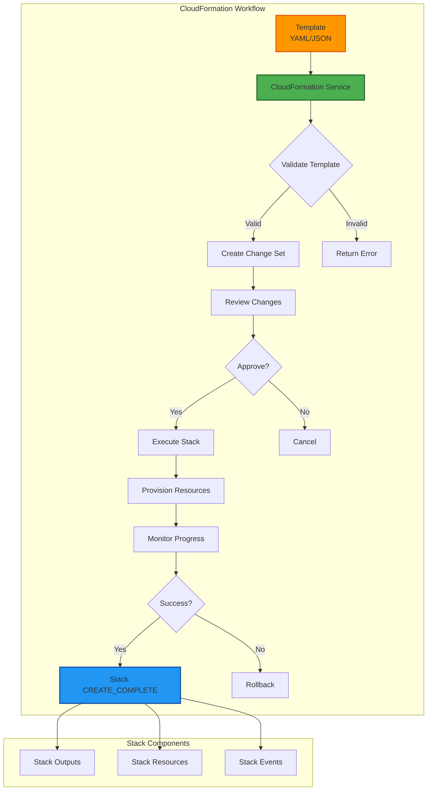
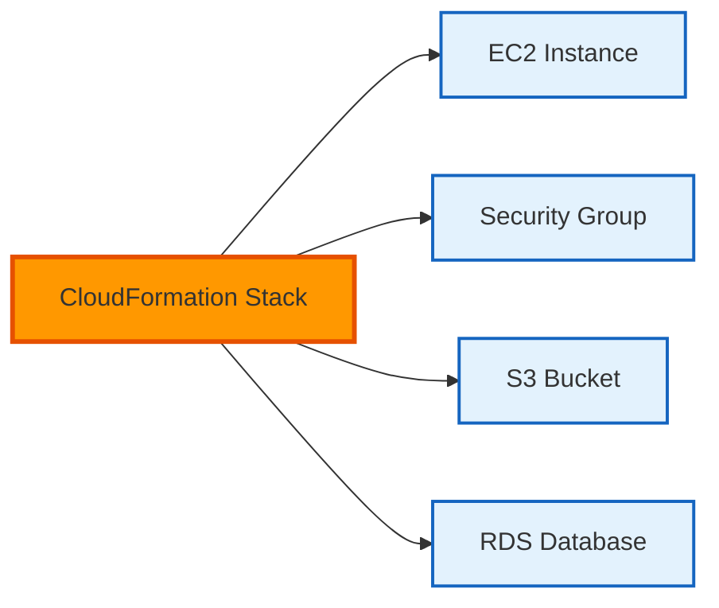
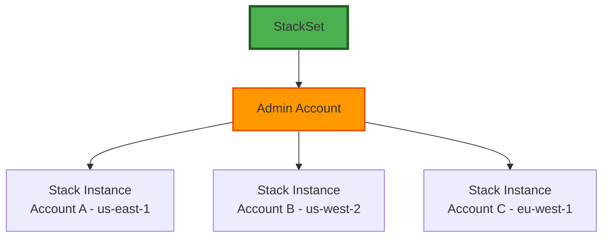

# ☁️ AWS CloudFormation - Template-Based Infrastructure as Code


## 📋 Overview

**AWS CloudFormation** is Amazon's native infrastructure as code service that allows you to model and provision AWS resources using declarative templates in JSON or YAML format. Launched in 2011, it remains the foundation of AWS infrastructure automation.

### Key Characteristics

- **Declarative**: Specify *what* resources you want, not *how* to create them
- **Template-Based**: JSON or YAML configuration files
- **Free**: No additional charge (pay only for AWS resources created)
- **Integration**: Deep AWS service integration with day-0 feature support
- **State Management**: AWS manages state automatically

---

## 🎯 When to Use CloudFormation

### ✅ Best Use Cases
- AWS-exclusive deployments (no multi-cloud requirement)
- Compliance-driven environments requiring AWS-native tools
- Organizations already invested in CloudFormation
- Need immediate access to new AWS features
- StackSets for multi-account/multi-region governance
- Integration with AWS Service Catalog

### ⚠️ Consider Alternatives When
- Multi-cloud deployments required (use Terraform)
- Team prefers programming languages over templates (use CDK)
- Serverless-only applications (use SAM)
- Need better state management visibility

---

## 🏗️ CloudFormation Architecture



---

## 📂 Module Structure

### 🔰 [Beginner Level](./Beginner/README.md)
**Foundation: Understanding Templates and Basic Deployments**

Topics:
- CloudFormation fundamentals and core concepts
- Template anatomy (Resources, Parameters, Outputs)
- Basic resource creation (EC2, S3, VPC)
- Stack operations (Create, Update, Delete)
- AWS Console and CLI basics
- Intrinsic functions (Ref, Fn::GetAtt, Fn::Join)

**Learning Objectives**:
- ✅ Write basic CloudFormation templates
- ✅ Deploy simple infrastructure stacks
- ✅ Understand template syntax and structure
- ✅ Use parameters and outputs effectively

---

### 🚀 [Intermediate Level](./Intermediate/README.md)
**Scale: Modularization and Advanced Features**

Topics:
- Nested stacks and cross-stack references
- Change sets and drift detection
- Stack policies and termination protection
- Conditional resource creation
- Mappings and pseudo parameters
- Custom resources with Lambda
- Helper scripts (cfn-init, cfn-signal)
- Stack updates and rollback mechanisms

**Learning Objectives**:
- ✅ Design modular, reusable templates
- ✅ Implement advanced CloudFormation features
- ✅ Manage dependencies and stack updates
- ✅ Create custom resources for unsupported features

---

### 🏆 [Advanced Level](./Advanced/README.md)
**Enterprise: Multi-Account Governance and Automation**

Topics:
- StackSets for multi-account/multi-region deployments
- CloudFormation macros and transforms
- Service Catalog integration
- CI/CD pipeline integration (CodePipeline, GitHub Actions)
- CloudFormation Registry and third-party resources
- Template validation and security scanning
- Cost optimization strategies
- Disaster recovery and cross-region replication

**Learning Objectives**:
- ✅ Architect enterprise-scale CloudFormation solutions
- ✅ Implement governance with StackSets
- ✅ Build automated deployment pipelines
- ✅ Optimize for cost, security, and compliance

---

## 📝 Template Anatomy

### Basic Template Structure

```yaml
AWSTemplateFormatVersion: '2010-09-09'
Description: 'My CloudFormation Template'

# Input parameters
Parameters:
  EnvironmentName:
    Type: String
    Default: dev
    AllowedValues:
      - dev
      - staging
      - prod
    Description: Environment name

# Conditional logic
Conditions:
  IsProduction: !Equals [!Ref EnvironmentName, prod]

# Mapping tables
Mappings:
  RegionMap:
    us-east-1:
      AMI: ami-0c55b159cbfafe1f0
    us-west-2:
      AMI: ami-0d1cd67c26f5fca19

# Resources to create
Resources:
  MyBucket:
    Type: AWS::S3::Bucket
    Properties:
      BucketName: !Sub '${EnvironmentName}-my-bucket'
      VersioningConfiguration:
        Status: !If [IsProduction, Enabled, Suspended]

# Output values
Outputs:
  BucketName:
    Description: Name of the S3 bucket
    Value: !Ref MyBucket
    Export:
      Name: !Sub '${AWS::StackName}-BucketName'
```

---

## 🔑 Key Concepts

### 1. Stacks
A **stack** is a collection of AWS resources managed as a single unit. All resources in a stack are created, updated, and deleted together.



### 2. Change Sets
Preview changes before applying them to prevent unintended modifications or deletions.

### 3. Drift Detection
Detect when resources have been modified outside of CloudFormation.

### 4. StackSets
Deploy stacks across multiple accounts and regions from a single template.



---

## 🔧 Essential Intrinsic Functions

### Ref
Reference parameters and logical resource IDs:
```yaml
!Ref MyParameter
!Ref MyResource
```

### Fn::GetAtt
Get attribute values from resources:
```yaml
!GetAtt MyEC2Instance.PublicDnsName
```

### Fn::Sub
Substitute variables in strings:
```yaml
!Sub '${EnvironmentName}-webapp-bucket'
!Sub 
  - 'arn:aws:s3:::${Bucket}/*'
  - Bucket: !Ref MyBucket
```

### Fn::Join
Join values with a delimiter:
```yaml
!Join ['-', [!Ref EnvironmentName, webapp, bucket]]
```

### Fn::ImportValue
Import values exported by other stacks:
```yaml
!ImportValue NetworkStack-VpcId
```

### Conditional Functions
```yaml
Conditions:
  CreateProdResources: !Equals [!Ref EnvironmentName, prod]

Resources:
  ProdOnlyResource:
    Type: AWS::S3::Bucket
    Condition: CreateProdResources
```

---

## 🛠️ Common Operations

### Create a Stack
```bash
# Using AWS CLI
aws cloudformation create-stack \
  --stack-name my-stack \
  --template-body file://template.yaml \
  --parameters ParameterKey=EnvironmentName,ParameterValue=dev \
  --capabilities CAPABILITY_IAM

# Using AWS Console
# Navigate to CloudFormation > Create Stack > Upload template file
```

### Update a Stack
```bash
# Create change set first (recommended)
aws cloudformation create-change-set \
  --stack-name my-stack \
  --change-set-name my-changes \
  --template-body file://template.yaml \
  --parameters ParameterKey=EnvironmentName,ParameterValue=staging

# Review change set
aws cloudformation describe-change-set \
  --stack-name my-stack \
  --change-set-name my-changes

# Execute change set
aws cloudformation execute-change-set \
  --stack-name my-stack \
  --change-set-name my-changes
```

### Delete a Stack
```bash
aws cloudformation delete-stack --stack-name my-stack

# Monitor deletion
aws cloudformation describe-stacks --stack-name my-stack
```

### Detect Drift
```bash
# Start drift detection
aws cloudformation detect-stack-drift --stack-name my-stack

# Check drift status
aws cloudformation describe-stack-drift-detection-status \
  --stack-drift-detection-id <drift-id>
```

---

## 📚 Learning Resources

### Official Documentation
- [CloudFormation User Guide](https://docs.aws.amazon.com/AWSCloudFormation/latest/UserGuide/)
- [Template Reference](https://docs.aws.amazon.com/AWSCloudFormation/latest/UserGuide/template-reference.html)
- [Resource Types](https://docs.aws.amazon.com/AWSCloudFormation/latest/UserGuide/aws-template-resource-type-ref.html)

### Sample Templates
- [AWS Sample Templates](https://github.com/awslabs/aws-cloudformation-templates)
- [AWS Quick Starts](https://aws.amazon.com/quickstart/)

### Tools
- [CloudFormation Linter (cfn-lint)](https://github.com/aws-cloudformation/cfn-lint)
- [TaskCat](https://github.com/aws-quickstart/taskcat) - CloudFormation testing
- [rain](https://github.com/aws-cloudformation/rain) - Modern CLI for CloudFormation

---

## 🎓 Hands-On Examples

### Example 1: Simple S3 Bucket (Beginner)
See: [Beginner/examples/simple-s3.yaml](./Beginner/README.md#example-1-simple-s3-bucket)

### Example 2: VPC with Public/Private Subnets (Intermediate)
See: [Intermediate/examples/vpc-networking.yaml](./Intermediate/README.md#example-1-vpc-architecture)

### Example 3: Multi-Account Deployment with StackSets (Advanced)
See: [Advanced/examples/stacksets-governance.yaml](./Advanced/README.md#example-1-stacksets)

---

## ❓ Interview Questions & Quizzes

**Comprehensive assessment materials available**:
- [Interview Questions](./Interview-Questions/README.md) - 25+ real-world interview questions
- [Quiz Questions](./Interview-Questions/README.md#quiz-section) - 20+ multiple-choice questions
- Difficulty: Beginner, Intermediate, Advanced

---

## 🔐 Security Best Practices

1. **Never hardcode credentials** - Use AWS Secrets Manager or Parameter Store
2. **Enable stack termination protection** for production stacks
3. **Use IAM roles** instead of access keys for resource permissions
4. **Implement least privilege** - Grant minimal permissions needed
5. **Enable CloudTrail** to audit all CloudFormation API calls
6. **Use stack policies** to prevent accidental updates/deletions
7. **Scan templates** with tools like cfn_nag or Checkov

---

## 📊 Comparison with Alternatives

| Feature | CloudFormation | Terraform | CDK | SAM |
|---------|---------------|-----------|-----|-----|
| **Syntax** | YAML/JSON | HCL | TypeScript/Python | YAML |
| **State Management** | Automatic (AWS) | Manual (backend) | Synth to CFN | SAM → CFN |
| **Multi-Cloud** | ❌ AWS only | ✅ Yes | ❌ AWS only | ❌ AWS only |
| **Learning Curve** | Medium | Medium | Medium-High | Low |
| **Day-0 Features** | ✅ Immediate | ⚠️ Delayed | ✅ Immediate | ✅ Immediate |
| **Cost** | Free | Free (OSS) | Free | Free |
| **Maturity** | ✅ Very mature | ✅ Mature | ⚠️ Growing | ✅ Mature |

---

## 🚀 Getting Started

### Step 1: Install AWS CLI
```bash
# Check if installed
aws --version

# Configure credentials
aws configure
```

### Step 2: Validate a Template
```bash
aws cloudformation validate-template \
  --template-body file://my-template.yaml
```

### Step 3: Deploy Your First Stack
Start with the [Beginner Level](./Beginner/README.md) tutorials.

---

## 🔄 Migration Strategies

### From Terraform to CloudFormation
- Use tools like `former2` to generate CFN from existing resources
- Recreate infrastructure definitions in YAML/JSON
- Consider using CDK as an intermediate step

### From CloudFormation to CDK
- Use `cdk migrate` command
- Refactor templates into CDK constructs
- Maintain backward compatibility during transition

---

**Return to**: [Vendor Tools](../README.md) | [Configuration Tools](../../README.md)

---

*"CloudFormation is the bedrock of AWS infrastructure automation. Master it, and you master AWS deployment architecture."*
