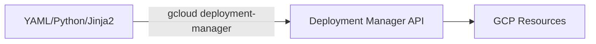
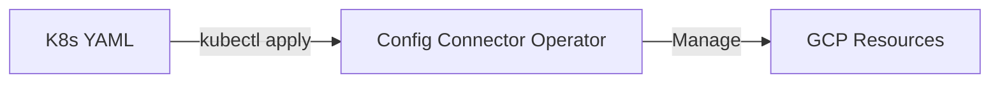

# 🟢 Google Cloud Platform (GCP) IaC

## 📋 Overview
Google Cloud offers two primary native ways to manage infrastructure as code: **Deployment Manager** and the newer, Kubernetes-native **Config Connector**.

### 1. Cloud Deployment Manager
The traditional declarative IaC for GCP.
- **Languages**: YAML, Jinja2, or Python.
- **Best for**: Standard infrastructure deployments not tied to GKE.

### 2. Config Connector
A Kubernetes-native way to manage GCP resources.
- **Languages**: Kubernetes YAML (CRDs).
- **Best for**: Teams already using Kubernetes/GKE who want to manage cloud resources using `kubectl` and GitOps.

---

## 🏗️ Architecture

### Deployment Manager

### Config Connector

---

## 📂 Module Structure

### 🛠️ [GCP Deployment Manager](./06-GCP-Deployment-Manager/README.md)
- [Beginner](./06-GCP-Deployment-Manager/Beginner/README.md)
- [Intermediate](./06-GCP-Deployment-Manager/Intermediate/README.md)
- [Advanced](./06-GCP-Deployment-Manager/Advanced/README.md)
- [Interview & Quiz](./06-GCP-Deployment-Manager/Interview-Questions/README.md)

### ☸️ [GCP Config Connector](./07-GCP-Config-Connector/README.md)
- [Beginner](./07-GCP-Config-Connector/Beginner/README.md)
- [Intermediate](./07-GCP-Config-Connector/Intermediate/README.md)
- [Advanced](./07-GCP-Config-Connector/Advanced/README.md)
- [Interview & Quiz](./07-GCP-Config-Connector/Interview-Questions/README.md)
