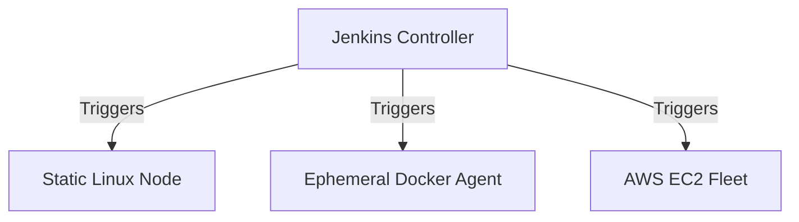

# Architecture and Distributed Setup

Jenkins shouldn't just run on one big server. To scale for an enterprise, you must use a distributed model where work is parallelized across multiple agents.

## 📚 Module Structure

- **[Boilerplates](./Boilerplates/)**: `agent-setup.sh` (Connecting an SSH agent).
- **[CHALLENGES](../../../../../1-Beginner/02-Phase-2/01-Automation/01-Shell-Scripting/01-Introduction/CHALLENGES.md)**: Setting up Docker-based agents.

---

## 🏗️ The Distributed Workload

---

## 🔑 Setup Strategies

1. **SSH Agent**: The most common. Jenkins connects to a remote server over SSH.
2. **JNLP / Inbound**: The agent connects back to Jenkins (good for servers behind firewalls).
3. **K8s Cloud**: Jenkins dynamically launches a pod in Kubernetes for every build.

---

## ❓ Interview Questions

1. **How do you prevent a build from running on the Controller?**
   - *Answer*: Set the "Usage" of the controller node to "Only build jobs with label expressions matching this node" and don't give any jobs that label.
2. **What is an Ephemeral Agent?**
   - *Answer*: An agent (usually a container) that is created for a single build and deleted immediately after, ensuring no "leftover" files from previous builds.
