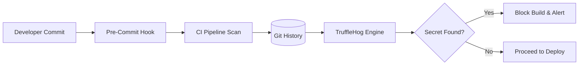

# Secret Scanning with TruffleHog

Leaking credentials in a Git repository is one of the most common causes of multi-million dollar security breaches. TruffleHog is an automated tool that scans your entire Git history for high-entropy strings and secrets.

## 📚 Module Structure
- **[Boilerplates](./Boilerplates/)**: `scan_repo.sh` (Local repo scanning script).
- **[CHALLENGES](./CHALLENGES.md)**: Detecting history-based leaks and CI integration.

---

## 🏗️ Architecture: The Scanning Process

---

## 🔑 Key Features
- **Regex Checks**: Looks for patterns like `AKIA...` (AWS) or `sk_live_...` (Stripe).
- **Entropy Analysis**: Detects random-looking strings that might be passwords.
- **Verification**: TruffleHog can automatically check if a found key is actually valid/active with the provider.

---

## 📖 Real-World Story: The "Public Fork" Leak
**Scenario**: A company open-sourced a tool, but forgot to scrub the commit history from 2 years ago.
**Crisis**: An attacker found a database password in a commit message from 2021. They used it to access the production database and steal 100,000 customer records.
**Outcome**: The company spent $5M on lawsuits and settlements.
**Solution**: They now mandate a full history scan with TruffleHog for every repository before it is made public.

---

## ❓ Interview Questions

1. **Why is scanning the filesystem not enough?**
   - *Answer*: Because Git stores the entire history of a file. Even if you "delete" a secret in the latest commit, it still exists in previous commits and can be retrieved easily.
2. **What is 'Entropy' in the context of secret scanning?**
   - *Answer*: It refers to the "randomness" of a string. Sensitive keys like API tokens usually have high entropy (very random) compared to normal text.
3. **What is a Pre-Commit Hook?**
   - *Answer*: A local script that runs on the developer's laptop before a `git commit` is finalized. This is the "Left-most" gate you can implement.

---

[Next: SonarQube Quality Gates](../04-Static-Code-Analysis-SonarQube/README.md)
