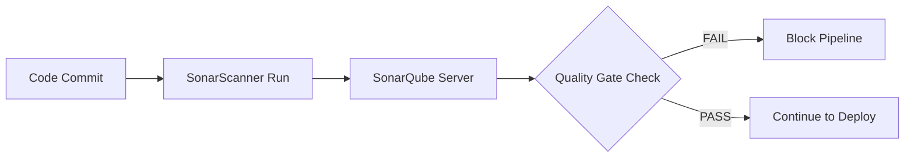

# Static Code Analysis with SonarQube

SonarQube is the "Quality Guardian" of your CI/CD pipeline. It automatically cleans your code by identifying bugs, security vulnerabilities, and code smells before they reach production.

## 📚 Module Structure
- **[Boilerplates](./Boilerplates/)**: `sonar-project.properties` (Scanner configuration).
- **[CHALLENGES](./CHALLENGES.md)**: Enforcing quality gates and reducing technical debt.

---

## 🏗️ Architecture: The Quality Loop

---

## 🔑 Key Metrics

| Metric | Description |
| :--- | :--- |
| **Code Coverage** | Percentage of code lines executed during testing. |
| **Technical Debt** | The estimated time required to fix all "Code Smells". |
| **Bugs** | Functional issues that will result in runtime errors. |
| **Vulnerabilities** | Security flaws (e.g., SQL Injection, XSS). |
| **Cognitive Complexity** | How difficult the code is for a human to understand and maintain. |

---

## 🛡️ Robust Pattern: The Quality Gate
A **Quality Gate** is a set of boolean conditions (e.g., `Coverage > 80%`). If any condition is met, the gate "Fails". In a professional CI/CD pipeline, a failed Quality Gate **STOP** the deployment immediately.

---

## 📖 Real-World Story: The "Duplicate Code" Nightmare
**Scenario**: A company had 10 different versions of a "Calculate Tax" function scattered across 50,000 lines of code.
**Crisis**: When tax laws changed, they only updated 9 versions. The 10th version caused a $100,000 billing error.
**Solution**: They ran **SonarQube**, which instantly flagged the high "Duplicated Lines" percentage.
**Outcome**: They refactored the 10 versions into 1 library, reducing their codebase by 2,000 lines and eliminating future inconsistencies.

---

## ❓ Interview Questions

1. **What is 'Static Code Analysis'?**
   - *Answer*: Analyzing code without actually executing it. It looks for structural issues, patterns of vulnerabilities, and stylistic errors.
2. **What is 'Code Coverage'?**
   - *Answer*: A measure used to describe the degree to which the source code of a program is executed when a particular test suite runs.
3. **Difference between a 'Bug' and a 'Code Smell' in SonarQube?**
   - *Answer*: A **Bug** is likely to cause a failure or wrong result. A **Code Smell** is a maintainability issue that makes the code harder to read or more likely to contain bugs in the future.

---

[⬅️ Back to CI/CD Index](../README.md)