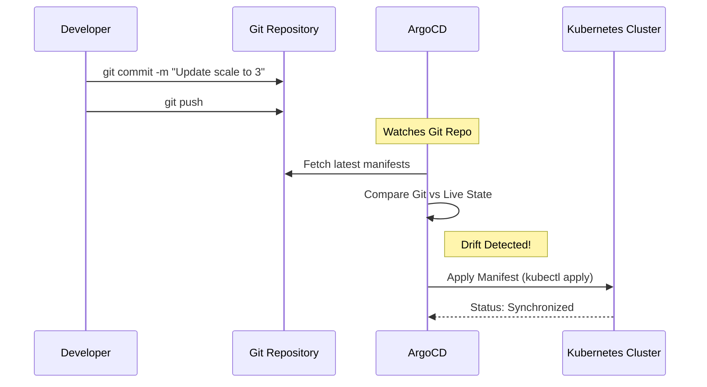

# 🟡 GitOps with ArgoCD (Intermediate)

## 📚 Overview

ArgoCD is a declarative, GitOps continuous delivery tool for Kubernetes. It monitors your Git repository for changes to your Kubernetes manifests and automatically applies those changes to your cluster.

## 🎯 Learning Objectives

- ✅ Install ArgoCD using **Helm**.
- ✅ Connect a Git repository to ArgoCD.
- ✅ Implement **Sync Policies** (Manual vs. Automatic).
- ✅ Manage application life cycles via the ArgoUI and CLI.

---

## 🏗️ Visual: ArgoCD Sync Lifecycle



---

## 🚀 Hands-on: Deployment via Helm

1.  **Add Argo Repo**:
    ```bash
    helm repo add argo https://argoproj.github.io/argo-helm
    helm repo update
    ```
2.  **Install**:
    ```bash
    helm install argo-cd argo/argo-cd --namespace argocd --create-namespace
    ```
3.  **Access UI**:
    ```bash
    kubectl port-forward service/argo-cd-argocd-server -n argocd 8080:443
    ```

---
## 🏆 Professional Pattern: The "App-of-Apps"
For managing complex environments, use the **App-of-Apps** pattern. One ArgoCD Application manages a directory of other ArgoCD Applications, allowing you to bootstrap an entire cluster with a single Git command.

---
**Next Step**: [ArgoCD Setup](./01-ArgoCD-Helm-Setup/) 🚀
