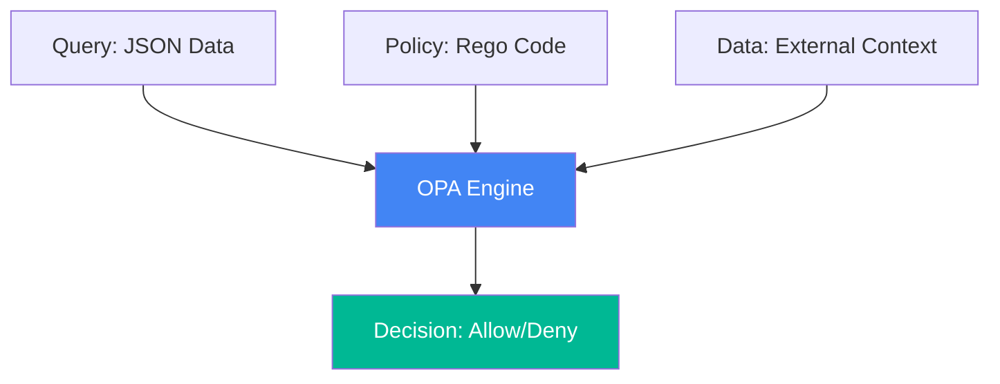

# 🟡 Compliance as Code Implementation (Intermediate)

## 📚 Overview

Transitioning from manual checks to automated policy enforcement using industry-standard tools like **Open Policy Agent (OPA)** and **Checkov**. This module focuses on "Static Analysis"—preventing insecure infrastructure from ever being deployed.

## Core Concept: Decoupled Authorization
**[REFERENCE: Policy-as-Code Architecture](./REFERENCE/Policy-as-Code-Architecture-Ref.md)**

Moving security logic out of the application and into a centralized engine:
- **Rego Language**: A purpose-built declarative language for expressing logic as code.
- **The OPA Loop**: Input (JSON Data) + Policy (Rego) = Decision (Allow/Deny).
- **Static Analysis**: Scanning Infrastructure as Code (Terraform, K8s) *before* deployment to identify risks for pennies.

## Enterprise Governance: The "Fail-Fast" Guardrails
**[REFERENCE: Policy-as-Code Architecture](./REFERENCE/Policy-as-Code-Architecture-Ref.md)**

Enforcing organizational standards automatically:
- **Mandatory Tagging**: Requiring every cloud resource to have an 'Owner' and 'CostCenter'.
- **Network Boundaries**: Automatically denying any Load Balancer creation in private subnets.
- **Admission Controllers**: Using OPA Gatekeeper to ensure the cluster itself rejects any non-compliant manifests.
- **Continuous Compliance**: Tracking policy violations in real-time to ensure zero configuration drift.

## 🎯 Learning Objectives

- ✅ Write basic **Rego** policies for environment validation.
- ✅ Implement **Checkov** to scan Terraform and Kubernetes manifests.
- ✅ Automate compliance checks in a CI/CD pipeline.
- ✅ Understand the "Fail-Fast" approach to security.

---

## 🏗️ Visual: OPA Policy Architecture



---

## 🛠️ Tooling: Checkov Boilerplate
Checkov scans your IaC files for misconfigurations before you run `terraform apply`.

**Boilerplate:** `.checkov.yaml`
```yaml
check:
  - CKV_AWS_41 # Ensure no hardcoded secrets in user data
  - CKV_AWS_20 # Ensure S3 bucket has 'Public Access Block' enabled
  - CKV_K8S_9  # Ensure pods do not run as root
soft-fail: false # Exit with non-zero code on failure
quiet: false
download-external-modules: true
```

## 📋 Professional Pattern: The "Admission Controller"
In Kubernetes, use OPA/Gatekeeper as an Admission Controller. This ensures that even if someone bypasses the CI/CD pipeline, the cluster itself will reject any manifest that violates your security policies.

---
**Next Step**: [OPA & Rego Basics](./01-OPA-and-Rego-Basics/) 🚀
