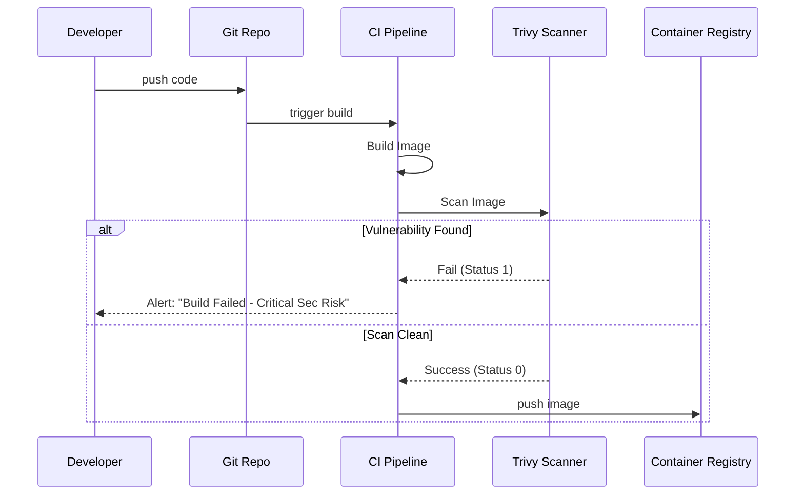

# 🟡 Container Security Scanning (Intermediate)

## 📚 Overview

Mastering automated vulnerability scanning using **Trivy**. This module covers how to integrate scanning into the developer workflow and CI/CD pipelines to achieve "Shift-Left Security."

## 🎯 Learning Objectives

- ✅ Install and configure **Trivy** for local and remote scans.
- ✅ Implement **Image Layer Analysis** to find hidden vulnerabilities.
- ✅ Configure CI/CD (GitHub Actions/GitLab) to fail builds on finding CRITICAL vulnerabilities.
- ✅ Manage vulnerability "Ignore lists" (False positives).

---

## 🏗️ Visual: Shift-Left Container Scanning



---

## 🛠️ Tooling: Trivy CLI Snippets
Trivy is the most popular scanner because it is fast, stateless, and supports many formats.

**Scan an image**:
```bash
trivy image --severity HIGH,CRITICAL python:3.9-slim
```

**Scan a filesystem**:
```bash
trivy fs --security-checks vuln,config .
```

**Output as JSON (for automation)**:
```bash
trivy image --format json --output results.json my-app:latest
```

---
**Next Step**: [Trivy Implementation](./01-Trivy-Implementation/) 🚀
