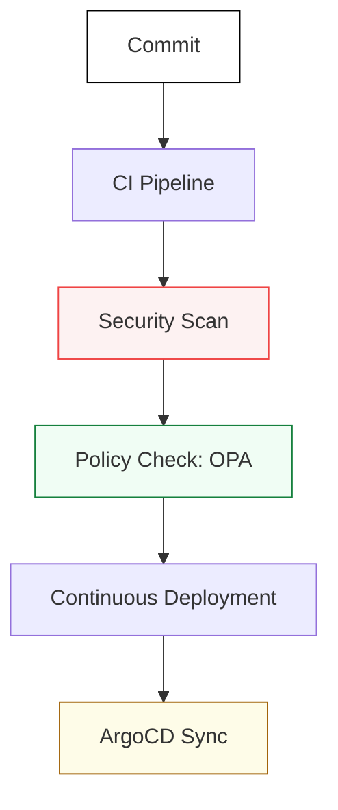

# 🚢 Part 2: Delivery & Governance

> **"Speed is irrelevant if you're heading in the wrong direction. Governance is the steering wheel; CI/CD is the engine."**

## 📖 Overview

Infrastructure is code, and code must be delivered safely. Part 2 covers the **Production Highway**—the systems that build, test, secure, and govern every line of code that enters your cluster.

## 🎓 Learning Objectives

- **Pipeline Mastery**: Build multi-stage pipelines that include testing, linting, and building.
- **GitOps Methodology**: Master the "Single Source of Truth" pattern using ArgoCD.
- **Security Left**: Integrate secret scanning and vulnerability checks into the developer workflow.
- **Compliance as Code**: Use Open Policy Agent (OPA) to enforce organization-wide rules automatically.

## 🔑 Key Modules

### 1. [CI/CD Pipelines](./01-CI-CD-Pipelines/README.md)
Jenkins mastery, GitHub Actions, and artifact management. Includes TruffleHog and SonarQube integration.

### 2. [GitOps Mastery](./02-GitOps-Mastery/README.md)
Deep dive into ArgoCD and Flux for Kubernetes-native deployments.

### 3. [Governance & Policy](./03-Governance-and-Policy/README.md)
Implementing OPA Gatekeeper and Kyverno to ensure no "illegal" infrastructure is created.

### 4. [Security Automation](./04-Security-Automation/README.md)
Container scanning, SBOM management, and automated incident response triggers.

---

## 🏆 Real-World DevOps Story: The 3:00 AM Rollback

Before GitOps, a failed deployment often meant an engineer manually ssh-ing into servers to revert changes while sweating.  
**With Part 2 standards**, a failed sync in ArgoCD can be reverted with one click—or automated to roll back if health checks fail. Governance ensures that even in an emergency, no one can bypass security checks.

---

## ❓ Knowledge Check

1. **What is 'Shifting Left'?**
   - It is the practice of moving security and testing early in the development lifecycle (to the "left" of the project timeline) to catch bugs before they reach production.

2. **Why use OPA (Open Policy Agent)?**
   - To have a unified way to write policies across different services (K8s, Terraform, Envoy) rather than having separate, inconsistent rules in each tool.

---

## 🔗 Next Steps
With the delivery engine secured, we move to the final frontier: systemic intelligence and cost optimization.

Proceed to: **[Part 3: Modern Operations](../Part-3-Modern-Operations/README.md)** →
